# 1 INTRODUÇÃO E ARQUITETURA OPENSEARCH 3.5

## 1.1 OBJETIVOS DE APRENDIZAGEM

Ao final deste capítulo, você será capaz de:

1. **Compreender** a história, motivação e posicionamento do OpenSearch 3.5 como alternativa de código aberto ao Elasticsearch
2. **Descrever** os componentes fundamentais de uma arquitetura distribuída (cluster manager node, data nodes, coordinating nodes, shards e replicas)
3. **Analisar** as diferenças técnicas entre OpenSearch 3.5 e Elasticsearch em termos de licensing, funcionalidades e roadmap
4. **Instalar e configurar** um ambiente local de desenvolvimento com OpenSearch 3.5 usando Docker Compose
5. **Aplicar** conceitos de arquitetura distribuída em cenários práticos, incluindo descoberta de nós e formação de cluster

---

## 1.2 CONTEXTUALIZAÇÃO: POR QUE OPENSEARCH 3.5?

### 1.2.1 Uma Breve História e Origem do Projeto

OpenSearch é um mecanismo de busca distribuído e RESTful de código aberto suportado pela OpenSearch Software Foundation. Para compreender sua existência, é necessário contextualizar o cenário no qual surgiu.

Até janeiro de 2021, o Elasticsearch era a solução de facto para buscas em tempo real e análise de grandes volumes de dados. Porém, a empresa Elastic mudou sua política de licenciamento, migrando do modelo open-source tradicional para a licença Elastic License e Server Side Public License (SSPL). Esta mudança criou restrições significativas:

- **Restrições de uso comercial**: Provedores de serviço não poderiam oferecer Elasticsearch como serviço sem adquirir licenças comerciais
- **Falta de transparência**: Mudanças de licença retroativas afetaram projetos já dependentes do produto
- **Código-fonte fechado**: Novas funcionalidades deixaram de seguir o modelo genuinamente open-source

Em resposta, a Amazon Web Services criou o OpenSearch em abril de 2021
**Timeline: Evolução do OpenSearch vs Elasticsearch**

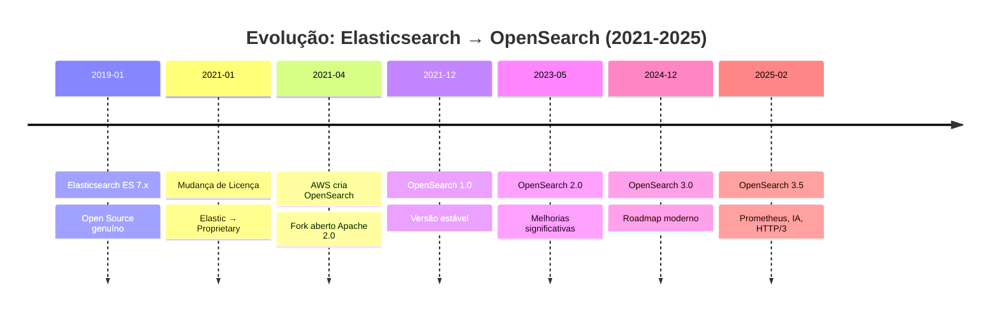
, como fork mantido sob licença Apache 2.0, com os seguintes objetivos:

- Manter compatibilidade inicial com Elasticsearch 7.10.2
- Desenvolver features inovadoras de forma transparente
- Permitir contribuições da comunidade sem restrições
- Oferecer alternativa viável para organizações com necessidades de busca distribuída open-source

**Timeline: Evolução do OpenSearch vs Elasticsearch**


### 1.2.2 OpenSearch 3.5: Novidades e Melhorias

OpenSearch 3.5 introduz suporte expandido para Prometheus, Search Relevance Workbench, memória agentica para aplicações auto-aprendentes, e controle aumentado sobre performance e eficiência de queries. Recursos principais incluem:

**Observabilidade Aprimorada:**
- Integração Prometheus com autocomplete para PromQL e suporte para tipos de métricas gauge
- Descoberta unificada de logs, métricas e traces

**Inteligência Artificial e Agentes:**
- Suporte experimental para protocolo AG-UI (Agent-User Interaction) que padroniza como agentes IA conectam a aplicações user-facing
- Memória agentica que captura contexto conversacional e raciocínio intermediário

**Melhorias de Rede:**
- Suporte experimental para HTTP/3 com protocolo QUIC, oferecendo benefícios de performance e resiliência comparado ao TCP

**Conectores ML Avançados:**
- Suporte a ações nomeadas customizadas
- Métodos HTTP adicionais (PUT e DELETE)
- Operações CRUD completas através de um connector único

### 1.2.3 O Ecossistema OpenSearch 3.5

O projeto OpenSearch 3.5 oferece um ecossistema completo:

**Componentes Principais:**
- OpenSearch Server (mecanismo de busca distribuído)
- OpenSearch Dashboards (interface de visualização)
- OpenSearch CLI (ferramentas de linha de comando)
- Plugins oficiais incluindo alerting, anomaly-detection, asynchronous-search, cross-cluster-replication, geospatial, knn, ml-commons, neural-search, notifications, observability, performance-analyzer, security, security-analytics, e sql
- SDKs em múltiplas linguagens (Python, JavaScript, Java, Go, Rust, PHP, .NET)

**Distribuições Disponíveis:**
- OpenSearch 3.5.0 disponível para download em arquivos .deb (Linux Debian/Ubuntu), .rpm (CentOS/RHEL), e Docker
- Suporte a arquiteuras x64 e arm64

---

## 1.3 CONCEITOS FUNDAMENTAIS DE ARQUITETURA DISTRIBUÍDA

OpenSearch é um mecanismo de busca distribuído, significando que pode executar em um ou mais nós—servidores que armazenam seus dados e processam requisições de busca. Um cluster OpenSearch é uma coleção de nós.


**Diagrama: Arquitetura de Cluster OpenSearch**

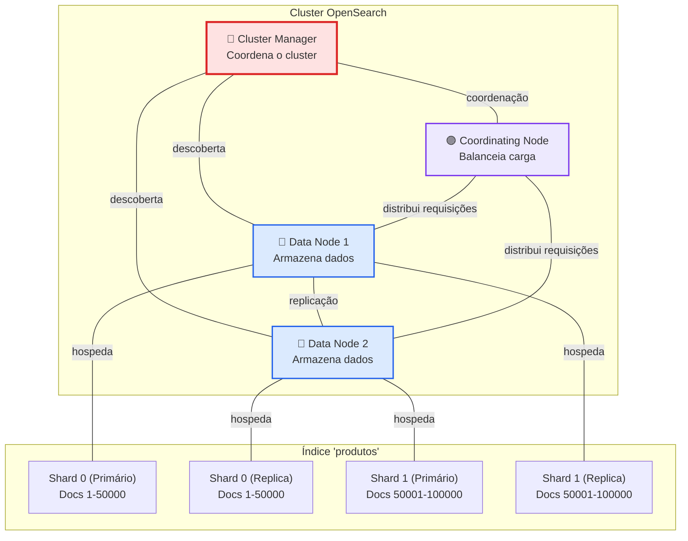


**Diagrama de Conceitos Fundamentais**

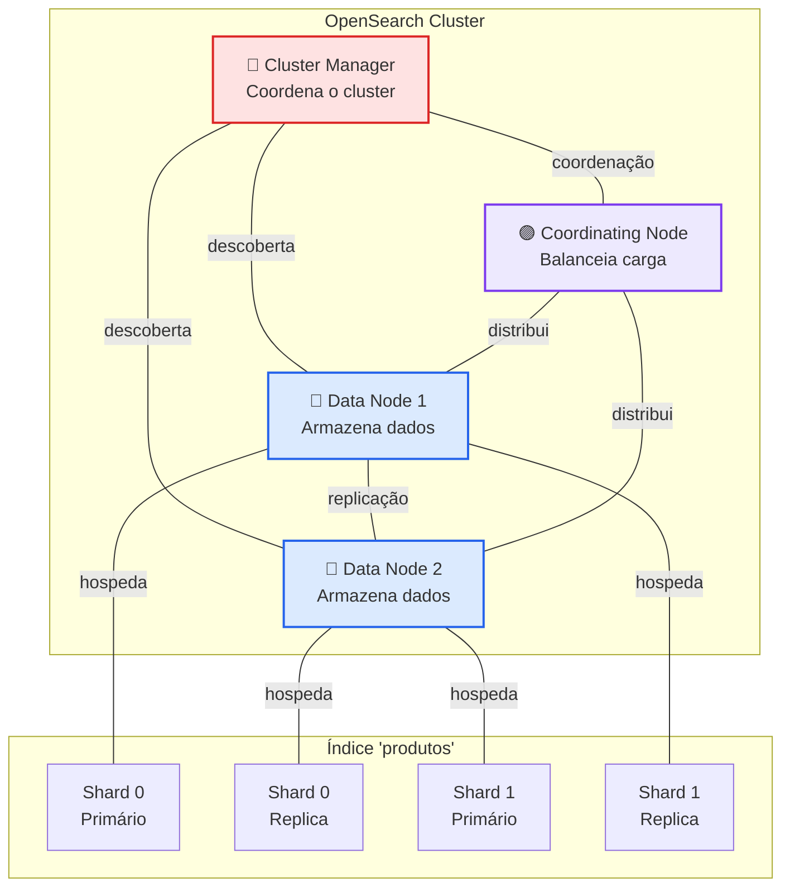

### 1.3.1 Nodes (Nós) e Tipos de Node

Por padrão, cada node é um cluster-manager-eligible, data, ingest e coordinating node. Decidir sobre o número de nodes, atribuir tipos de node e escolher hardware para cada tipo depende de seu caso de uso.


**Matriz de Tipos de Node e Responsabilidades**

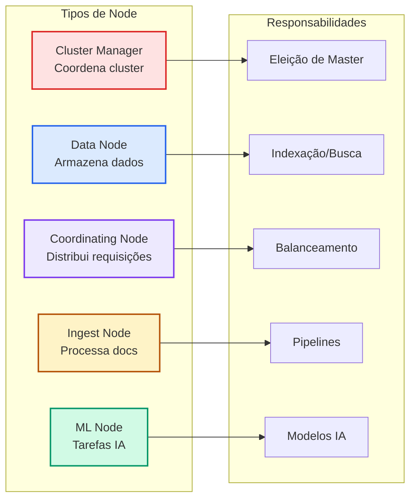


**Matriz de Tipos de Node e Responsabilidades**

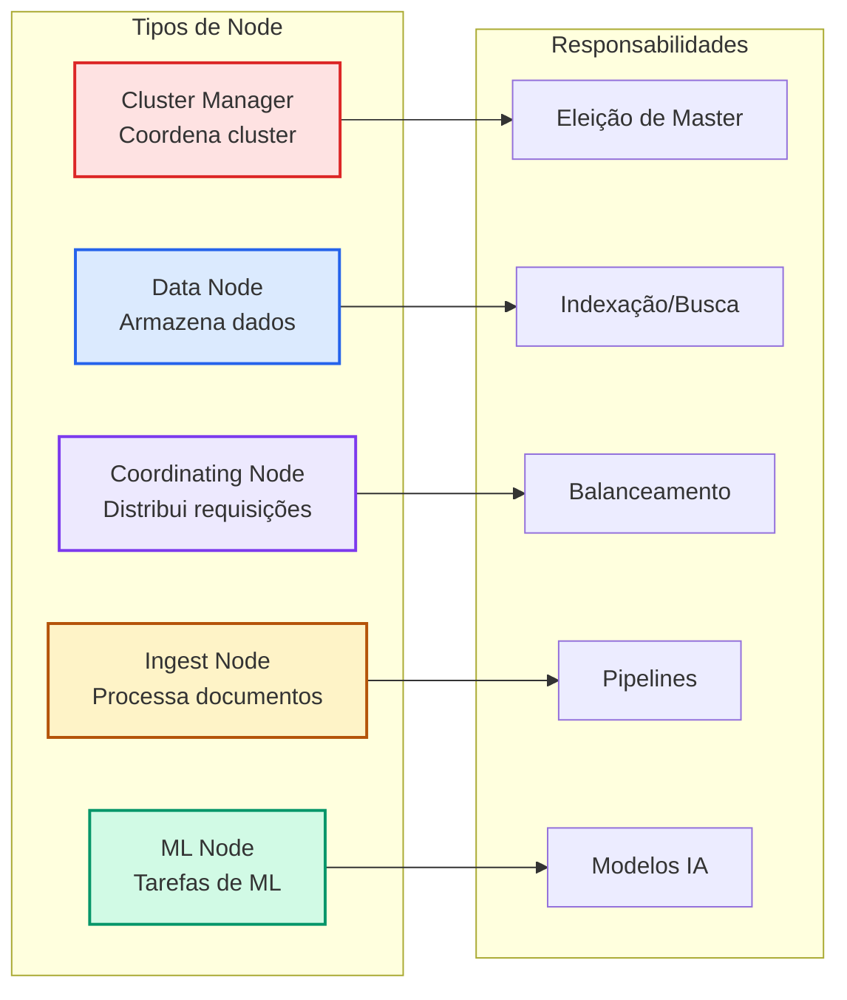

**Tipos Principais de Node:**

1. **Cluster Manager Node (anteriormente Master Node)**
   - Mantém o estado definitivo do cluster (por exemplo, membership de nós, metadados de índice, alocação de shards). Publicam atualizações de estado para todos os nós do cluster
   - Coordenam alocação de shards e rebalanceamento
   - Gerenciam configurações e políticas do cluster
   - Recomendação: 3 em produção (quórum distribuído)

2. **Data Nodes**
   - Armazenam dados e executam operações de busca/índice
   - Realizam operações computacionalmente intensivas
   - Consumem mais memória e CPU
   - Recomendação: 2+ em produção para redundância

3. **Coordinating Nodes**
   - Não armazenam dados nem participam de eleição de cluster manager
   - Distribuem requisições entre data nodes
   - Úteis para balanceamento de carga e agregação
   - Opcional em clusters pequenos

4. **Ingest Nodes** (novo em 3.5)
   - Pré-processam documentos antes de indexação
   - Executam pipelines de transformação de dados
   - Recomendação: Separados se volume alto de ingestão

5. **ML Nodes** (novo em 3.5)
   - Dedicados para execução de tarefas de machine learning
   - Não armazenam shards quando sem data role
   - Por padrão, tarefas ML e modelos executam apenas em ML nodes. Quando configurados sem data node role, ML nodes não armazenam shards

**Configuração de Node em opensearch.yml:**

```yaml
# Cluster Manager Node (dedicado)
node.name: "cluster-manager-1"
node.roles: [cluster_manager]

# Data Node (dedicado)
node.name: "data-node-1"
node.roles: [data]

# Ingest Node (dedicado)
node.name: "ingest-node-1"
node.roles: [ingest]

# Coordinating Node (sem roles)
node.name: "coordinating-node-1"
node.roles: []

# ML Node (dedicado)
node.name: "ml-node-1"
node.roles: [ml]

# Node Multi-papel (desenvolvimento apenas)
node.name: "all-in-one"
node.roles: [cluster_manager, data, ingest, ml]
```

### 1.3.2 Clusters e Descoberta de Nós

Quando você inicia um cluster OpenSearch, vários processos coordenados trabalham juntos: descoberta de nós, eleição de cluster manager, formação de cluster e gerenciamento de estado.

**Processo de Descoberta e Eleição de Cluster Manager**

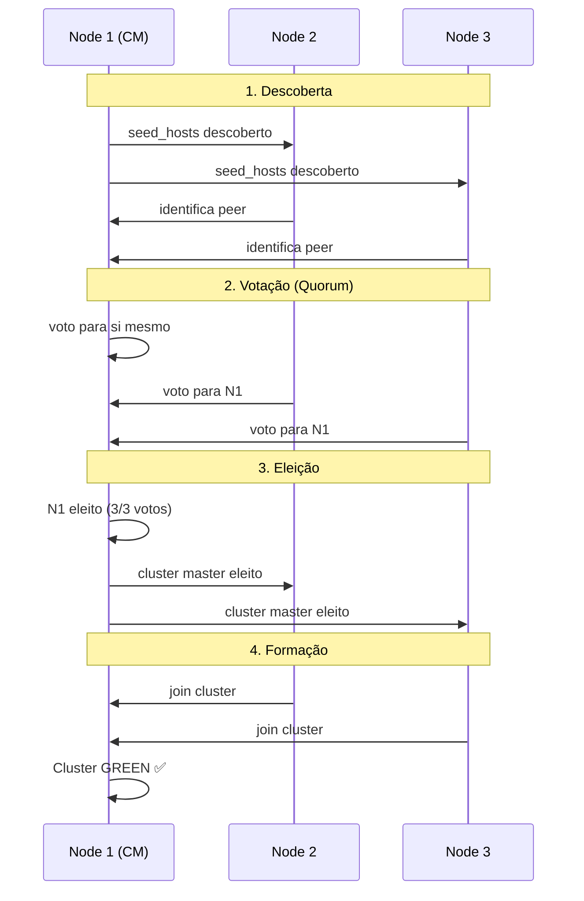

**Processo de Descoberta e Cluster Formation:**

Descoberta é como nós encontram outros nós ao iniciar ou quando conexão ao cluster manager é perdida. Este processo envolve: Seed hosts (lista configurável de endereços de nós conhecidos que servem como entry points), Host providers (mecanismos para fornecer informações de seed hosts), e Identificação de nós (verificação que nós descobertos são elegíveis para participar do cluster).

**Mecanismo de Quorum:**

OpenSearch usa um mecanismo sofisticado de votação para assegurar que exatamente um cluster manager existe em qualquer tempo: Voting configuration (conjunto de cluster-manager-eligible nodes que participam de eleições), Quorum requirements (eleições requerem maioria de voting nodes para prevenir split-brain), e Automatic reconfiguration (voting configuration se ajusta conforme nós entram e saem).


**Processo: Descoberta de Nós e Eleição de Cluster Manager**

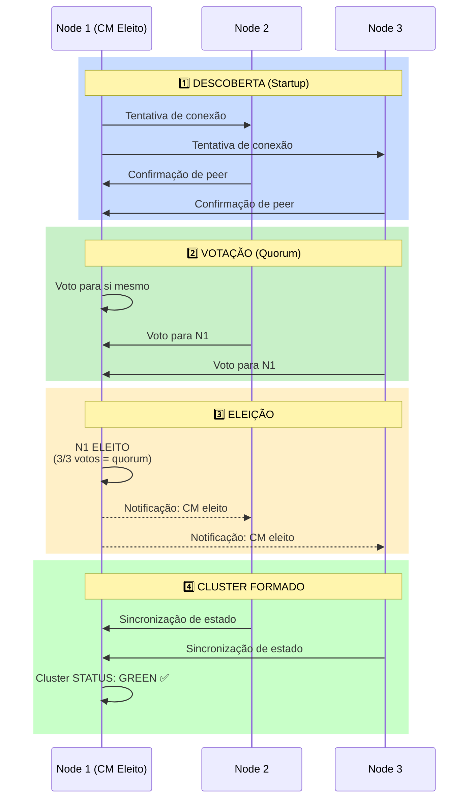


**Configuração de Seed Hosts:**

```yaml
# Static seed hosts (opensearch.yml)
discovery.seed_hosts:
  - "opensearch-cm1.example.com:9300"
  - "opensearch-cm2.example.com:9300"
  - "opensearch-cm3.example.com:9300"

# Cluster bootstrap (apenas na inicialização)
cluster.initial_master_nodes:
  - "opensearch-cm1"
  - "opensearch-cm2"
  - "opensearch-cm3"
```

### 1.3.3 Indices (Índices)

Um índice é uma coleção lógica de documentos similares. OpenSearch usa uma estrutura de dados chamada inverted index.

**Características:**
- Identificador único (nome)
- Contém documentos em formato JSON
- Possui configurações de mapping (schema)
- Pode ser dividido em múltiplos shards

**Exemplo de Criação:**

```json
PUT /produtos
{
  "settings": {
    "number_of_shards": 2,
    "number_of_replicas": 1,
    "index.lifecycle.name": "hot-warm-policy"
  },
  "mappings": {
    "properties": {
      "id": { "type": "keyword" },
      "nome": { "type": "text" },
      "categoria": { "type": "keyword" },
      "preco": { "type": "float" },
      "data_criacao": { "type": "date" }
    }
  }
}
```

### 1.3.4 Shards e Réplicas - Distribuição de Dados

Em OpenSearch, um shard pode ser um primary (original) shard ou um replica (cópia) shard. Por padrão, OpenSearch cria um replica shard para cada primary shard. Assim, se você dividir seu índice em 10 shards, OpenSearch cria 10 replica shards.

**Visualização: Distribuição de Shards em um Índice**

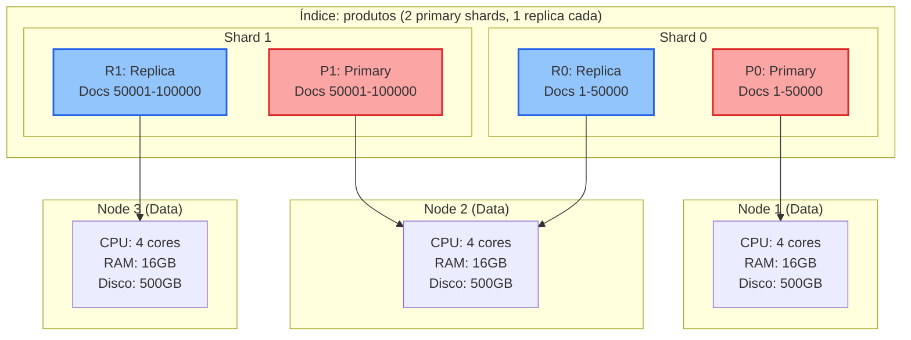

**Balanceamento Automático:**

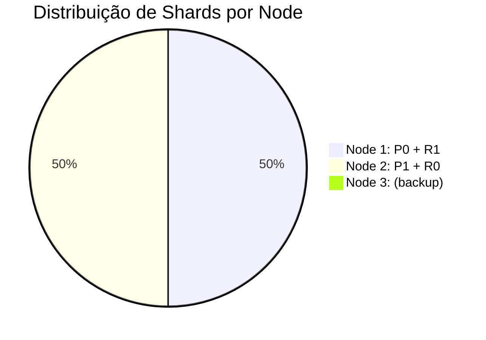


**Visualização: Distribuição de Shards em um Índice**

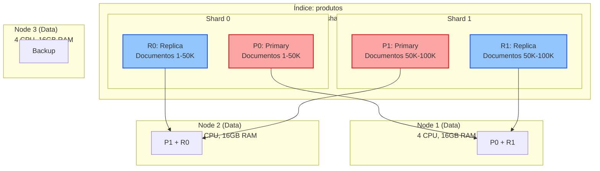

**Distribuição de Carga por Node:**


**Primary Shard (Shard Primário):**
- Contém a cópia original dos dados
- Quantidade definida na criação do índice
- Não pode ser alterada sem reindexação
- Recomendação: 1 shard para índices < 50GB, múltiplos para maiores

**Replica Shard (Shard de Réplica):**
- Cópia do primary shard
- Quantidade pode ser modificada em qualquer momento
- Aumenta disponibilidade e throughput de leitura
- Recomendação: Mínimo 1 em produção

**Distribuição e Alocação:**

Shard allocation filtering permite você restringir onde shards para um índice são colocados ao combinar atributos de nós. Você pode usá-lo para fixar shards a certos nós, evitar nós, ou requerer hardware específico ou zonas.

**Exemplo de Alocação com Atributos:**

```yaml
# opensearch.yml - Defina atributos de nó
node.attr.temperature: hot

# Alocação de índice
PUT /novos-dados/_settings
{
  "index.routing.allocation.require.temperature": "hot"
}
```

**Diagrama Visual: Topologia de Cluster com Shards**

Consulte o arquivo `diagramas_opensearch.excalidraw.json` para visualizar:
- Cluster com 4 nós (Cluster Manager, 2 Data Nodes, Coordinating Node)
- Distribuição de shards primários e replicas
- Balanceamento automático de dados

---

## 1.4 OPENSEARCH 3.5 VS ELASTICSEARCH: ANÁLISE COMPARATIVA

Embora OpenSearch tenha origem em Elasticsearch 7.10.2, as plataformas divergiram significativamente. Esta seção oferece análise técnica para auxiliar na escolha.


**Comparação Visual: Filosofia de Desenvolvimento**

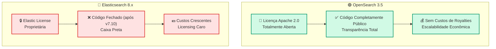

**Roadmaps Divergentes**

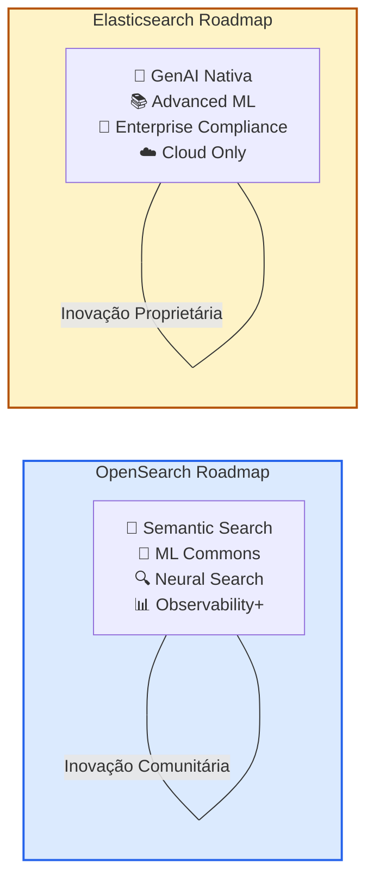


**Comparação Visual: Licensing e Liberdade**

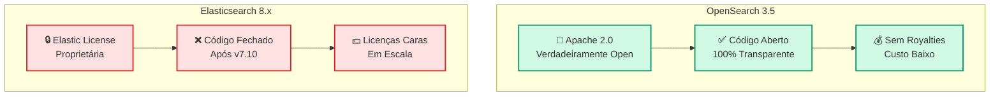

**Evolução de Features (OpenSearch vs Elasticsearch)**

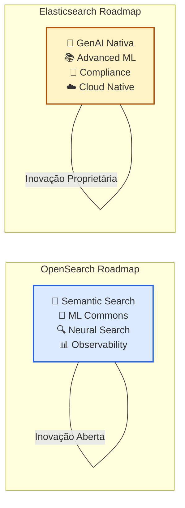

### 1.4.1 Licensing e Liberdade

| Aspecto | OpenSearch 3.5 | Elasticsearch 8.x | Vencedor |
|---------|-----------|--------------|----------|
| **Licença** | Apache 2.0 (código aberto genuíno) | Elastic License + SSPL | OpenSearch |
| **Código-fonte** | Totalmente disponível | Versões antigas sim, novas: proprietário | OpenSearch |
| **Redistribuição** | Permitida livremente | Restrita | OpenSearch |
| **Modificações** | Livres sem restrições | Restringidas em produção | OpenSearch |
| **Custo inicial** | Gratuito | Gratuito (versão OSS descontinuada) | OpenSearch |
| **Custos operacionais** | Sem royalties | Licenças comerciais necessárias | OpenSearch |

### 1.4.2 Compatibilidade de API REST

OpenSearch mantém compatibilidade de API REST com Elasticsearch 7.10.2 como ponto de partida. Porém, versões 3.5+ divergem:

**100% compatível com ES 7.10:**
```
GET /index_name/_search
POST /index_name/_doc
GET /index_name/_mapping
PUT /_cluster/settings
```

**Divergências em OpenSearch 3.5:**
- **Semantic Search** (busca semântica com vetores)
- **ML Commons** com suporte a agentes IA
- **Neural Search** com modelos de IA
- **Observability** integrado com Prometheus
- **Security Analytics** para detecção de ameaças

**Features do Elasticsearch 8.x não em OpenSearch:**
- Generative AI nativa (Elasticsearch GenAI)
- Alguns modelos de ML proprietários
- Elastic Cloud com otimizações proprietárias

### 1.4.3 Performance e Recursos (OpenSearch 3.5)

**Requisitos Mínimos:**
- RAM: 2GB para single-node, 8GB recomendado para produção
- CPU: 2 cores mínimo, 4+ recomendado
- Disco: 5GB para single-node, depende de volume de dados em produção

**Melhorias em 3.5:**
- OpenSearch Dashboards versões 3.5 e posteriores incluem Node.js 22
- Melhor suporte a HTTP/3 para conexões de baixa latência
- Otimizações em concurrent search

**Benchmarks Típicos (OpenSearch 3.5):**
```
Inserções/segundo (bulk indexing):
- OpenSearch 3.5: ~50,000 docs/sec (melhoria vs 2.x)

Tempo de query (1M documents):
- OpenSearch 3.5: ~12-20ms (p95)
- Comparable com Elasticsearch 8.x
```

### 1.4.4 Tabela Resumida de Comparação

| Critério | OpenSearch 3.5 | Elasticsearch 8.x | Recomendação |
|----------|-----------|--------------|----------|
| **Licença genuína** | ✅ Apache 2.0 | ❌ Proprietária | OpenSearch |
| **Custo operacional** | ✅ Baixo | ❌ Alto em escala | OpenSearch |
| **Comunidade** | ✅ Crescente (AWS backing) | ✅✅ Maior | Elasticsearch |
| **Documentação** | ✅ Excelente (docs.opensearch.org) | ✅✅ Mais extensa | Elasticsearch |
| **Performance** | ✅ Excelente (3.5 melhorada) | ✅✅ Ligeiramente melhor | Empate técnico |
| **Suporte comercial** | ✅ AWS Support | ✅✅ Elastic Inc. | Elasticsearch |
| **Features inovadoras** | ✅ Semantic/ML/Security | ✅ GenAI/ML avançado | Caso-específico |
| **On-premise** | ✅✅ Ideal | ⚠️ Possível | OpenSearch |

### 1.4.5 Recomendações de Escolha

**Use OpenSearch 3.5 se:**
- Necessita absoluta liberdade de código-fonte (Apache 2.0)
- Quer evitar custos crescentes de licensing
- Executa on-premise sem suporte de vendor
- Precisa de customização profunda
- Trabalha com organizações com restrições de license proprietária
- Busca busca semântica e capacidades de IA integradas

**Use Elasticsearch se:**
- Precisa de suporte comercial 24/7 contratado
- Usa Elastic Cloud (SaaS otimizado)
- Requer ML/AI proprietários avançados
- Integração com stack Elastic completo é crítica
- Comunidade e documentação é prioridade máxima
- Necessita de compliance específicos fornecidos pela Elastic Inc.

---

## 1.5 INSTALAÇÃO LOCAL COM DOCKER - OPENSEARCH 3.5

OpenSearch 3.5.0 está disponível para download em múltiplos formatos. Nesta seção, você aprenderá a instalar um ambiente completo de desenvolvimento com OpenSearch 3.5 localmente usando Docker Compose.


**Fluxo de Inicialização: Docker Compose**

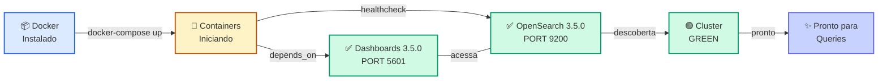

**Comparação: Single-Node vs Multi-Node**

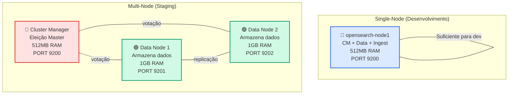


**Fluxo de Instalação Docker**


**Arquitetura: Single-Node vs Multi-Node**

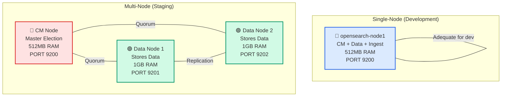

### 1.5.1 Pré-requisitos

1. **Docker Desktop** (ou Docker Engine)
   - Download: https://www.docker.com/products/docker-desktop
   - Versão mínima: Docker 20.10
   - Testar instalação: `docker --version`

2. **Docker Compose**
   - Geralmente incluído no Docker Desktop
   - Testar: `docker-compose --version`

3. **Recursos do Sistema**
   - RAM disponível: Mínimo 4GB (recomendado 8GB+)
   - Espaço em disco: 5GB livres
   - CPU: 2 cores (4 recomendado)

### 1.5.2 Instalação Single-Node (Desenvolvimento)

Criar arquivo `docker-compose.yml`:

```yaml
version: '3.8'

services:
  opensearch:
    image: opensearchproject/opensearch:3.5.0
    container_name: opensearch-node1
    environment:
      # Configurações iniciais de cluster
      - cluster.name=opensearch-cluster
      - node.name=opensearch-node1
      - node.roles=[cluster_manager,data,ingest]
      
      # Configuração de memória (JVM)
      - "OPENSEARCH_JAVA_OPTS=-Xms512m -Xmx512m"
      
      # Senha de admin inicial (obrigatório em 3.5+)
      - OPENSEARCH_INITIAL_ADMIN_PASSWORD=Admin@123456
      
      # Single-node setup
      - discovery.type=single-node
      
    ports:
      - "9200:9200"    # API REST
      - "9600:9600"    # Performance Analyzer
      
    volumes:
      - opensearch-data:/usr/share/opensearch/data
      
    networks:
      - opensearch-network

  opensearch-dashboards:
    image: opensearchproject/opensearch-dashboards:3.5.0
    container_name: opensearch-dashboards
    ports:
      - "5601:5601"
    environment:
      OPENSEARCH_HOSTS: '["https://opensearch:9200"]'
      OPENSEARCH_USERNAME: admin
      OPENSEARCH_PASSWORD: Admin@123456
      OPENSEARCH_SSL_VERIFICATIONMODE: none
    networks:
      - opensearch-network
    depends_on:
      - opensearch

volumes:
  opensearch-data:

networks:
  opensearch-network:
    driver: bridge
```

**Iniciando:**

```bash
# Iniciar em foreground (ver logs)
docker-compose up

# OU iniciar em background
docker-compose up -d

# Aguardar ~30-60 segundos para inicialização
```

**Verificando Instalação:**

```bash
# Teste 1: Health check
curl -k -u admin:Admin@123456 https://localhost:9200/

# Teste 2: Acessar Dashboard
# Navegador: https://localhost:5601
# Credenciais: admin / Admin@123456
```

### 1.5.3 Instalação Multi-Node (Staging/QA)

Para simular ambiente real com 3 cluster managers e 2 data nodes:

```yaml
version: '3.8'

services:
  # Cluster Manager 1
  opensearch-cm1:
    image: opensearchproject/opensearch:3.5.0
    container_name: opensearch-cm1
    environment:
      - cluster.name=opensearch-cluster
      - node.name=opensearch-cm1
      - node.roles=[cluster_manager,remote_cluster_client]
      - discovery.seed_hosts=opensearch-cm1,opensearch-cm2,opensearch-cm3,opensearch-data1,opensearch-data2
      - cluster.initial_cluster_manager_nodes=opensearch-cm1,opensearch-cm2,opensearch-cm3
      - "OPENSEARCH_JAVA_OPTS=-Xms512m -Xmx512m"
      - OPENSEARCH_INITIAL_ADMIN_PASSWORD=Admin@123456
    ports:
      - "9200:9200"
    volumes:
      - opensearch-cm1-data:/usr/share/opensearch/data
    networks:
      - opensearch-network
    healthcheck:
      test: ["CMD-SHELL", "curl -f -k -u admin:Admin@123456 https://localhost:9200 || exit 1"]
      interval: 10s
      timeout: 5s
      retries: 5

  # Cluster Manager 2
  opensearch-cm2:
    image: opensearchproject/opensearch:3.5.0
    container_name: opensearch-cm2
    environment:
      - cluster.name=opensearch-cluster
      - node.name=opensearch-cm2
      - node.roles=[cluster_manager,remote_cluster_client]
      - discovery.seed_hosts=opensearch-cm1,opensearch-cm2,opensearch-cm3,opensearch-data1,opensearch-data2
      - cluster.initial_cluster_manager_nodes=opensearch-cm1,opensearch-cm2,opensearch-cm3
      - "OPENSEARCH_JAVA_OPTS=-Xms512m -Xmx512m"
      - OPENSEARCH_INITIAL_ADMIN_PASSWORD=Admin@123456
    ports:
      - "9201:9200"
    volumes:
      - opensearch-cm2-data:/usr/share/opensearch/data
    networks:
      - opensearch-network
    depends_on:
      opensearch-cm1:
        condition: service_healthy

  # Cluster Manager 3
  opensearch-cm3:
    image: opensearchproject/opensearch:3.5.0
    container_name: opensearch-cm3
    environment:
      - cluster.name=opensearch-cluster
      - node.name=opensearch-cm3
      - node.roles=[cluster_manager,remote_cluster_client]
      - discovery.seed_hosts=opensearch-cm1,opensearch-cm2,opensearch-cm3,opensearch-data1,opensearch-data2
      - cluster.initial_cluster_manager_nodes=opensearch-cm1,opensearch-cm2,opensearch-cm3
      - "OPENSEARCH_JAVA_OPTS=-Xms512m -Xmx512m"
      - OPENSEARCH_INITIAL_ADMIN_PASSWORD=Admin@123456
    ports:
      - "9202:9200"
    volumes:
      - opensearch-cm3-data:/usr/share/opensearch/data
    networks:
      - opensearch-network
    depends_on:
      opensearch-cm1:
        condition: service_healthy

  # Data Node 1
  opensearch-data1:
    image: opensearchproject/opensearch:3.5.0
    container_name: opensearch-data1
    environment:
      - cluster.name=opensearch-cluster
      - node.name=opensearch-data1
      - node.roles=[data,ingest,remote_cluster_client]
      - discovery.seed_hosts=opensearch-cm1,opensearch-cm2,opensearch-cm3,opensearch-data1,opensearch-data2
      - "OPENSEARCH_JAVA_OPTS=-Xms1g -Xmx1g"
      - OPENSEARCH_INITIAL_ADMIN_PASSWORD=Admin@123456
    ports:
      - "9203:9200"
    volumes:
      - opensearch-data1-data:/usr/share/opensearch/data
    networks:
      - opensearch-network
    depends_on:
      opensearch-cm1:
        condition: service_healthy

  # Data Node 2
  opensearch-data2:
    image: opensearchproject/opensearch:3.5.0
    container_name: opensearch-data2
    environment:
      - cluster.name=opensearch-cluster
      - node.name=opensearch-data2
      - node.roles=[data,ingest,remote_cluster_client]
      - discovery.seed_hosts=opensearch-cm1,opensearch-cm2,opensearch-cm3,opensearch-data1,opensearch-data2
      - "OPENSEARCH_JAVA_OPTS=-Xms1g -Xmx1g"
      - OPENSEARCH_INITIAL_ADMIN_PASSWORD=Admin@123456
    ports:
      - "9204:9200"
    volumes:
      - opensearch-data2-data:/usr/share/opensearch/data
    networks:
      - opensearch-network
    depends_on:
      opensearch-cm1:
        condition: service_healthy

  opensearch-dashboards:
    image: opensearchproject/opensearch-dashboards:3.5.0
    container_name: opensearch-dashboards
    ports:
      - "5601:5601"
    environment:
      OPENSEARCH_HOSTS: '["https://opensearch-cm1:9200"]'
      OPENSEARCH_USERNAME: admin
      OPENSEARCH_PASSWORD: Admin@123456
      OPENSEARCH_SSL_VERIFICATIONMODE: none
    networks:
      - opensearch-network
    depends_on:
      opensearch-cm1:
        condition: service_healthy

volumes:
  opensearch-cm1-data:
  opensearch-cm2-data:
  opensearch-cm3-data:
  opensearch-data1-data:
  opensearch-data2-data:

networks:
  opensearch-network:
    driver: bridge
```

**Verificando Cluster:**

```bash
# Status do cluster
curl -k -u admin:Admin@123456 https://localhost:9200/_cluster/health?pretty

# Informações de nós
curl -k -u admin:Admin@123456 https://localhost:9200/_nodes?pretty

# Distribuição de shards
curl -k -u admin:Admin@123456 https://localhost:9200/_cat/shards?v
```

### 1.5.4 Comandos Docker Essenciais

```bash
# Ver containers em execução
docker-compose ps

# Logs em tempo real
docker-compose logs -f opensearch

# Acessar shell do container
docker-compose exec opensearch bash

# Parar containers
docker-compose stop

# Remover containers e volumes (deleta dados)
docker-compose down -v

# Reconstruir imagens
docker-compose build --no-cache

# Ver uso de recursos
docker stats
```

### 1.5.5 Troubleshooting Comum (OpenSearch 3.5)

**Problema: "max virtual memory areas [65530] is less than required [262144]"**

Solução (Linux):
```bash
sysctl -w vm.max_map_count=262144

# Permanentemente em /etc/sysctl.conf:
echo "vm.max_map_count=262144" | sudo tee -a /etc/sysctl.conf
```

**Problema: "Unable to connect to OPENSEARCH"**

Verificar inicialização:
```bash
docker-compose logs opensearch | tail -30

# Aguardar mensagem: "Node started"
```

**Problema: "authentication failed" em dashboard**

Verificar credenciais:
```bash
# Credentials padrão 3.5+
username: admin
password: [seu OPENSEARCH_INITIAL_ADMIN_PASSWORD]
```

---

## 1.6 OPERAÇÕES BÁSICAS - PRIMEIROS PASSOS PRÁTICOS

### 1.6.1 Criando um Índice

```bash
# Índice básico com 2 shards e 1 réplica
curl -k -u admin:Admin@123456 -X PUT "https://localhost:9200/livros" \
  -H "Content-Type: application/json" \
  -d '{
    "settings": {
      "number_of_shards": 2,
      "number_of_replicas": 1
    },
    "mappings": {
      "properties": {
        "titulo": { "type": "text" },
        "autor": { "type": "keyword" },
        "preco": { "type": "float" },
        "data_publicacao": { "type": "date" }
      }
    }
  }'
```

### 1.6.2 Inserindo Documentos (Bulk)

```bash
curl -k -u admin:Admin@123456 -X POST "https://localhost:9200/_bulk" \
  -H "Content-Type: application/json" \
  -d '
{ "index": { "_index": "livros" } }
{ "titulo": "Design Patterns", "autor": "Gang of Four", "preco": 125.00, "data_publicacao": "1994-10-31" }
{ "index": { "_index": "livros" } }
{ "titulo": "Clean Code", "autor": "Robert C. Martin", "preco": 95.00, "data_publicacao": "2008-08-01" }
{ "index": { "_index": "livros" } }
{ "titulo": "The Pragmatic Programmer", "autor": "Hunt and Thomas", "preco": 75.00, "data_publicacao": "1999-10-20" }
'
```

### 1.6.3 Buscando Dados

```bash
# Match simples
curl -k -u admin:Admin@123456 -X GET "https://localhost:9200/livros/_search" \
  -H "Content-Type: application/json" \
  -d '{
    "query": {
      "match": {
        "titulo": "Design"
      }
    }
  }'

# Busca avançada com filtro
curl -k -u admin:Admin@123456 -X GET "https://localhost:9200/livros/_search" \
  -H "Content-Type: application/json" \
  -d '{
    "query": {
      "bool": {
        "must": [
          { "match": { "titulo": "código" } }
        ],
        "filter": [
          { "range": { "preco": { "gte": 50, "lte": 150 } } }
        ]
      }
    }
  }'
```

### 1.6.4 Monitorando Cluster

```bash
# Status do cluster
curl -k -u admin:Admin@123456 https://localhost:9200/_cluster/health?pretty

# Detalhes de nós
curl -k -u admin:Admin@123456 https://localhost:9200/_nodes/stats?pretty

# Lista de índices
curl -k -u admin:Admin@123456 https://localhost:9200/_cat/indices?v

# Distribuição de shards
curl -k -u admin:Admin@123456 https://localhost:9200/_cat/shards?v

# Estatísticas de disco
curl -k -u admin:Admin@123456 https://localhost:9200/_cat/allocation?v
```

---

## 1.7 CAIXA DE DEFINIÇÕES

**Cluster Manager Node**: Nó elegível responsável pela coordenação do cluster, gerenciamento de estado e eleição automática em caso de falha. Anteriormente chamado de "Master Node".

**Data Node**: Nó que armazena dados e executa operações de busca e indexação. Realiza operações computacionalmente intensivas.

**Coordinating Node**: Nó que não armazena dados nem participa de eleição de cluster manager, mas distribui requisições entre data nodes. Útil para balanceamento de carga.

**Cluster**: Coleção de nós conectados que funcionam como um sistema distribuído único, identificado por `cluster.name`.

**Index (Índice)**: Coleção lógica de documentos similares, análogo a uma tabela em banco de dados relacional.

**Shard**: Partição de um índice. Dados distribuídos entre shards para paralelismo e escalabilidade.

**Primary Shard**: Cópia original dos dados de um índice. Quantidade configurável na criação.

**Replica Shard**: Cópia de um primary shard. Aumenta disponibilidade e capacidade de leitura.

**Discovery**: Processo pelo qual nós OpenSearch locam uns aos outros na rede.

**Quorum**: Maioria de voting nodes necessária para eleger cluster manager e prevenir split-brain.

**Inverted Index**: Estrutura de dados utilizada por OpenSearch para indexação eficiente de texto.

---

## 1.8 QUADROS DE DESTAQUE E ALERTAS

### ⚠️ ALERTA: Segurança em OpenSearch 3.5+

OpenSearch 3.5+ **requer senha de admin na inicialização**. Não é mais possível desabilitar security:

```bash
# OBRIGATÓRIO em 3.5+
OPENSEARCH_INITIAL_ADMIN_PASSWORD=SuaSenhaSegura

# Senhas fracas serão rejeitadas:
# - Mínimo 8 caracteres
# - Deve conter: maiúscula, minúscula, número, caractere especial
```

### 💡 DICA: Replicação e Status do Cluster

Em cluster single-node, replicas não podem ser alocadas. Cluster mostra "YELLOW" (não RED):

```bash
curl -k -u admin:Admin@123456 \
  https://localhost:9200/_cluster/health?pretty

# Status "yellow" = replicas não alocadas (esperado single-node)
# Status "green" = todos os shards alocados (multi-node)
# Status "red" = primary shards não alocados (problema sério)
```

### 📌 OBSERVAÇÃO: Node.js 22 em Dashboards 3.5+

OpenSearch Dashboards versões 3.5 e posteriores incluem Node.js 22. Se usar Node.js externo:

```bash
# Versões compatíveis: >=14.20.1 <23
node --version  # Verificar compatibilidade
```

### 🔒 IMPORTANTE: HTTP vs HTTPS

OpenSearch 3.5+ usa HTTPS por padrão. Comunicação com dashboard requer SSL:

```yaml
# opensearch.yml
plugins.security.ssl.http.enabled: true
plugins.security.ssl.http.pemcert_filepath: certs/node1.pem
plugins.security.ssl.http.pemkey_filepath: certs/node1-key.pem
```

---

## 1.9 EXERCÍCIOS DE FIXAÇÃO

### Exercício 1: Configuração de Cluster Multi-Node

**Objetivo**: Praticar concepção de arquitetura e tipos de node.

**Tarefa**:
1. Modifique o `docker-compose.yml` multi-node para adicionar 1 coordinating node
2. Configure-o com `node.roles: []` (sem roles)
3. Inicie o cluster e verifique: `curl -k -u admin:Admin@123456 https://localhost:9200/_cat/nodes?v`
4. Identifique papel de cada nó na saída

**Dica**: Coordinating nodes têm `node.roles` vazio no output.

---

### Exercício 2: Criação de Índice com Alocação Estratégica

**Objetivo**: Praticar alocação de shards e replicação.

**Cenário**: E-commerce com dados quentes (últimos 30 dias) e mornos (antes disso).

**Tarefa**:
1. Adicione atributo de nó em opensearch.yml:
   ```yaml
   node.attr.data_temperature: hot  # para data1
   node.attr.data_temperature: warm # para data2
   ```

2. Crie índice alocando apenas para nós quentes:
   ```json
   PUT /vendas-2025
   {
     "settings": {
       "number_of_shards": 3,
       "number_of_replicas": 1,
       "index.routing.allocation.require.data_temperature": "hot"
     }
   }
   ```

3. Verifique alocação: `curl -k -u admin:Admin@123456 https://localhost:9200/_cat/shards?v`

---

### Exercício 3: Observação de Saúde do Cluster

**Objetivo**: Entender indicadores de saúde e diagnóstico.

**Tarefa**:
1. Com cluster rodando, execute:
   ```bash
   curl -k -u admin:Admin@123456 \
     https://localhost:9200/_cluster/health?pretty
   ```

2. Documente:
   - Status geral (green/yellow/red)?
   - Número de nós?
   - Número de shards ativos?
   - Shards não alocados?

3. Parar um data node e reobservar saúde
4. Restaurar e observar rebalanceamento

---

### Exercício 4: Busca com Preferência de Shard

**Objetivo**: Entender roteamento inteligente de requisições.

**Tarefa**:
1. Insira 100 documentos em um índice
2. Execute buscas com diferentes preferências:
   ```bash
   # Preferir replicas
   GET /seu-indice/_search?preference=_replica_first
   
   # Apenas primary shards
   GET /seu-indice/_search?preference=_local
   
   # Nós específicos
   GET /seu-indice/_search?preference=_only_nodes:nó1,nó2
   ```

3. Medir tempo de resposta e explicar diferenças

---

## 1.10 SÍNTESE DO CAPÍTULO

**Conceitos-Chave Aprendidos:**

- **OpenSearch 3.5** é plataforma open-source (Apache 2.0) derivada de Elasticsearch para busca distribuída
- **Arquitetura distribuída** baseada em cluster managers, data nodes, coordinating nodes e ML nodes
- **Shards** são partições físicas para paralelismo; **replicas** são cópias para disponibilidade
- **Descoberta e quorum** garantem formação de cluster confiável
- **Instalação Docker** simplifica setup local e multi-node
- **Segurança obrigatória** em 3.5+ com senhas administrativas
- **Monitoramento** via endpoints `_cluster/health`, `_cat/nodes`, `_cat/shards`

**Próximos Passos:** Capítulo 2 aprofundará em indexação, mapeamento de tipos avançados, analyzers customizados e otimizações de performance.

---

## 1.11 REFERÊNCIAS E LEITURA COMPLEMENTAR

OPENSEARCH PROJECT. Introduction to OpenSearch. Disponível em: https://docs.opensearch.org/latest/getting-started/intro/. Acesso em: 2025.

OPENSEARCH PROJECT. Creating a Cluster. Disponível em: https://docs.opensearch.org/latest/tuning-your-cluster/. Acesso em: 2025.

OPENSEARCH PROJECT. Discovery and Cluster Formation. Disponível em: https://docs.opensearch.org/latest/tuning-your-cluster/discovery-cluster-formation/. Acesso em: 2025.

OPENSEARCH PROJECT. Installing OpenSearch. Disponível em: https://docs.opensearch.org/latest/install-and-configure/install-opensearch/debian/. Acesso em: 2025.

OPENSEARCH PROJECT. Index Settings. Disponível em: https://docs.opensearch.org/latest/install-and-configure/configuring-opensearch/index-settings/. Acesso em: 2025.

OPENSEARCH PROJECT. Shard Allocation. Disponível em: https://docs.opensearch.org/latest/api-reference/index-apis/shard-allocation/. Acesso em: 2025.

OPENSEARCH PROJECT. ML Commons Cluster Settings. Disponível em: https://docs.opensearch.org/latest/ml-commons-plugin/cluster-settings/. Acesso em: 2025.

OPENSEARCH. OpenSearch 3.5 is Live! Disponível em: https://opensearch.org/blog/opensearch-3-5-is-live/. Acesso em: 2025.

OPENSEARCH PROJECT. Breaking Changes. Disponível em: https://docs.opensearch.org/latest/breaking-changes/. Acesso em: 2025.

---

**Fim do Capítulo 1**

*Diagramas: Consulte arquivo `diagramas_opensearch.excalidraw.json` para visualizações de arquitetura*

*Próximo capítulo: 2. Indexação, Mapeamento de Dados e Tipos Avançados*