# CAPÍTULO 2: CONCEITOS FUNDAMENTAIS

## 2. CONCEITOS FUNDAMENTAIS

### Objetivos de Aprendizagem

Ao final deste capítulo, você será capaz de:

1. Compreender a estrutura hierárquica de índices, documentos e tipos de dados no OpenSearch
2. Implementar mapeamentos dinâmicos e explícitos para estruturação de dados
3. Aplicar analyzers e tokenização para otimizar buscas textuais
4. Explicar o funcionamento do inverted index e suas estruturas internas
5. Executar operações CRUD completas via API REST do OpenSearch

---

## 2.1 FUNDAÇÕES: ÍNDICES, DOCUMENTOS E TIPOS DE DADOS

### Introdução Conceitual

O OpenSearch organiza dados em uma hierarquia bem definida: **cluster** → **índice** → **documento** → **campo**. Compreender essa estrutura é fundamental para trabalhar efetivamente com a plataforma, pois determina como os dados são armazenados, indexados e recuperados.

Diferentemente de bancos de dados relacionais tradicionais, onde você trabalha com tabelas e registros, o OpenSearch utiliza um modelo baseado em **documentos JSON** armazenados em **índices**. Essa abordagem oferece flexibilidade estrutural e escalabilidade horizontal, permitindo buscas ultra-rápidas em volumes massivos de dados.

### 2.1.1 Índices: O Contenedor de Dados

Um **índice** no OpenSearch é a unidade básica de armazenamento e representa um conjunto lógico de documentos relacionados. Você pode pensar em um índice como equivalente a uma tabela em um banco de dados relacional, mas com capacidades muito mais robustas de busca.

**Características principais de um índice:**

- **Distribuído**: Os dados são divididos em shards (fragmentos) distribuídos entre múltiplos nós
- **Replicável**: Cada shard possui réplicas para alta disponibilidade
- **Versionado**: Suporta controle de versão automático de documentos
- **Mapeável**: Possui um schema flexível que pode ser definido ou evoluir dinamicamente

Um índice é identificado por um **nome único** no cluster. Por convenção, os nomes devem seguir padrões como: `logs-aplicacao-2025`, `produtos-ecommerce`, `usuarios-ativa`.

**Arquitetura hierárquica de um índice:**

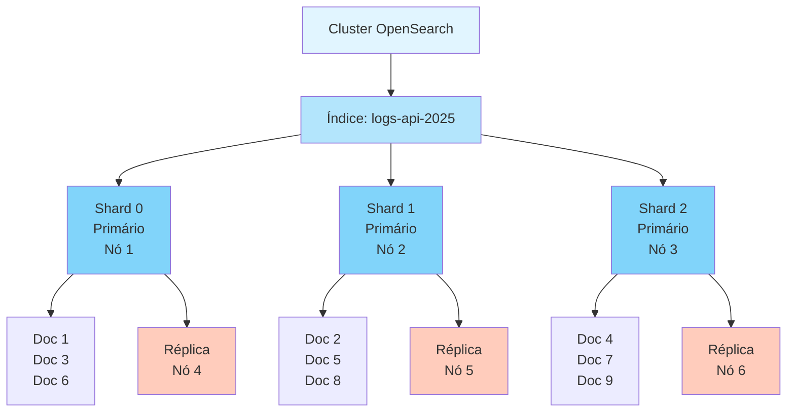

### 2.1.2 Documentos: Registros de Dados

Um **documento** é a unidade fundamental de dados no OpenSearch. Trata-se de um objeto JSON que contém dados estruturados ou semi-estruturados associados a um identificador único (\_id).

**Estrutura e composição de um documento:**

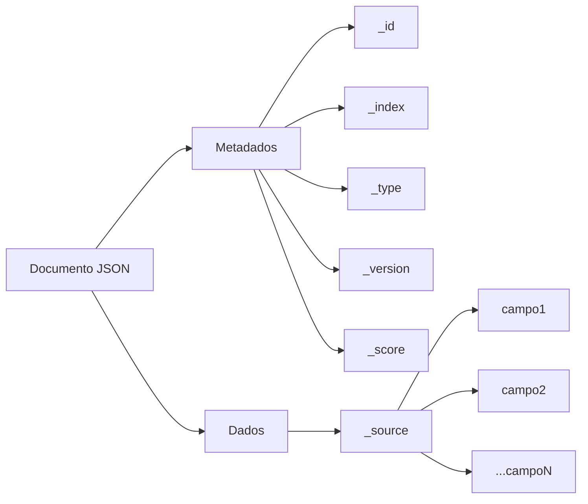

**Exemplo de documento completo:**

```json
{
  "_id": "12345",
  "_index": "produtos-ecommerce",
  "_type": "_doc",
  "_version": 1,
  "_score": 1.0,
  "_source": {
    "nome": "Notebook Dell XPS 13",
    "preco": 4500.00,
    "categoria": "Eletrônicos",
    "estoque": 25,
    "descricao": "Notebook ultraportátil com processador Intel Core i7",
    "criado_em": "2025-01-10T14:30:00Z",
    "ativo": true
  }
}
```

**Campos de metadados:**

- **\_id**: Identificador único do documento. Pode ser gerado automaticamente ou definido pelo usuário
- **\_index**: Nome do índice ao qual o documento pertence
- **\_type**: Tipo do documento (no OpenSearch 2.0+, sempre \_doc)
- **\_version**: Número de versão do documento (incrementado a cada modificação)
- **\_score**: Relevância do documento em uma busca (presente apenas em resultados de queries)
- **\_source**: Dados reais do documento em formato JSON

### 2.1.3 Tipos de Dados Suportados

O OpenSearch suporta diversos tipos de dados nativamente. A correta escolha de tipos impacta diretamente em performance, armazenamento e capacidades de busca.

**Categorização de tipos de dados:**

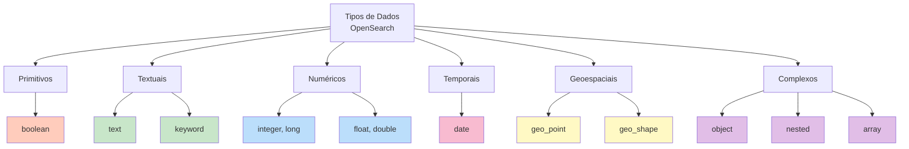

**Tipos de dados primitivos:**

| Tipo | Descrição | Exemplo |
|------|-----------|---------|
| text | Texto completo, analisado para buscas | "O rápido raposa marrom" |
| keyword | Texto exato, não analisado | "eletrônicos", "ativo" |
| integer | Número inteiro | 42, -100 |
| long | Número inteiro grande | 9223372036854775807 |
| float | Número decimal | 3.14, 99.99 |
| double | Número decimal de alta precisão | 2.718281828 |
| boolean | Verdadeiro/Falso | true, false |
| date | Data e hora ISO 8601 | "2025-01-15T10:30:00Z" |
| geo_point | Coordenadas geográficas | {"lat": -23.55, "lon": -46.63} |
| ip | Endereço IP | "192.168.1.1" |

**Tipos de dados complexos:**

| Tipo | Descrição | Uso |
|------|-----------|-----|
| object | Documento aninhado | Dados hierárquicos |
| nested | Array de objetos | Manter relação entre campos |
| keyword | Array de palavras-chave | Tags, categorias |
| text | Array de textos | Descrições múltiplas |

---

### 📌 **BOX DE DEFINIÇÃO: Diferença Entre text e keyword**

**text**: Campo analisado pelo analyzer padrão. Ideal para buscas em texto completo. Exemplo: descrições de produtos.

**keyword**: Campo não analisado, armazenado como valor exato. Ideal para filtros e agregações. Exemplo: status, categoria.

---

## 2.2 MAPPING: DEFININDO A ESTRUTURA DE DADOS

### Conceito e Importância

**Mapping** é o esquema que define como os documentos e seus campos devem ser indexados. É análogo ao schema de um banco de dados relacional, mas com maior flexibilidade e capacidades de busca.

Um bom mapping é crítico para:

- **Performance**: Tipos incorretos causam ineficiência de busca
- **Precisão**: Determina como dados são interpretados (número vs. texto)
- **Funcionalidade**: Habilita agregações, sorting e análises avançadas
- **Armazenamento**: Otimiza espaço em disco

### 2.2.1 Mapping Dinâmico

Quando você indexa um documento sem pré-definir um mapping, o OpenSearch **automaticamente detecta** os tipos de campos e cria o mapping dinamicamente. Isso oferece flexibilidade mas pode levar a inconsistências.

**Processo de mapping dinâmico vs. explícito:**

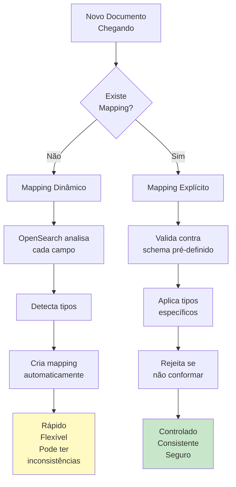

**Exemplo: Criando um índice e adicionando documento sem mapping prévio**

```bash
# Requisição HTTP POST
POST http://localhost:9200/produtos-dinamico/_doc
Content-Type: application/json

{
  "nome": "Mouse Logitech MX Master 3",
  "preco": 350.00,
  "em_estoque": true,
  "tags": ["periférico", "wireless"],
  "criado_em": "2025-01-15T10:30:00Z"
}
```

O OpenSearch automaticamente cria o mapping:

```json
{
  "produtos-dinamico": {
    "mappings": {
      "properties": {
        "nome": {
          "type": "text",
          "fields": {
            "keyword": {
              "type": "keyword",
              "ignore_above": 256
            }
          }
        },
        "preco": {
          "type": "float"
        },
        "em_estoque": {
          "type": "boolean"
        },
        "tags": {
          "type": "text",
          "fields": {
            "keyword": {
              "type": "keyword",
              "ignore_above": 256
            }
          }
        },
        "criado_em": {
          "type": "date"
        }
      }
    }
  }
}
```

**Vantagens:**

- ✓ Prototipagem rápida
- ✓ Flexibilidade imediata
- ✓ Ideal para dados exploratórios

**Desvantagens:**

- ✗ Tipos podem não ser ótimos
- ✗ Dificil controlar formato de datas
- ✗ Pode causar inconsistências entre documentos

### 2.2.2 Mapping Explícito

Para aplicações em produção, é recomendado definir o mapping **explicitamente** antes de indexar dados. Isso garante consistência, performance e controle total.

**Exemplo: Criando um índice com mapping explícito**

```bash
# Requisição HTTP PUT
PUT http://localhost:9200/produtos-explicitamente-mapeado
Content-Type: application/json

{
  "settings": {
    "number_of_shards": 1,
    "number_of_replicas": 0
  },
  "mappings": {
    "properties": {
      "id_produto": {
        "type": "keyword",
        "index": true
      },
      "nome": {
        "type": "text",
        "analyzer": "standard",
        "fields": {
          "raw": {
            "type": "keyword"
          }
        }
      },
      "descricao": {
        "type": "text",
        "analyzer": "portuguese"
      },
      "preco": {
        "type": "float"
      },
      "categoria": {
        "type": "keyword"
      },
      "estoque": {
        "type": "integer"
      },
      "ativo": {
        "type": "boolean"
      },
      "criado_em": {
        "type": "date",
        "format": "strict_date_time"
      },
      "atualizado_em": {
        "type": "date",
        "format": "strict_date_time"
      },
      "localizacao": {
        "type": "geo_point"
      }
    }
  }
}
```

**Parâmetros importantes do mapping:**

- **type**: Tipo de dado (text, keyword, integer, date, etc.)
- **analyzer**: Analisador para processamento de texto
- **index**: Se o campo deve ser indexável (true/false)
- **store**: Se o valor original deve ser armazenado separadamente
- **fields**: Sub-campos adicionais (exemplo: nome.raw para valor exato)
- **format**: Formato específico para datas

### 2.2.3 Padrão Multi-Campo (Multi-field)

Uma abordagem poderosa é mapear um campo de múltiplas formas, permitindo diferentes tipos de buscas:

```json
{
  "properties": {
    "titulo": {
      "type": "text",
      "analyzer": "portuguese",
      "fields": {
        "raw": {
          "type": "keyword"
        },
        "comprimento": {
          "type": "token_count",
          "analyzer": "standard"
        }
      }
    }
  }
}
```

Isso permite:
- Busca em texto completo: `GET /_search { "query": { "match": { "titulo": "opensearch" } } }`
- Filtro exato: `GET /_search { "query": { "term": { "titulo.raw": "OpenSearch" } } }`
- Contagem de palavras: `GET /_search { "aggs": { "media_palavras": { "avg": { "field": "titulo.comprimento" } } } }`

---

### ⚠️ **BOX DE ALERTA: Modificar Mapping em Produção**

Uma vez que um índice está criado e contém dados, **não é possível modificar o tipo de um campo existente**. Para alterar o mapping, você deve:

1. Criar um novo índice com o mapping corrigido
2. Reindexar dados do índice antigo para o novo
3. Atualizar aliases para apontar ao novo índice
4. Remover o índice antigo

Esta é uma operação crítica que deve ser planejada com cuidado em produção.

---

## 2.3 ANALYZERS E TOKENIZAÇÃO

### Conceito Fundamental

Um **analyzer** é um componente que processa texto para preparar campos do tipo `text` para indexação e busca. Ele transforma texto bruto em tokens (palavras individuais) que são indexados no inverted index.

A tokenização correta é essencial para a qualidade das buscas. Por exemplo:

- Texto original: "O rápido raposa marrom pulou sobre a cerca"
- Tokens após análise: ["rápido", "raposa", "marrom", "pulou", "cerca"]

### 2.3.1 Componentes de um Analyzer

Um analyzer é composto por três componentes:

1. **Character Filter**: Processa caracteres antes da tokenização
2. **Tokenizer**: Divide o texto em tokens
3. **Token Filter**: Modifica tokens após tokenização

**Fluxo de análise passo a passo:**

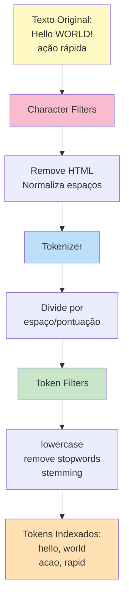

### 2.3.2 Analyzers Pré-configurados

O OpenSearch fornece diversos analyzers prontos para uso:

**Comparação visual de analyzers:**

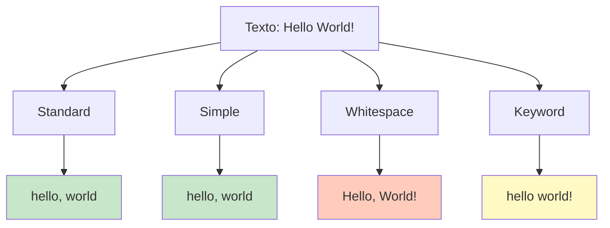

**Características de cada analyzer:**

**Standard Analyzer** (padrão)
- Character Filter: Nenhum
- Tokenizer: standard (divide por espaço e pontuação)
- Token Filter: lowercase
- Exemplo: "Hello World!" → ["hello", "world"]

**Simple Analyzer**
- Tokenizer: lowercase
- Divide por caracteres não-alfanuméricos
- Exemplo: "Hello World!" → ["hello", "world"]

**Whitespace Analyzer**
- Tokenizer: whitespace
- Divide apenas por espaço em branco
- Exemplo: "Hello-World!" → ["hello-world!"]

**Keyword Analyzer**
- Não divide o texto, trata como single token
- Ideal para valores que devem permanecer íntegros
- Exemplo: "Hello World!" → ["hello world!"]

**Language Analyzers**
- Específicos por idioma (english, portuguese, spanish, etc.)
- Incluem stopwords removal e stemming
- Exemplo com "portuguese": "executando" → ["execut"]

### 2.3.3 Criando Analyzers Customizados

Para necessidades específicas, você pode criar analyzers personalizados:

**Exemplo: Analyzer customizado para logs de API**

```bash
PUT http://localhost:9200/logs-api
Content-Type: application/json

{
  "settings": {
    "analysis": {
      "analyzer": {
        "log_analyzer": {
          "type": "custom",
          "char_filter": ["html_strip"],
          "tokenizer": "standard",
          "filter": ["lowercase", "stop", "snowball"]
        }
      },
      "char_filter": {
        "html_strip": {
          "type": "html_strip",
          "escaped_tags": ["b", "i"]
        }
      },
      "filter": {
        "stop": {
          "type": "stop",
          "stopwords": ["_english_", "para", "de", "a"]
        }
      }
    }
  },
  "mappings": {
    "properties": {
      "mensagem": {
        "type": "text",
        "analyzer": "log_analyzer"
      },
      "level": {
        "type": "keyword"
      },
      "timestamp": {
        "type": "date"
      }
    }
  }
}
```

**Exemplo: Analyzer para busca de nomes próprios (case-insensitive, sem stemming)**

```json
{
  "settings": {
    "analysis": {
      "analyzer": {
        "nome_analyzer": {
          "type": "custom",
          "tokenizer": "standard",
          "filter": ["lowercase"]
        }
      }
    }
  },
  "mappings": {
    "properties": {
      "nome_pessoa": {
        "type": "text",
        "analyzer": "nome_analyzer"
      }
    }
  }
}
```

### 2.3.4 Token Filters Importantes

| Filter | Função | Exemplo |
|--------|--------|---------|
| lowercase | Converte para minúsculas | "HELLO" → "hello" |
| stop | Remove palavras comuns | "the quick brown" → "quick brown" |
| snowball | Stemming (raiz da palavra) | "running" → "run" |
| synonym | Substitui por sinônimos | "carro" → "carro, automóvel" |
| length | Filtra por comprimento | Mantém tokens com 3-20 caracteres |

---

### 💡 **BOX DE DICA: Escolhendo o Analyzer Correto**

- **Buscas em texto completo**: Use language analyzers específicos (portuguese, english)
- **Buscas facetadas/filtros**: Use keyword (sem análise)
- **URLs e códigos**: Use whitespace ou custom sem stemming
- **Buscas multi-idioma**: Crie múltiplos campos com analyzers diferentes

---

## 2.4 INVERTED INDEX E ESTRUTURAS INTERNAS

### O Coração da Busca: Inverted Index

O **inverted index** é a estrutura de dados fundamental que permite buscas ultra-rápidas no OpenSearch. Diferentemente de um índice tradicional que mapeia documentos → conteúdo, o inverted index mapeia **termos → documentos**.

**Visualização comparativa: Forward vs. Inverted Index**

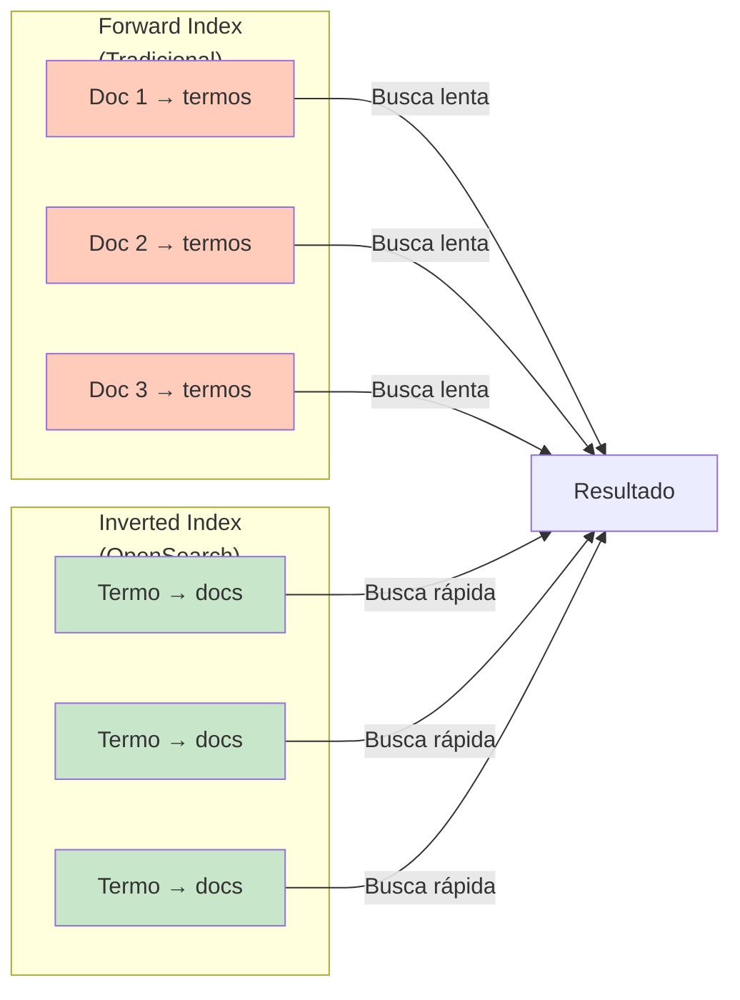

**Exemplo detalhado de inverted index:**

```
Documentos originais:
Doc 1: "OpenSearch é um mecanismo de busca"
Doc 2: "OpenSearch é distribuído"
Doc 3: "Busca rápida com OpenSearch"

Inverted Index resultante:
┌─────────────┬──────────────────┐
│ Termo       │ Documentos       │
├─────────────┼──────────────────┤
│ OpenSearch  │ [Doc 1, Doc 2, Doc 3] │
│ é           │ [Doc 1, Doc 2]   │
│ um          │ [Doc 1]          │
│ mecanismo   │ [Doc 1]          │
│ de          │ [Doc 1, Doc 3]   │
│ busca       │ [Doc 1, Doc 3]   │
│ distribuído │ [Doc 2]          │
│ rápida      │ [Doc 3]          │
│ com         │ [Doc 3]          │
└─────────────┴──────────────────┘
```

Quando você busca por "OpenSearch busca", o sistema consulta o índice invertido:
- Encontra "OpenSearch" → [Doc 1, Doc 2, Doc 3]
- Encontra "busca" → [Doc 1, Doc 3]
- Retorna intersecção: [Doc 1, Doc 3]

**Vantagem**: Em vez de ler todos os documentos sequencialmente, o sistema encontra diretamente quais documentos contêm os termos procurados.

### 2.4.1 Estrutura Interna de um Inverted Index

Para cada termo, o inverted index armazena mais que apenas a lista de documentos. Ele mantém informações detalhadas para scoring (cálculo de relevância):

**Componentes de uma posting list:**

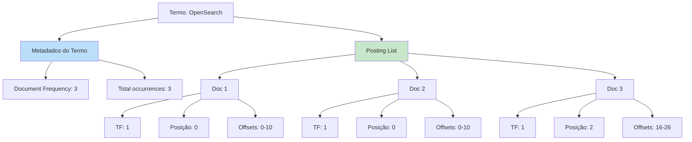

Estrutura detalhada em formato textual:

```
Termo: "OpenSearch"
├── Document Frequency: 3 (aparece em 3 documentos)
├── Posting List:
│   ├── Doc 1
│   │   ├── Term Frequency: 1 (aparece 1 vez)
│   │   ├── Posição: 0 (primeira palavra)
│   │   └── Offsets: 0-10 (bytes no documento)
│   ├── Doc 2
│   │   ├── Term Frequency: 1
│   │   ├── Posição: 0
│   │   └── Offsets: 0-10
│   └── Doc 3
│       ├── Term Frequency: 1
│       ├── Posição: 2
│       └── Offsets: 16-26
```

### 2.4.2 TF-IDF: Calculando Relevância

O OpenSearch utiliza algoritmos de scoring como **TF-IDF** (Term Frequency-Inverse Document Frequency) para calcular a relevância de cada documento em uma busca.

**Componentes do TF-IDF:**

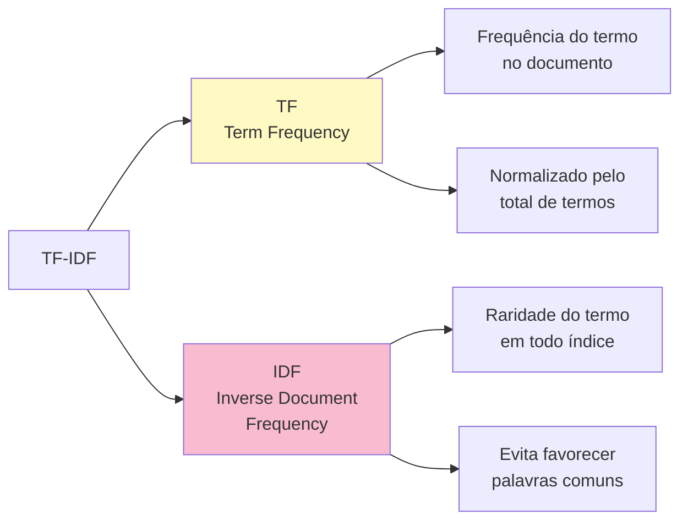

**Fórmula de scoring:**

```
Score Final = TF × IDF

Onde:
  TF = (frequência do termo no doc) / (total de termos no doc)
  IDF = log(total de docs / docs contendo o termo)
```

**Exemplo prático de cálculo:**

```
Busca: "OpenSearch distribuído"

Documento 1: "OpenSearch é um mecanismo de busca" (8 termos)
├── TF("OpenSearch") = 1/8 = 0.125
├── IDF("OpenSearch") = log(3/3) = 0.0 (comum)
├── TF("distribuído") = 0/8 = 0.0 (não contém)
└── Score Total: 0.0

Documento 2: "OpenSearch é distribuído e rápido" (5 termos)
├── TF("OpenSearch") = 1/5 = 0.2
├── IDF("OpenSearch") = log(3/3) = 0.0
├── TF("distribuído") = 1/5 = 0.2
├── IDF("distribuído") = log(3/1) = 1.099 (raro!)
└── Score Total: (0.2 × 0.0) + (0.2 × 1.099) = 0.22 ✓ MELHOR

Documento 3: "Busca rápida com OpenSearch" (5 termos)
├── TF("OpenSearch") = 1/5 = 0.2
├── IDF("OpenSearch") = log(3/3) = 0.0
├── TF("distribuído") = 0/5 = 0.0
└── Score Total: 0.0
```

**Visualização de scores:**

```mermaid
bar
    title Scores de Relevância para "OpenSearch distribuído"
    x-axis [Doc 1, Doc 2, Doc 3]
    y-axis "Score" 0 --> 0.3
    bar [0.0, 0.22, 0.0]
```

Resultado: **Documento 2 tem o score mais alto (0.22)** e aparece primeiro nos resultados.

### 2.4.3 Shards e Replicas: Distribuição

Um índice é dividido em **shards** (fragmentos) para distribuição horizontal:

**Arquitetura de shards e réplicas:**

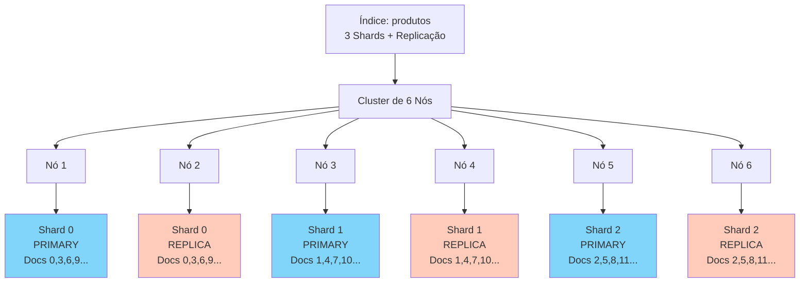

**Estrutura visual de um shard:**

```
Shard 0 (Primary) em Nó A
├── Inverted Index (termos → documentos)
├── Documentos 0, 3, 6, 9, ...
└── Metadados do shard
    ├── Tamanho
    ├── Data de criação
    └── Status

    ↓ Replicado para ↓
    
Shard 0 (Replica) em Nó B
├── Cópia idêntica do Primary
├── Pode servir buscas
└── Atualizado automaticamente
```

**Benefícios da arquitetura distribuída:**

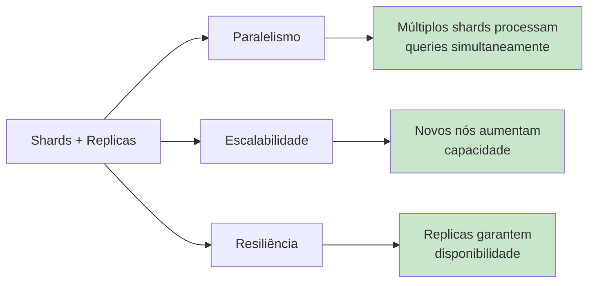

---

## 2.5 OPERAÇÕES CRUD VIA API REST

**Ciclo de vida de um documento:**

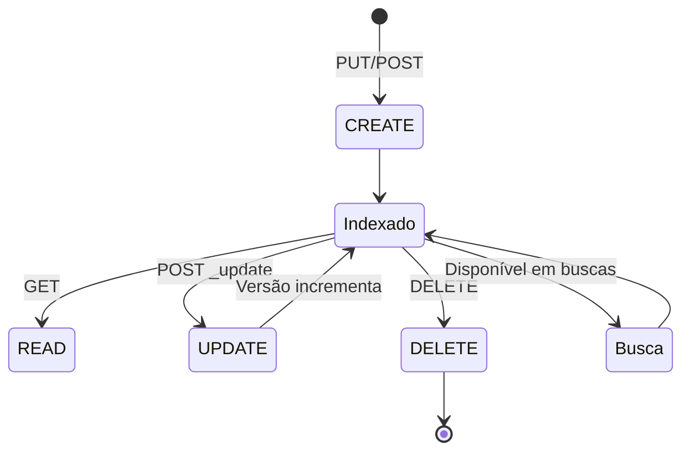

### 2.5.1 CREATE: Criando Documentos

**Operação Create**: Adiciona novo documento ao índice. O OpenSearch retorna erro se o documento já existe.

**Sintaxe:**
```
PUT /<index>/_doc/<_id>
POST /<index>/_doc
```

**Fluxo de criação de documento:**

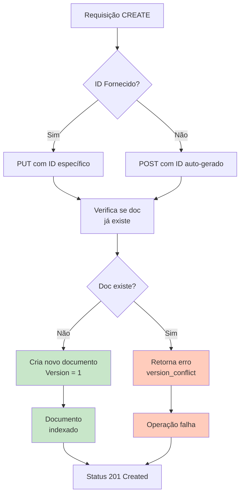

**Exemplo 1: Criar documento com ID especificado**

```bash
PUT http://localhost:9200/usuarios/_doc/user-001
Content-Type: application/json

{
  "nome": "João Silva",
  "email": "joao@example.com",
  "idade": 28,
  "ativo": true,
  "criado_em": "2025-01-15T10:30:00Z"
}
```

**Resposta:**
```json
{
  "_index": "usuarios",
  "_type": "_doc",
  "_id": "user-001",
  "_version": 1,
  "result": "created",
  "_shards": {
    "total": 2,
    "successful": 1,
    "failed": 0
  },
  "_seq_no": 0,
  "_primary_term": 1
}
```

**Exemplo 2: Criar documento com ID auto-gerado**

```bash
POST http://localhost:9200/usuarios/_doc
Content-Type: application/json

{
  "nome": "Maria Santos",
  "email": "maria@example.com",
  "idade": 32,
  "ativo": true,
  "criado_em": "2025-01-15T11:45:00Z"
}
```

**Resposta:**
```json
{
  "_index": "usuarios",
  "_id": "aBc123DeF456",
  "_version": 1,
  "result": "created"
}
```

**Exemplo 3: Criar documento com operação de índice (upsert)**

```bash
PUT http://localhost:9200/produtos/_doc/prod-laptop-001?op_type=create
Content-Type: application/json

{
  "nome": "Notebook Dell XPS 13",
  "preco": 4500.00,
  "categoria": "Eletrônicos",
  "em_estoque": true
}
```

Se o documento já existir, retorna erro:
```json
{
  "error": {
    "type": "version_conflict_engine_exception",
    "reason": "[prod-laptop-001]: version conflict"
  }
}
```

---

### 2.5.2 READ: Recuperando Documentos

**Operação Read**: Recupera documento existente por ID.

**Sintaxe:**
```
GET /<index>/_doc/<_id>
```

**Exemplo 1: Recuperar documento específico**

```bash
GET http://localhost:9200/usuarios/_doc/user-001
```

**Resposta:**
```json
{
  "_index": "usuarios",
  "_type": "_doc",
  "_id": "user-001",
  "_version": 1,
  "found": true,
  "_source": {
    "nome": "João Silva",
    "email": "joao@example.com",
    "idade": 28,
    "ativo": true,
    "criado_em": "2025-01-15T10:30:00Z"
  }
}
```

**Exemplo 2: Recuperar apenas campos específicos (partial read)**

```bash
GET http://localhost:9200/usuarios/_doc/user-001?_source=nome,email
```

**Resposta:**
```json
{
  "_index": "usuarios",
  "_id": "user-001",
  "found": true,
  "_source": {
    "nome": "João Silva",
    "email": "joao@example.com"
  }
}
```

**Exemplo 3: Verificar existência do documento (apenas header)**

```bash
HEAD http://localhost:9200/usuarios/_doc/user-001
```

Retorna status 200 se existe, 404 se não existe.

**Exemplo 4: Recuperar múltiplos documentos (mget)**

```bash
GET http://localhost:9200/_mget
Content-Type: application/json

{
  "docs": [
    {
      "_index": "usuarios",
      "_id": "user-001"
    },
    {
      "_index": "usuarios",
      "_id": "user-002"
    },
    {
      "_index": "produtos",
      "_id": "prod-laptop-001"
    }
  ]
}
```

**Resposta:**
```json
{
  "docs": [
    {
      "_index": "usuarios",
      "_id": "user-001",
      "found": true,
      "_source": { ... }
    },
    {
      "_index": "usuarios",
      "_id": "user-002",
      "found": false
    },
    {
      "_index": "produtos",
      "_id": "prod-laptop-001",
      "found": true,
      "_source": { ... }
    }
  ]
}
```

---

### 2.5.3 UPDATE: Modificando Documentos

**Operação Update**: Modifica um documento existente. OpenSearch atualiza apenas os campos especificados.

**Sintaxe:**
```
POST /<index>/_update/<_id>
PUT /<index>/_doc/<_id> (substitui completamente)
```

**Comparação entre UPDATE parcial vs. substituição completa:**

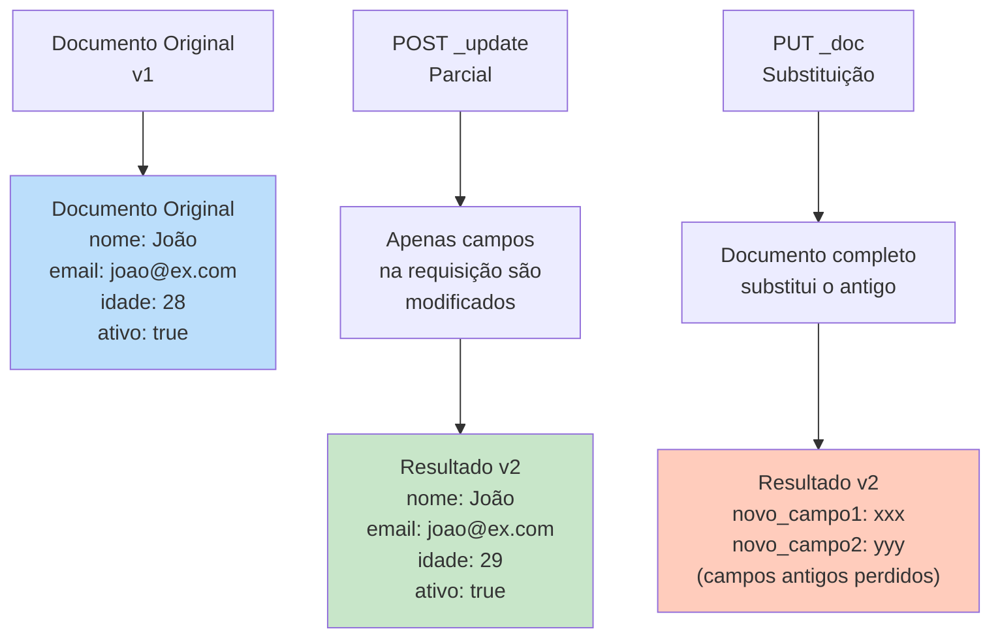

**Fluxo de atualização:**

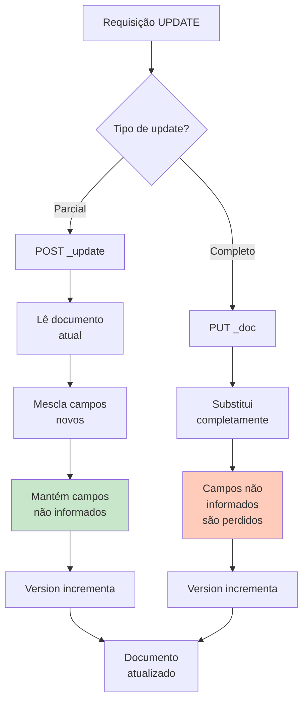

**Exemplo 1: Update parcial (apenas campos alterados)**

```bash
POST http://localhost:9200/usuarios/_update/user-001
Content-Type: application/json

{
  "doc": {
    "idade": 29,
    "atualizado_em": "2025-01-16T14:20:00Z"
  }
}
```

**Resposta:**
```json
{
  "_index": "usuarios",
  "_id": "user-001",
  "_version": 2,
  "result": "updated",
  "_shards": {
    "total": 2,
    "successful": 1,
    "failed": 0
  }
}
```

O documento agora contém: nome, email, idade (29), ativo, criado_em, atualizado_em.

**Exemplo 2: Update com script**

```bash
POST http://localhost:9200/produtos/_update/prod-laptop-001
Content-Type: application/json

{
  "script": {
    "source": "ctx._source.estoque -= params.quantidade",
    "params": {
      "quantidade": 5
    }
  }
}
```

Este script reduz o estoque em 5 unidades. Pode ser executado atomicamente.

**Exemplo 3: Update com upsert (atualizar ou criar)**

```bash
POST http://localhost:9200/usuarios/_update/user-999
Content-Type: application/json

{
  "doc": {
    "nome": "Pedro Costa",
    "email": "pedro@example.com",
    "idade": 35,
    "ativo": true
  },
  "doc_as_upsert": true
}
```

Se user-999 não existe, será criado. Se existe, será atualizado.

**Exemplo 4: Substituição completa (PUT com ID)**

```bash
PUT http://localhost:9200/usuarios/_doc/user-001
Content-Type: application/json

{
  "nome": "João Silva Atualizado",
  "email": "joao.novo@example.com",
  "idade": 29,
  "ativo": true,
  "criado_em": "2025-01-15T10:30:00Z",
  "atualizado_em": "2025-01-16T14:20:00Z"
}
```

Substitui completamente o documento anterior. Versão incrementa para 2.

---

### 2.5.4 DELETE: Removendo Documentos

**Operação Delete**: Remove um documento do índice.

**Sintaxe:**
```
DELETE /<index>/_doc/<_id>
```

**Estados e fluxo de deleção:**

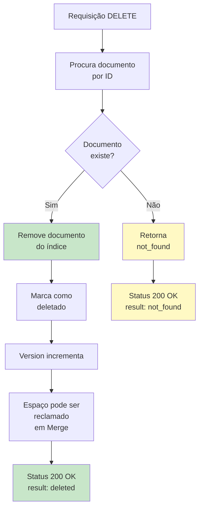

**Ciclo de vida pós-deleção:**

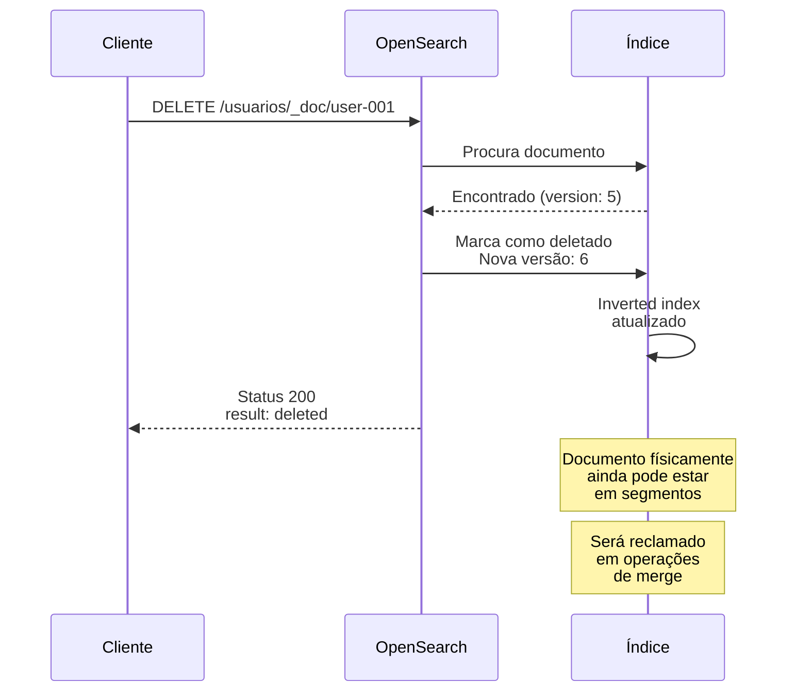

**Exemplo 1: Deletar documento específico**

```bash
DELETE http://localhost:9200/usuarios/_doc/user-999
```

**Resposta:**
```json
{
  "_index": "usuarios",
  "_id": "user-999",
  "_version": 1,
  "result": "deleted",
  "_shards": {
    "total": 2,
    "successful": 1,
    "failed": 0
  }
}
```

**Exemplo 2: Tentativa de deletar documento inexistente**

```bash
DELETE http://localhost:9200/usuarios/_doc/nao-existe
```

**Resposta:**
```json
{
  "_index": "usuarios",
  "_id": "nao-existe",
  "_version": 1,
  "result": "not_found"
}
```

**Exemplo 3: Deletar múltiplos documentos por query (bulk delete)**

```bash
POST http://localhost:9200/_bulk
Content-Type: application/json

{"delete":{"_index":"usuarios","_id":"user-001"}}
{"delete":{"_index":"usuarios","_id":"user-002"}}
{"delete":{"_index":"produtos","_id":"prod-laptop-001"}}
```

**Resposta:**
```json
{
  "took": 45,
  "errors": false,
  "items": [
    {
      "delete": {
        "_index": "usuarios",
        "_id": "user-001",
        "_version": 3,
        "result": "deleted"
      }
    },
    {
      "delete": {
        "_index": "usuarios",
        "_id": "user-002",
        "result": "not_found"
      }
    },
    {
      "delete": {
        "_index": "produtos",
        "_id": "prod-laptop-001",
        "result": "deleted"
      }
    }
  ]
}
```

---

### 🔐 **BOX DE ALERTA: Considerar Soft Delete em Produção**

Deletar documentos permanentemente pode ser irreversível. Em muitos cenários de produção, é preferível usar **soft delete**:

```bash
POST /usuarios/_update/user-001
{
  "doc": {
    "deletado": true,
    "data_deletacao": "2025-01-16T15:00:00Z"
  }
}
```

Depois filtrar nas queries:
```bash
GET /usuarios/_search
{
  "query": {
    "term": {
      "deletado": false
    }
  }
}
```

---

## 2.6 OPERAÇÕES AVANÇADAS COM DOCUMENTOS

### 2.6.1 Bulk Operations

Para inserir, atualizar ou deletar múltiplos documentos eficientemente, use a API Bulk:

**Fluxo de processamento de bulk operations:**

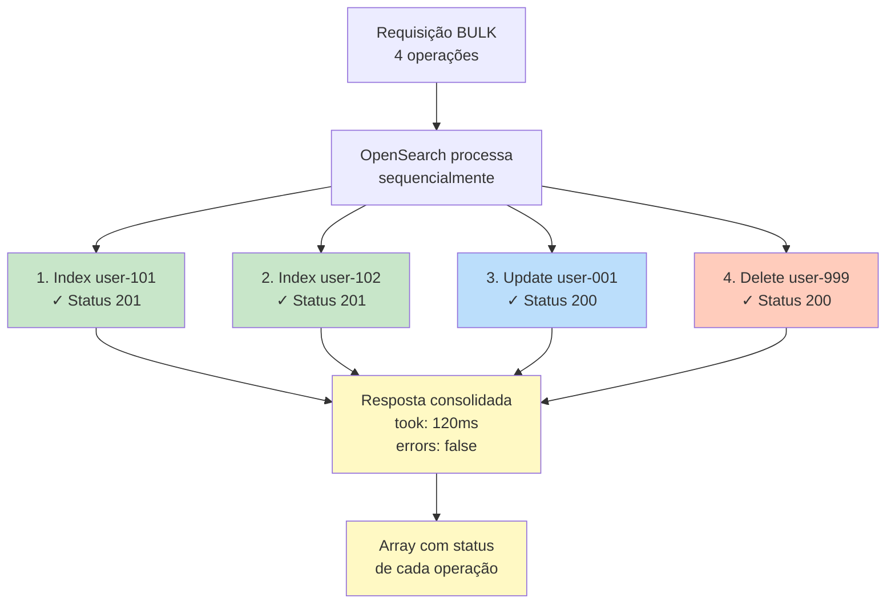

**Comparação: Single vs. Bulk Operations:**

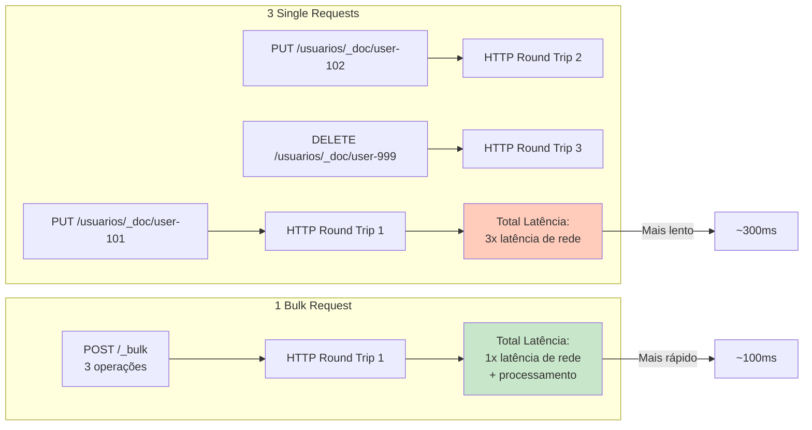

```bash
POST http://localhost:9200/_bulk
Content-Type: application/json

{"index":{"_index":"usuarios","_id":"user-101"}}
{"nome":"Alice","email":"alice@example.com","idade":25,"ativo":true}
{"index":{"_index":"usuarios","_id":"user-102"}}
{"nome":"Bob","email":"bob@example.com","idade":31,"ativo":true}
{"update":{"_index":"usuarios","_id":"user-001"}}
{"doc":{"idade":30}}
{"delete":{"_index":"usuarios","_id":"user-999"}}
```

**Resposta:**
```json
{
  "took": 120,
  "errors": false,
  "items": [
    {
      "index": {
        "_index": "usuarios",
        "_id": "user-101",
        "_version": 1,
        "result": "created"
      }
    },
    {
      "index": {
        "_index": "usuarios",
        "_id": "user-102",
        "_version": 1,
        "result": "created"
      }
    },
    {
      "update": {
        "_index": "usuarios",
        "_id": "user-001",
        "_version": 2,
        "result": "updated"
      }
    },
    {
      "delete": {
        "_index": "usuarios",
        "_id": "user-999",
        "result": "deleted"
      }
    }
  ]
}
```

**Vantagens:**
- ✓ Uma única requisição HTTP para múltiplas operações
- ✓ Reduz latência de rede significativamente
- ✓ OpenSearch processa em paralelo nos shards
- ✓ Ideal para grandes volumes de dados

---

### 2.6.2 Versionamento de Documentos

O OpenSearch mantém automaticamente a versão de cada documento. Isso é útil para controle de concorrência:

**Histórico de versões durante operações:**

```mermaid
graph LR
    A["Doc criado<br/>v1"] --> B["Primeiro update<br/>v2"]
    B --> C["Segundo update<br/>v3"]
    C --> D["Delete<br/>v4"]
    D --> E["Recreado<br/>v5"]
    
    style A fill:#c8e6c9
    style B fill:#bbdefb
    style C fill:#bbdefb
    style D fill:#ffccbc
    style E fill:#c8e6c9
```

**Controle de concorrência com versionamento:**

```mermaid
sequenceDiagram
    participant Client1 as Cliente 1
    participant Client2 as Cliente 2
    participant OS as OpenSearch
    
    OS->>Client1: GET user-001<br/>v5
    OS->>Client2: GET user-001<br/>v5
    
    Client1->>OS: PUT user-001?if_seq_no=5<br/>Novos dados
    OS->>OS: Valida versão OK
    OS-->>Client1: Status 200<br/>v6 criada
    
    Client2->>OS: PUT user-001?if_seq_no=5<br/>Novos dados diferentes
    OS->>OS: Verifica: seq_no agora é 6<br/>Conflito!
    OS-->>Client2: Status 409<br/>version_conflict_engine_exception
    
    Note over Client2: Cliente 2 precisa<br/>recarregar e<br/>tentar novamente
```

```bash
PUT http://localhost:9200/usuarios/_doc/user-001?if_seq_no=5&if_primary_term=1
Content-Type: application/json

{
  "nome": "João Silva",
  "email": "joao@example.com",
  "idade": 30
}
```

Se a versão não corresponder, retorna erro de conflito:
```json
{
  "error": {
    "type": "version_conflict_engine_exception",
    "reason": "[user-001]: version conflict"
  }
}
```

Isso previne race conditions quando múltiplos clientes atualizam o mesmo documento.

---

## 2.7 EXERCÍCIOS PRÁTICOS DE FIXAÇÃO

### Exercício 2.1: Criando um Índice com Mapping Explícito

**Objetivo**: Criar um índice para gerenciar artigos de blog com tipos de dados apropriados.

**Tarefa:**
1. Crie um índice chamado `blog-posts` com mapping explícito
2. Defina os seguintes campos:
   - `titulo` (text com analyzer portuguese)
   - `conteudo` (text com analyzer portuguese)
   - `autor` (keyword)
   - `data_publicacao` (date)
   - `categoria` (keyword)
   - `tags` (array de keywords)
   - `visualizacoes` (integer)
   - `curtidas` (integer)
   - `ativo` (boolean)

3. Teste inserindo um documento de exemplo

**Resposta esperada:**
```bash
PUT http://localhost:9200/blog-posts
Content-Type: application/json

{
  "settings": {
    "number_of_shards": 1,
    "number_of_replicas": 0
  },
  "mappings": {
    "properties": {
      "titulo": {
        "type": "text",
        "analyzer": "portuguese"
      },
      "conteudo": {
        "type": "text",
        "analyzer": "portuguese"
      },
      "autor": {
        "type": "keyword"
      },
      "data_publicacao": {
        "type": "date"
      },
      "categoria": {
        "type": "keyword"
      },
      "tags": {
        "type": "keyword"
      },
      "visualizacoes": {
        "type": "integer"
      },
      "curtidas": {
        "type": "integer"
      },
      "ativo": {
        "type": "boolean"
      }
    }
  }
}
```

### Exercício 2.2: Operações CRUD Completas

**Objetivo**: Executar todas as operações CRUD em um índice.

**Tarefa:**
1. Crie um documento no índice `blog-posts` com ID `post-001`
2. Recupere o documento
3. Atualize apenas o campo `visualizacoes` para 150
4. Recupere novamente para confirmar
5. Delete o documento
6. Tente recuperar (deve retornar not found)

**Passo a passo:**

```bash
# CREATE
POST http://localhost:9200/blog-posts/_doc/post-001
Content-Type: application/json

{
  "titulo": "Introdução ao OpenSearch",
  "conteudo": "OpenSearch é um fork do Elasticsearch...",
  "autor": "João Silva",
  "data_publicacao": "2025-01-15T10:00:00Z",
  "categoria": "Tecnologia",
  "tags": ["opensearch", "busca", "tutorial"],
  "visualizacoes": 0,
  "curtidas": 0,
  "ativo": true
}

# READ
GET http://localhost:9200/blog-posts/_doc/post-001

# UPDATE
POST http://localhost:9200/blog-posts/_update/post-001
Content-Type: application/json

{
  "doc": {
    "visualizacoes": 150
  }
}

# READ novamente
GET http://localhost:9200/blog-posts/_doc/post-001

# DELETE
DELETE http://localhost:9200/blog-posts/_doc/post-001

# READ (not found)
GET http://localhost:9200/blog-posts/_doc/post-001
```

### Exercício 2.3: Testando Diferentes Analyzers

**Objetivo**: Compreender o impacto de analyzers na tokenização.

**Tarefa:**
1. Crie um índice `analyzer-test` com dois campos:
   - `texto_standard` (usando analyzer padrão)
   - `texto_portuguese` (usando analyzer português)
2. Insira um documento com texto em português
3. Use a API de análise para ver como cada analyzer processa o texto

**Teste de análise:**

```bash
POST http://localhost:9200/analyzer-test/_analyze
Content-Type: application/json

{
  "analyzer": "standard",
  "text": "O rápido raposa marrom pulou sobre a cerca"
}
```

**Resultado:**
```json
{
  "tokens": [
    {"token":"o","start_offset":0,"end_offset":1,"type":"<ALPHANUM>","position":0},
    {"token":"rápido","start_offset":2,"end_offset":8,"type":"<ALPHANUM>","position":1},
    {"token":"raposa","start_offset":9,"end_offset":15,"type":"<ALPHANUM>","position":2},
    {"token":"marrom","start_offset":16,"end_offset":22,"type":"<ALPHANUM>","position":3},
    {"token":"pulou","start_offset":23,"end_offset":28,"type":"<ALPHANUM>","position":4},
    {"token":"sobre","start_offset":29,"end_offset":34,"type":"<ALPHANUM>","position":5},
    {"token":"a","start_offset":35,"end_offset":36,"type":"<ALPHANUM>","position":6},
    {"token":"cerca","start_offset":37,"end_offset":42,"type":"<ALPHANUM>","position":7}
  ]
}
```

```bash
POST http://localhost:9200/analyzer-test/_analyze
Content-Type: application/json

{
  "analyzer": "portuguese",
  "text": "O rápido raposa marrom pulou sobre a cerca"
}
```

**Resultado (note a remoção de stopwords):**
```json
{
  "tokens": [
    {"token":"rápid","start_offset":2,"end_offset":8,"type":"<ALPHANUM>","position":1},
    {"token":"rapos","start_offset":9,"end_offset":15,"type":"<ALPHANUM>","position":2},
    {"token":"marrom","start_offset":16,"end_offset":22,"type":"<ALPHANUM>","position":3},
    {"token":"pul","start_offset":23,"end_offset":28,"type":"<ALPHANUM>","position":4},
    {"token":"sobr","start_offset":29,"end_offset":34,"type":"<ALPHANUM>","position":5},
    {"token":"cerc","start_offset":37,"end_offset":42,"type":"<ALPHANUM>","position":7}
  ]
}
```

---

## 2.8 SÍNTESE DO CAPÍTULO

Neste capítulo, você aprendeu os fundamentos essenciais do OpenSearch:

**Estrutura de dados:**
- Índices são contineres de documentos
- Documentos são objetos JSON com metadados
- OpenSearch suporta diversos tipos de dados para diferentes necessidades

**Mapeamento:**
- Mapping dinâmico oferece flexibilidade mas com riscos
- Mapping explícito é recomendado para produção
- Multi-campos permitem diferentes tipos de busca no mesmo dado

**Análise e tokenização:**
- Analyzers processam texto em tokens para indexação
- Escolher o analyzer correto impacta qualidade de busca
- Language analyzers específicos melhoram resultados em português

**Inverted Index:**
- Mapeia termos → documentos para busca rápida
- TF-IDF calcula relevância dos resultados
- Shards distribuem dados para escalabilidade

**Operações CRUD:**
- CREATE: Inserir novos documentos
- READ: Recuperar por ID
- UPDATE: Modificar campos existentes
- DELETE: Remover documentos
- Bulk: Operações em massa eficientemente

Você agora possui os conhecimentos necessários para estruturar dados, criar índices apropriados e realizar operações básicas de manipulação de dados no OpenSearch. No próximo capítulo, exploraremos como buscar e analisar dados com queries avançadas.

---

## REFERÊNCIAS

OPENSEARCH PROJECT. OpenSearch Documentation: Data Types. Disponível em: https://docs.opensearch.org/latest/clients/data/. Acesso em: 15 jan. 2025.

OPENSEARCH PROJECT. OpenSearch Documentation: Mapping. Disponível em: https://docs.opensearch.org/latest/field-types/index/. Acesso em: 15 jan. 2025.

OPENSEARCH PROJECT. OpenSearch Documentation: Analyzers. Disponível em: https://docs.opensearch.org/latest/analyzers/token-analyzers/. Acesso em: 15 jan. 2025.

OPENSEARCH PROJECT. OpenSearch Documentation: Document API. Disponível em: https://docs.opensearch.org/latest/api-reference/document-apis/index/. Acesso em: 15 jan. 2025.

---

**Fim do Capítulo 2**