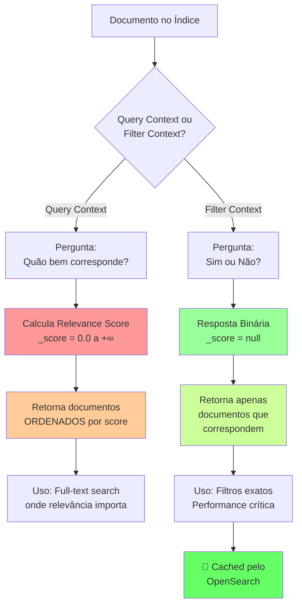
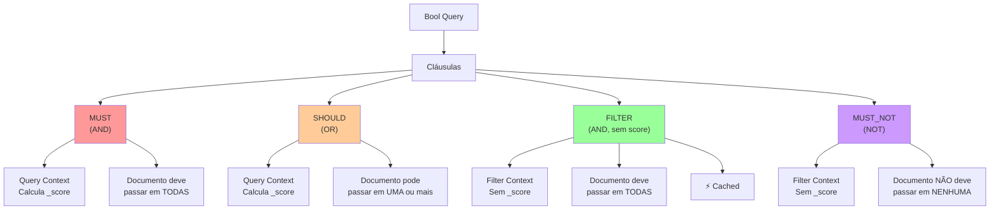
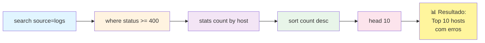
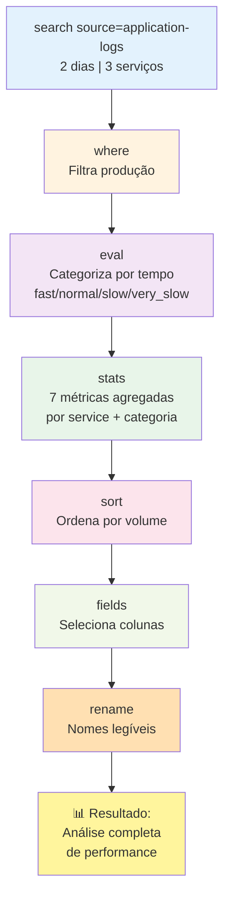
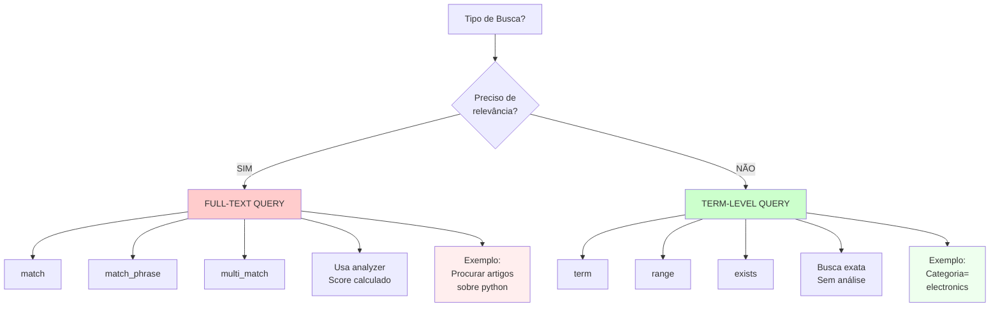
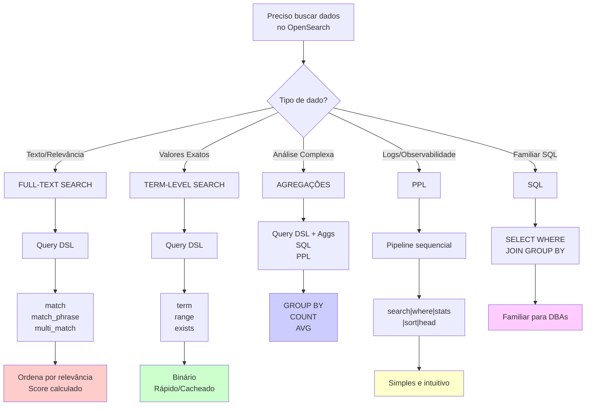

# CAPÍTULO 3: QUERIES BÁSICAS E QUERY DSL

## Queries funcionais para diferentes cenários

---

## OBJETIVOS DE APRENDIZAGEM

Ao final deste capítulo, você será capaz de:

✓ Compreender a diferença entre Query Context e Filter Context e sua aplicação prática  
✓ Dominar a sintaxe de Query DSL: match, term, range e bool queries  
✓ Executar queries com SQL e PPL de forma eficiente  
✓ Construir Boolean queries complexas com must, should, filter e must_not  
✓ Diferenciar full-text search de term-level queries e saber quando usá-las  
✓ Criar queries funcionais para cenários reais em ambientes de produção  
✓ Escrever comandos PPL avançados para processamento de dados observáveis  

---

## INTRODUÇÃO AO UNIVERSO DE QUERIES NO OPENSEARCH

Você já parou para pensar em como o OpenSearch sabe qual documento é mais relevante quando você busca por "melhor coffee shop em São Paulo"? Essa mágica acontece através das **queries**, os comandos que transformam suas intenções de busca em resultados precisos e ordenados por relevância.

Neste capítulo, você mergulhará no universo das queries no OpenSearch, começando pelas mais simples até construções complexas que resolvem problemas reais em ambientes de produção. Exploraremos três abordagens principais:

1. **Query DSL** - A poderosa linguagem baseada em JSON
2. **SQL** - O familiar dialeto relacional
3. **PPL** - A elegante Piped Processing Language otimizada para observabilidade

> **NOTA IMPORTANTE**: As queries no OpenSearch funcionam em dois contextos distintos: o **QUERY CONTEXT** (retorna documentos + score de relevância) e o **FILTER CONTEXT** (retorna apenas documentos que correspondem, sem scoring). Essa distinção é fundamental para otimizar performance e precisão.

---

## SEÇÃO 1: FUNDAMENTOS DE QUERIES

### 1.1 Query Context vs Filter Context

As queries no OpenSearch funcionam em dois universos distintos. Compreender essa divisão é essencial para escrever queries eficientes.

#### Diagrama de Fluxo: Os Dois Contextos



#### Características Comparativas

| Aspecto | Query Context | Filter Context |
|---------|--------------|-----------------|
| **Pergunta** | Quão bem corresponde? | Corresponde ou não? |
| **Retorna** | Documentos + _score | Documentos (sem score) |
| **Score** | Calculado (0 a ∞) | null |
| **Uso** | Full-text, relevância | Filtros, booleanos exatos |
| **Performance** | Mais lento | Muito rápido |
| **Cache** | Não | Sim, cacheado |
| **Tipos de Query** | match, multi_match, match_phrase | term, range, exists, bool/filter |

---

### 1.2 A REST API do OpenSearch para Queries

Todas as queries são executadas através da REST API. Você pode usar curl, Postman, Python, JavaScript ou qualquer cliente HTTP.

#### Estrutura Básica de uma Request

```json
POST /<índice>/_search
{
  "query": {
    "<tipo_de_query>": {
      "<parametros>"
    }
  },
  "from": 0,
  "size": 10,
  "sort": [{"_score": "desc"}],
  "_source": ["campo1", "campo2"],
  "highlight": {
    "fields": {
      "campo": {}
    }
  }
}
```

**Parâmetros Obrigatórios:**
- `índice` - O índice ou padrão ("products", "logs-*", "_all")

**Parâmetros Opcionais:**
- `query` - Definição da query
- `from` - Offset para paginação (padrão: 0)
- `size` - Número de resultados (padrão: 10, máx: 10000)
- `sort` - Ordenação
- `_source` - Campos a retornar
- `highlight` - Destacar termos

#### EXEMPLO 1: Query Context - Full-Text Search

Encontrar artigos sobre "machine learning" ordenados por relevância:

```json
POST /articles/_search
{
  "query": {
    "match": {
      "content": "machine learning"
    }
  }
}
```

**Resposta:**

```json
{
  "hits": {
    "total": {"value": 1250, "relation": "eq"},
    "max_score": 8.547294,
    "hits": [
      {
        "_id": "1",
        "_score": 8.547294,
        "_source": {
          "title": "Deep Learning with TensorFlow",
          "content": "machine learning algorithms..."
        }
      },
      {
        "_id": "2",
        "_score": 7.234561,
        "_source": {
          "title": "Introduction to Machine Learning",
          "content": "Learn the basics of machine learning..."
        }
      }
    ]
  }
}
```

**Observação**: Cada documento tem um `_score` diferente, indicando sua relevância.

---

#### EXEMPLO 2: Filter Context - Filtro Exato (Sem Scoring)

Apenas artigos publicados em 2024 de autores verificados:

```json
POST /articles/_search
{
  "query": {
    "bool": {
      "filter": [
        {
          "range": {
            "publish_date": {
              "gte": "2024-01-01",
              "lte": "2024-12-31"
            }
          }
        },
        {
          "term": {
            "author_verified": true
          }
        }
      ]
    }
  }
}
```

**Resposta:**

```json
{
  "hits": {
    "total": {"value": 342, "relation": "eq"},
    "max_score": null,
    "hits": [
      {
        "_id": "5",
        "_score": null,
        "_source": {
          "title": "Best Practices 2024",
          "author": "John Doe",
          "author_verified": true,
          "publish_date": "2024-06-15"
        }
      }
    ]
  }
}
```

**Nota**: `max_score` e `_score` são `null` em Filter Context.

---

#### EXEMPLO 3: Combinando Contextos (O Caso Mais Comum)

Artigos relevantes sobre "python" publicados em 2024:

```json
POST /articles/_search
{
  "query": {
    "bool": {
      "must": [
        {
          "match": {
            "content": "python"
          }
        }
      ],
      "filter": {
        "range": {
          "publish_date": {
            "gte": "2024-01-01"
          }
        }
      }
    }
  }
}
```

**Decodificação:**
- `must` → Query Context (calcula relevância)
- `filter` → Filter Context (apenas filtra)
- **Resultado**: Documentos de 2024, ordenados por relevância

> **DICA DE PERFORMANCE**: Use Filter Context quando puder. Filters são cacheados pelo OpenSearch. Se não precisa de score, use filter.

---

### 1.3 Exercício Prático

**EXERCÍCIO 1.1 - Diferenciando Contextos**

Você tem um índice "products" com campos: `name`, `category`, `price`, `rating`, `in_stock`.

**Escreva:**
1. Uma query em Query Context que busca produtos cujo nome contém "laptop"
2. Uma query em Filter Context que retorna apenas produtos em estoque com preço entre 1000-3000

---

## SEÇÃO 2: QUERY DSL - TIPOS FUNDAMENTAIS

### 2.1 Queries Full-Text (Texto Analisado)

Full-text queries buscam em campos de texto que foram **analisados** durante a indexação. O analisador quebra o texto em tokens, remove stopwords e aplica stemming. Quando você executa uma full-text query, o mesmo analisador é aplicado ao seu termo de busca.

**DEFINIÇÃO**: *Full-Text Query* é uma busca em campos de texto analisados que retorna resultados ordenados por relevância.

#### A. MATCH QUERY - A Rainha das Buscas Full-Text

A forma mais simples e comum de fazer full-text search em um campo simples.

**Sintaxe Básica:**

```json
{
  "query": {
    "match": {
      "<campo>": "<termo>"
    }
  }
}
```

**EXEMPLO 4: Match Query Simples**

```json
POST /blog-posts/_search
{
  "query": {
    "match": {
      "content": "python programming"
    }
  }
}
```

Encontra documentos onde `content` contém "python" **OU** "programming" (ou ambos). Documentos com ambas as palavras recebem maior score.

**EXEMPLO 5: Match Query com Operador AND**

```json
POST /blog-posts/_search
{
  "query": {
    "match": {
      "content": {
        "query": "python programming tutorial",
        "operator": "and"
      }
    }
  }
}
```

Apenas documentos contendo python **E** programming **E** tutorial.

**Parâmetros Úteis:**
- `operator` - "or" (padrão) ou "and"
- `fuzziness` - Permite erros de digitação ("AUTO")
- `boost` - Aumenta relevância (ex: 2.0)
- `minimum_should_match` - Mínimo de termos

**EXEMPLO 6: Match Query com Fuzziness**

```json
POST /users/_search
{
  "query": {
    "match": {
      "email": {
        "query": "john@examle.com",
        "fuzziness": "AUTO"
      }
    }
  }
}
```

Mesmo com erro "examle", encontrará "example".

---

#### B. MULTI_MATCH QUERY - Múltiplos Campos

Buscar em múltiplos campos simultaneamente.

**EXEMPLO 7: Multi-Match Básica**

```json
POST /documents/_search
{
  "query": {
    "multi_match": {
      "query": "machine learning algorithms",
      "fields": ["title", "abstract", "content"]
    }
  }
}
```

**EXEMPLO 8: Multi-Match com Boost (Campos Ponderados)**

```json
POST /documents/_search
{
  "query": {
    "multi_match": {
      "query": "database optimization",
      "fields": [
        "title^3",
        "abstract^2",
        "content"
      ]
    }
  }
}
```

| Campo | Peso | Significado |
|-------|------|-------------|
| `title^3` | 3x | Match no título vale 3x mais |
| `abstract^2` | 2x | Match no abstract vale 2x mais |
| `content` | 1x | Peso padrão |

Um match no título contribui muito mais para o score final.

---

#### C. MATCH_PHRASE QUERY - Frases Exatas

Exige que os termos apareçam na ordem exata, não como termos individuais.

**EXEMPLO 9: Match Phrase Simples**

```json
POST /articles/_search
{
  "query": {
    "match_phrase": {
      "content": "artificial intelligence is the future"
    }
  }
}
```

Encontra apenas documentos onde essa frase exata aparece.

**EXEMPLO 10: Match Phrase com Slop (Tolerância de Espaçamento)**

```json
POST /articles/_search
{
  "query": {
    "match_phrase": {
      "content": {
        "query": "artificial intelligence future",
        "slop": 2
      }
    }
  }
}
```

`slop: 2` permite até 2 palavras entre "artificial" e "intelligence".

---

### 2.2 Queries Term-Level (Valores Exatos)

Term-level queries **NÃO analisam** o valor de busca. Procuram por valores exatos. Perfeitas para campos estruturados (IDs, categorias, datas, números).

**DEFINIÇÃO**: *Term-Level Query* é uma busca por valores exatos SEM análise. Ideal para campos `keyword`.

#### A. TERM QUERY - Correspondência Exata

**Sintaxe:**

```json
{
  "query": {
    "term": {
      "<campo>": "<valor>"
    }
  }
}
```

**EXEMPLO 11: Term Query para ID**

```json
POST /users/_search
{
  "query": {
    "term": {
      "user_id": "12345"
    }
  }
}
```

**EXEMPLO 12: Term Query para Categoria**

```json
POST /products/_search
{
  "query": {
    "term": {
      "category.keyword": "electronics"
    }
  }
}
```

> **Importante**: Use `.keyword` quando o campo é text + keyword. Sem `.keyword`, busca pelo termo analisado.

---

#### B. RANGE QUERY - Valores em Intervalo

Para buscar por números, datas ou strings em um intervalo.

**Sintaxe:**

```json
{
  "query": {
    "range": {
      "<campo>": {
        "gte": <valor>,
        "lte": <valor>
      }
    }
  }
}
```

**Operadores:**
- `gte` - Greater Than or Equal (≥)
- `gt` - Greater Than (>)
- `lte` - Less Than or Equal (≤)
- `lt` - Less Than (<)

**EXEMPLO 13: Range para Preço**

```json
POST /products/_search
{
  "query": {
    "range": {
      "price": {
        "gte": 100,
        "lte": 500
      }
    }
  }
}
```

**EXEMPLO 14: Range para Data**

```json
POST /events/_search
{
  "query": {
    "range": {
      "event_date": {
        "gte": "2024-01-01",
        "lt": "2024-12-31",
        "format": "yyyy-MM-dd"
      }
    }
  }
}
```

**EXEMPLO 15: Range com Date Math**

```json
POST /articles/_search
{
  "query": {
    "range": {
      "publish_date": {
        "gte": "now-30d"
      }
    }
  }
}
```

`now-30d` = "nos últimos 30 dias"

---

#### C. EXISTS QUERY - Campos com Valores

Retorna documentos onde um campo tem um valor indexado (não null).

**EXEMPLO 16: Exists Simples**

```json
POST /products/_search
{
  "query": {
    "exists": {
      "field": "description"
    }
  }
}
```

Apenas produtos com `description` preenchida.

**EXEMPLO 17: Negação com Must_Not**

```json
POST /products/_search
{
  "query": {
    "bool": {
      "must_not": {
        "exists": {
          "field": "discontinued_date"
        }
      }
    }
  }
}
```

Produtos que NÃO foram descontinuados.

---

#### D. WILDCARD e PREFIX QUERIES

**WILDCARD QUERY:**

```json
{
  "query": {
    "wildcard": {
      "email": "john.*@example.com"
    }
  }
}
```

- `*` = qualquer número de caracteres
- `?` = exatamente um caractere

**PREFIX QUERY:**

```json
{
  "query": {
    "prefix": {
      "product_name": "iPhone"
    }
  }
}
```

Produtos cujo nome começa com "iPhone".

---

### 2.3 BOOL QUERY - O Coração das Queries Complexas

A forma mais poderosa de combinar múltiplas queries com lógica booleana: AND, OR, NOT.

#### Estrutura e Fluxo



**Sintaxe Geral:**

```json
{
  "query": {
    "bool": {
      "must": [...],
      "should": [...],
      "filter": [...],
      "must_not": [...]
    }
  }
}
```

---

#### A. MUST - AND (Todas as Condições)

Cláusulas devem passar em **TODAS**. Query Context → afeta score.

**EXEMPLO 18: Must Query**

```json
POST /blog/_search
{
  "query": {
    "bool": {
      "must": [
        {"match": {"title": "python"}},
        {"match": {"content": "web development"}},
        {"range": {"views": {"gte": 1000}}}
      ]
    }
  }
}
```

Retorna artigos que:
- Têm "python" no título **E**
- Têm "web development" no conteúdo **E**
- Têm pelo menos 1000 visualizações

---

#### B. SHOULD - OR (Pelo Menos Uma)

Cláusulas podem passar em **UMA ou mais**. Query Context → afeta score.

**EXEMPLO 19: Should Query**

```json
POST /job-listings/_search
{
  "query": {
    "bool": {
      "should": [
        {"match": {"title": "Senior Developer"}},
        {"match": {"title": "Lead Engineer"}},
        {"match": {"title": "Architect"}}
      ]
    }
  }
}
```

Retorna vagas com qualquer uma das três palavras-chave.

---

#### C. FILTER - AND (Sem Scoring)

Cláusulas devem passar em **TODAS**. Filter Context → sem score, cacheado.

**EXEMPLO 20: Filter Query**

```json
POST /store/_search
{
  "query": {
    "bool": {
      "must": [
        {"match": {"product_name": "laptop"}}
      ],
      "filter": [
        {"term": {"brand.keyword": "Dell"}},
        {"range": {"price": {"lte": 1500}}},
        {"term": {"in_stock": true}}
      ]
    }
  }
}
```

| Cláusula | Contexto | Função |
|----------|----------|--------|
| `must` | Query | Busca por relevância em "laptop" |
| `filter` | Filter | Garante Dell, ≤ 1500, em estoque |

---

#### D. MUST_NOT - NOT (Exclusão)

Cláusulas que devem ser **EXCLUÍDAS**. Filter Context → sem score.

**EXEMPLO 21: Must_Not Query**

```json
POST /news/_search
{
  "query": {
    "bool": {
      "must": [
        {"match": {"content": "technology news"}}
      ],
      "must_not": [
        {"term": {"category.keyword": "spam"}},
        {"term": {"author.keyword": "unknown"}}
      ]
    }
  }
}
```

Notícias sobre tecnologia, **EXCLUINDO** spam e autores desconhecidos.

---

#### E. Query Complexa do Mundo Real

**EXEMPLO 22: E-commerce Complex Search**

```json
POST /products/_search
{
  "query": {
    "bool": {
      "must": [
        {
          "multi_match": {
            "query": "wireless headphones",
            "fields": ["name^2", "description"]
          }
        }
      ],
      "should": [
        {"match": {"brand": "Sony"}},
        {"match": {"brand": "Bose"}},
        {"match": {"brand": "JBL"}}
      ],
      "filter": [
        {"range": {"price": {"gte": 50, "lte": 300}}},
        {"range": {"rating": {"gte": 4}}},
        {"term": {"available": true}},
        {"term": {"warranty.keyword": "2 years"}}
      ],
      "minimum_should_match": 0
    }
  }
}
```

**Decodificação:**
- `must` → "wireless headphones" em nome/descrição (relevância importa)
- `should` → Favorece Sony/Bose/JBL (não obrigatório)
- `filter` → Preço 50-300, rating ≥4, disponível, garantia 2 anos
- `minimum_should_match: 0` → should é opcional

---

### 2.4 Exercício Prático

**EXERCÍCIO 2.1 - Construindo Bool Queries**

Você tem um índice "posts" com: `title`, `content`, `author`, `published_date`, `likes`, `tags` (array).

**Escreva uma bool query que:**
1. Encontre posts sobre "machine learning" (title OU content)
2. De qualquer autor EXCETO "bot"
3. Publicados em 2024
4. Com mais de 100 likes
5. Que contenham a tag "tutorial"

---

## SEÇÃO 3: QUERIES COM SQL

### 3.1 SQL: A Ponte Entre Relacional e OpenSearch

Se você vem de um background SQL (Oracle, PostgreSQL, MySQL), o SQL no OpenSearch será como ir para casa. Você usa SELECT, WHERE, GROUP BY, JOIN como em qualquer banco relacional, mas buscando em índices OpenSearch.

> **REQUISITO**: SQL requer que o plugin SQL esteja instalado. Distribuições padrão incluem por padrão.

#### Endpoint e Sintaxe

```json
POST /_plugins/_sql
{
  "query": "SELECT * FROM index_name WHERE condition"
}
```

#### EXEMPLO 23: SELECT Simples

```json
POST /_plugins/_sql
{
  "query": "SELECT title, author, publish_date FROM articles LIMIT 10"
}
```

**Resposta:**

```json
{
  "schema": [
    {"name": "title", "type": "text"},
    {"name": "author", "type": "text"},
    {"name": "publish_date", "type": "date"}
  ],
  "datarows": [
    ["Deep Learning Basics", "John Doe", 1609459200000],
    ["Neural Networks 101", "Jane Smith", 1612137600000]
  ],
  "total": 50,
  "size": 10
}
```

---

#### EXEMPLO 24: WHERE com Múltiplas Condições

```sql
SELECT title, views 
FROM blog_posts 
WHERE views > 1000 AND publish_year = 2024 
LIMIT 5
```

---

#### EXEMPLO 25: ORDER BY e LIMIT

```sql
SELECT product_name, price, rating 
FROM products 
WHERE category = 'electronics' 
ORDER BY price DESC 
LIMIT 20
```

---

#### EXEMPLO 26: GROUP BY e Agregações

```sql
SELECT category, COUNT(*) as count, AVG(price) as avg_price 
FROM products 
GROUP BY category
```

**Resultado esperado:**

```
category    | count | avg_price
------------|-------|----------
electronics | 245   | 599.50
clothing    | 1203  | 45.20
books       | 5420  | 29.99
```

---

#### EXEMPLO 27: JOIN entre Índices

```sql
SELECT a.title, a.author_id, b.author_name 
FROM articles a 
JOIN authors b ON a.author_id = b.id 
LIMIT 10
```

---

#### EXEMPLO 28: Date Math

```sql
SELECT title, publish_date 
FROM articles 
WHERE publish_date >= DATE_SUB(NOW(), INTERVAL 30 DAY) 
ORDER BY publish_date DESC
```

---

#### Quando Usar SQL

| Use SQL quando | Evite SQL quando |
|---|---|
| ✓ Você conhece SQL | ✗ Precisa de full-text sofisticado |
| ✓ Precisa de JOINs | ✗ Trabalha com semi-estruturado |
| ✓ Agregações complexas | ✗ Performance é crítica |
| ✓ Quer familiaridade | ✗ Precisa de relevância scoring |

---

## SEÇÃO 4: PIPED PROCESSING LANGUAGE (PPL)

### 4.1 Introdução ao PPL - A Linguagem de Pipelines

PPL é uma abordagem radicalmente diferente para consultar dados. Em vez de escrever uma query complexa, você constrói um **pipeline**: pega dados de uma fonte, passa por transformações sequenciais, obtém resultados.

**FILOSOFIA PPL**: Iniciar simples, encadear transformações, aprofundar progressivamente.

PPL foi projetado especificamente para análise de logs, métricas e dados de observabilidade.

#### Anatomia de uma Query PPL

```
search source=<índice> | <comando1> | <comando2> | <comando3> ...
```

Cada `|` (pipe) passa o resultado do comando anterior para o próximo.

#### Fluxo Visual



---

#### Quando Usar PPL

| Use PPL quando | Evite PPL quando |
|---|---|
| ✓ Trabalha com logs/métricas | ✗ Precisa full-text sofisticado |
| ✓ Análise exploratória | ✗ Precisa de JOINs complexos |
| ✓ Quer sintaxe simples | ✗ Precisa de relevância scoring |
| ✓ Pipeline sequencial | ✗ Dados altamente estruturados |

---

#### Endpoint

```json
POST /_plugins/_ppl
{
  "query": "search source=index_name | where condition | fields field1, field2"
}
```

Ou via OpenSearch Dashboards > Query Workbench > PPL tab.

---

### 4.2 Comando SEARCH - Iniciar o Pipeline

Toda query PPL começa com `search`. Define qual índice buscar e filtra opcionalmente.

**Sintaxe:**

```
search source=<índice> [<filtro>]
```

**EXEMPLO 29: Search Básico**

```
search source=application-logs | head 5
```

Busca todos os documentos (limitado aos 5 primeiros).

**EXEMPLO 30: Search com Filtro Inline**

```
search source=application-logs | where level = 'ERROR'
```

Documentos contendo "ERROR" no campo `level`.

**EXEMPLO 31: Search em Múltiplos Índices**

```
search source=logs-* | where status_code = 500
```

Todos os índices começando com "logs-" com status code 500.

**EXEMPLO 32: Search com Time Range**

```
search source=metrics | where timestamp >= '2024-01-01' AND timestamp <= '2024-01-31'
```

---

### 4.3 Comando WHERE - Filtrar Dados

Filtra documentos baseado em condições booleanas.

**Sintaxe:**

```
where <condição>
```

**Operadores:**
- `=` (igual com wildcard `*`) | `!=` ou `<>` (diferente)
- `>` | `<` | `>=` | `<=`
- `AND` | `OR` | `NOT`
- `IN` (múltiplos valores)

**EXEMPLO 33: Where Simples**

```
search source=api-logs | where status_code = 500
```

Apenas erros 500.

**EXEMPLO 34: Where com Múltiplas Condições**

```
search source=api-logs 
  | where status_code >= 400 AND response_time > 1000
```

Erros que demoraram mais de 1 segundo.

**EXEMPLO 35: Where com IN**

```
search source=products 
  | where category IN ('electronics', 'computers', 'phones')
```

Três categorias específicas.

**EXEMPLO 36: Where com Wildcard**

```
search source=logs
  | where message = 'Connection*'
```

Mensagens começando com "Connection". (Em PPL, usamos `=` com wildcard `*` ao invés de `LIKE`)

**EXEMPLO 37: Where Complexa**

```
search source=orders 
  | where (status = 'pending' OR status = 'processing')
    AND order_total > 500
    AND customer_verified = true
```

---

### 4.4 Comando FIELDS - Selecionar Campos

Seleciona quais campos retornar. Reduz dados desnecessários, melhora performance.

**Sintaxe:**

```
fields <campo1>, <campo2>, ...
fields - <campo_excluido>
```

**EXEMPLO 38: Fields Simples**

```
search source=logs | fields timestamp, level, message
```

Apenas 3 campos.

**EXEMPLO 39: Fields com Exclusão**

```
search source=logs
  | fields - timestamp, level
```

Todos os campos EXCETO timestamp e level. (Alternativa: selecionar apenas campos desejados com `fields message, service`)

**EXEMPLO 40: Fields Combinada**

```
search source=api-logs
  | where status_code >= 400
  | fields timestamp, endpoint, status_code
```

---

### 4.5 Comando STATS - Agregações e Estatísticas

O coração das análises em PPL. Calcula agregações: contagem, soma, média, etc.

**Funções:**
- `count()` - Número de documentos
- `sum(campo)` - Soma
- `avg(campo)` - Média
- `max(campo)` / `min(campo)` - Máximo/Mínimo
- `percentile(campo, percentil)` - Percentil (ex: p95)
- `distinct_count(campo)` - Contagem única

**Sintaxe Básica:**

```
stats <função1>() as <alias1>, <função2>() as <alias2>

Com GROUP BY:
stats count() as total by category
```

**EXEMPLO 41: Contagem Simples**

```
search source=api-logs | stats count() as total_requests
```

Número total de requisições.

**EXEMPLO 42: Múltiplas Agregações**

```
search source=api-logs
  | stats count() as total_requests,
          avg(response_time) as avg_time,
          max(response_time) as max_time
```

**EXEMPLO 43: Agregação por Grupo**

```
search source=api-logs
  | stats count() as num_calls by endpoint
```

**Resultado:**

```
endpoint           | num_calls
/api/users        | 15234
/api/posts        | 42108
/api/comments     | 8923
```

**EXEMPLO 44: Múltiplos Grupos**

```
search source=orders
  | stats count() as order_count,
          sum(order_total) as revenue,
          avg(order_total) as avg_order_value
    by status
```

Estatísticas por status do pedido.

**EXEMPLO 45: Percentis (P50, P95, P99)**

```
search source=api-logs
  | where service = 'checkout'
  | stats count() as total,
          percentile(response_time, 50) as p50,
          percentile(response_time, 95) as p95,
          percentile(response_time, 99) as p99
```

Útil para SLA: "99% das requisições respondem em menos de X ms".

**EXEMPLO 46: Contagem Distinta**

```
search source=logs
  | stats count() as total_events,
          distinct_count(user_id) as unique_users
    by service_name
```

---

### 4.6 Comando SORT - Ordenação

Ordena resultados por um ou mais campos.

**Sintaxe:**

```
sort <campo1>, <campo2>
```

Padrão: ascending (ordem crescente)

**EXEMPLO 47: Sort Simples**

```
search source=products
  | fields product_name, price
  | sort price
  | head 10
```

Top 10 produtos ordenados por preço (ordem padrão).

**EXEMPLO 48: Sort por Múltiplos Campos**

```
search source=sales
  | stats sum(amount) as total_sales by region, salesperson
  | sort total_sales
```

---

### 4.7 Comando HEAD - Limitar Resultados

Retorna apenas os N primeiros documentos.

**EXEMPLO 49: Head com Sort**

```
search source=logs
  | where status_code = 500
  | sort timestamp
  | head 20
```

Os 20 erros 500 ordenados por timestamp.

---

### 4.8 Comando RENAME - Renomear Campos

Renomeia campos no resultado.

**Sintaxe:**

```
rename <campo_original> as <novo_nome>
```

**EXEMPLO 50: Rename**

```
search source=api-logs
  | where status_code >= 400
  | stats count() as num_errors by endpoint
  | rename endpoint as problematic_endpoint,
           num_errors as error_count
```

---

### 4.9 Comando EVAL - Criar Campos Calculados

Avalia expressões e cria novos campos com os resultados.

**Sintaxe:**

```
eval <novo_campo> = <expressão>
```

**EXEMPLO 51: Eval Simples**

```
search source=sales
  | eval profit = revenue - cost
  | fields product, revenue, cost, profit
```

**EXEMPLO 52: Eval com Função de String**

```
search source=logs
  | eval level_upper = upper(level)
  | fields timestamp, level_upper, message
```

**EXEMPLO 53: Eval Condicional (IF)**

```
search source=users
  | eval user_type = if(age >= 18, 'adult', 'minor')
  | stats count() as count by user_type
```

**EXEMPLO 54: Eval com Múltiplas Operações**

```
search source=e-commerce
  | where order_status = 'completed'
  | eval
    discount_percentage = (original_price - final_price) / original_price * 100,
    shipping_days = datediff(delivery_date, order_date)
  | fields product_name, final_price, discount_percentage, shipping_days
```

---

### 4.10 Comando DEDUP - Remover Duplicatas

Remove documentos duplicados baseado em um ou mais campos.

**Sintaxe:**

```
dedup <campo1> [, <campo2>]
```

**EXEMPLO 55: Dedup Simples**

```
search source=logs
  | dedup service_name
  | stats count() as num_unique_services
```

Conta serviços únicos.

**EXEMPLO 56: Dedup com Múltiplos Campos**

```
search source=transactions
  | dedup transaction_type
  | stats count() as unique_transactions by transaction_type
```

---

### 4.11 Comando RARE - Valores Raros

Oposto de "top". Retorna valores menos frequentes (útil para detectar anomalias).

**EXEMPLO 57: Rare para Anomalias**

```
search source=api-logs
  | rare 10 endpoint by status_code
```

10 endpoints menos comuns por status code.

---

### 4.12 Comando FILLNULL - Preencher Nulos

Substitui valores NULL por um valor padrão.

**EXEMPLO 58: Fillnull**

```
search source=products
  | fields name, category, description
  | fillnull 'N/A' description
  | stats count() by category
```

---

### 4.13 Comando BUCKET - Agrupar em Intervalos

Agrupa valores numéricos em buckets de tamanho fixo.

**EXEMPLO 59: Bucket para Distribuição (usando EVAL)**

```
search source=orders
  | eval price_bucket = floor(order_total / 100) * 100
  | stats count() as frequency by price_bucket
```

Agrupa em buckets de 100 usando operações matemáticas (0-100, 100-200, etc.).

---

### 4.14 Pipeline PPL Completo - Exemplo Real

#### CENÁRIO: Analisar Performance de Serviços E-Commerce

**EXEMPLO 60: Pipeline Complexo de Análise**

```ppl
search source=application-logs
| where
    timestamp >= '2024-01-15' AND timestamp < '2024-01-16'
    AND (service IN ('checkout', 'payment', 'shipping')
    AND environment = 'production')
| eval
    response_category = if(response_time < 100, 'fast',
      if(response_time < 500, 'normal',
      if(response_time < 1000, 'slow', 'very_slow')))
| stats
    count() as total_requests,
    sum(response_time) as total_time,
    avg(response_time) as avg_time,
    percentile(response_time, 95) as p95_time,
    percentile(response_time, 99) as p99_time,
    distinct_count(user_id) as unique_users
  by service, response_category
| fields service, response_category, total_requests, avg_time, p95_time, unique_users
| rename
    service as service_name,
    total_requests as req_count,
    avg_time as avg_resp_ms,
    p95_time as p95_resp_ms
```

**Passo a Passo:**



---

#### EXEMPLO 61: Detectar Padrões de Erro

```ppl
search source=error-logs
| where level = 'ERROR'
| stats
    count() as error_frequency,
    distinct_count(error_type) as num_unique_errors
  by host, service
| eval error_severity = if(error_frequency > 100, 'critical',
    if(error_frequency > 50, 'high',
    if(error_frequency > 10, 'medium', 'low')))
| where error_severity IN ('critical', 'high')
| head 20
```

**Objetivo**: Top 20 hosts/serviços com piores problemas.

---

#### EXEMPLO 62: Análise de Tendência Temporal

```ppl
search source=metrics
| where timestamp >= '2024-01-01' AND timestamp < '2024-02-01'
| eval day = day(timestamp)
| stats
    avg(cpu_usage) as avg_cpu,
    avg(memory_usage) as avg_mem,
    max(disk_io) as peak_disk_io
  by day, server_type
| sort day
| fields day, server_type, avg_cpu, avg_mem, peak_disk_io
```

**Objetivo**: Como CPU, memória e I/O evoluem ao longo de um mês.

---

### 4.15 Exercício Prático - PPL

**EXERCÍCIO 4.1 - Construindo Pipelines PPL**

Você tem um índice "customer-interactions" com:
- `timestamp`
- `customer_id`
- `interaction_type` (chat, email, phone, social)
- `duration_seconds`
- `resolved` (true/false)
- `department` (sales, support, billing)

**Escreva queries PPL para:**

**A) Top 10 tipos de interação mais comuns e duração média**

---

**B) Interações resolvidas vs não resolvidas por departamento**

---

**C) Clientes com 5+ interações no último mês (customer_id + contagem)**

---

**D) Pipeline complexo: Por departamento, mostre:**
- Total de interações
- Taxa de resolução (%)
- Duração média
- Últimas 5 interações

---

## SEÇÃO 5: BOAS PRÁTICAS E OTIMIZAÇÃO

### 5.1 Full-Text vs Term-Level - Quando Usar Cada Uma



#### Comparação Detalhada

| Aspecto | Full-Text | Term-Level |
|---------|-----------|-----------|
| **Tipo de Campo** | text | keyword, numérico, data |
| **Análise** | SIM (tokenização, stemming) | NÃO (valor exato) |
| **Scoring** | SIM (relevância) | NÃO (binário) |
| **Quando Usar** | Textos livres | Valores estruturados |
| **Exemplos de Query** | match, match_phrase | term, range, exists |
| **Exemplo Real** | Buscar "python" em artigo | Filtrar categoria="tech" |

---

### 5.2 Usando .keyword para Buscas Exatas

Quando um campo é **text + keyword** (dual-field), você tem dois acessos:

- Campo `text` (padrão) - Analisado, full-text
- Campo `.keyword` - Não analisado, busca exata

**EXEMPLO 63: Comparando Comportamento**

**Documento:**

```json
{
  "email": "john.doe@example.com",
  "status": "Active"
}
```

**Mapeamento:**

```json
{
  "email": {
    "type": "text",
    "fields": {
      "keyword": {"type": "keyword"}
    }
  },
  "status": {
    "type": "keyword"
  }
}
```

**Query 1: Full-text em email (encontra parciais)**

```json
POST /users/_search
{
  "query": {
    "match": {
      "email": "john"
    }
  }
}
```

✓ Encontra o documento (busca parcial).

**Query 2: Busca exata**

```json
POST /users/_search
{
  "query": {
    "term": {
      "email.keyword": "john.doe@example.com"
    }
  }
}
```

✓ Encontra apenas se for exatamente "john.doe@example.com".

---

### 5.3 Boas Práticas de Query

#### PRÁTICA 1: Combine Query Context com Filter Context

**❌ Ruim** (tudo em must, afeta score desnecessariamente):

```json
{
  "query": {
    "bool": {
      "must": [
        {"match": {"content": "python"}},
        {"term": {"language": "english"}},
        {"range": {"publish_date": {"gte": "2024-01-01"}}}
      ]
    }
  }
}
```

**✅ Bom** (separar scoring de filtros):

```json
{
  "query": {
    "bool": {
      "must": [
        {"match": {"content": "python"}}
      ],
      "filter": [
        {"term": {"language": "english"}},
        {"range": {"publish_date": {"gte": "2024-01-01"}}}
      ]
    }
  }
}
```

**Por quê?** Filters são cacheados, sem overhead de scoring.

---

#### PRÁTICA 2: Use Search_After para Paginação Grande

**❌ Ruim** (lento em offset grande):

```
GET /logs/_search?from=100000&size=10
```

**✅ Bom** (use search_after):

```json
GET /logs/_search
{
  "query": {"match_all": {}},
  "size": 10,
  "search_after": [1609459200000, "doc_id_from_last_page"],
  "sort": ["timestamp", "_id"]
}
```

---

#### PRÁTICA 3: Índices com Padrão de Tempo

Para logs/métricas, use índices por data:

```
logs-2024-01-01
logs-2024-01-02
logs-2024-01-03
```

Query em padrão:

```
GET /logs-*/_search?q=error&size=100
```

Muito mais rápido que um índice único com 1 bilhão de docs.

---

#### PRÁTICA 4: Use _explain para Entender Scoring

```json
GET /articles/_explain/1?pretty
{
  "query": {
    "match": {"content": "machine learning"}
  }
}
```

Mostra como o score foi calculado (TF-IDF, boost, etc.).

---

#### PRÁTICA 5: Sempre use timeout

```json
POST /products/_search
{
  "query": {"match_all": {}},
  "timeout": "5s"
}
```

Evita queries que congelam o sistema.

---

### 5.4 Comparação: Query DSL vs SQL vs PPL

**Mesma tarefa**: Encontre 5 produtos mais caros em "electronics" com rating ≥ 4.

#### Query DSL (JSON)

```json
POST /products/_search
{
  "query": {
    "bool": {
      "must": [
        {"match": {"category": "electronics"}}
      ],
      "filter": [
        {"range": {"rating": {"gte": 4}}}
      ]
    }
  },
  "size": 5,
  "sort": [{"price": "desc"}],
  "_source": ["product_name", "price", "rating"]
}
```

---

#### SQL

```sql
SELECT product_name, price, rating 
FROM products 
WHERE category = 'electronics' AND rating >= 4 
ORDER BY price DESC 
LIMIT 5
```

---

#### PPL

```ppl
search source=products
| where category = 'electronics' AND rating >= 4
| sort price desc
| head 5
| fields product_name, price, rating
```

---

#### Comparação Rápida

| Aspecto | Query DSL | SQL | PPL |
|---------|-----------|-----|-----|
| **Poder** | ⭐⭐⭐⭐⭐ | ⭐⭐⭐⭐ | ⭐⭐⭐ |
| **Facilidade** | ⭐⭐⭐ | ⭐⭐⭐⭐ | ⭐⭐⭐⭐⭐ |
| **Relevância** | ⭐⭐⭐⭐⭐ | ⭐⭐ | ⭐ |
| **JOINs** | ⭐⭐ | ⭐⭐⭐⭐⭐ | ⭐ |
| **Observabilidade** | ⭐⭐ | ⭐⭐ | ⭐⭐⭐⭐⭐ |

---

### 5.5 Exercício Prático - Otimização

**EXERCÍCIO 5.1 - Identificar Problemas em Queries**

Para cada query, identifique o problema e escreva a versão corrigida:

**QUERY 1:**

```json
POST /products/_search
{
  "query": {
    "bool": {
      "must": [
        {"term": {"description": "waterproof"}},
        {"range": {"price": {"lte": 100}}}
      ]
    }
  }
}
```

**Problema:** 

---

**Solução:** 

---

**QUERY 2:**

```json
POST /users/_search
{
  "query": {
    "multi_match": {
      "query": "admin",
      "fields": ["username.keyword", "email.keyword"]
    }
  }
}
```

**Problema:**

---

**Solução:**

---

## SÍNTESE DO CAPÍTULO

Neste capítulo, você aprendeu que:

### 1️⃣ CONTEXTOS DE EXECUÇÃO
Query Context calcula relevância, Filter Context retorna apenas sim/não. Use ambos estrategicamente para otimizar performance.

### 2️⃣ QUERY DSL
A forma mais poderosa de buscar. Suporta full-text e term-level queries. Bool query é o coração das buscas complexas com must, should, filter, must_not.

### 3️⃣ SQL
Familiar para quem conhece bancos relacionais. Bom para agregações e JOINs. Menos ideal para relevância e observabilidade.

### 4️⃣ PPL
Linguagem de pipeline para observabilidade. Simples, intuitivo, otimizado para logs/métricas. O comando `search` inicia, pipes transformam dados sequencialmente.

### 5️⃣ FULL-TEXT vs TERM-LEVEL
Full-text em text fields (match), term-level em keyword/estruturados (term, range). Conhecer a diferença é crítico.

### 6️⃣ OTIMIZAÇÃO
Use filter context quando não precisar de score. Combine query + filter contextos. Teste suas queries com `_explain`. Índices por data para logs. Search_after para paginação.

---

## DIAGRAMA CONSOLIDADO: ÁRVORE DE DECISÃO DE QUERIES



---

## REFERÊNCIAS ABNT

OpenSearch Project. (2024). *Query DSL*. Disponível em: https://docs.opensearch.org/latest/query-dsl/

OpenSearch Project. (2024). *Piped Processing Language (PPL)*. Disponível em: https://docs.opensearch.org/latest/sql-and-ppl/ppl/

OpenSearch Project. (2024). *SQL and PPL*. Disponível em: https://docs.opensearch.org/latest/sql-and-ppl/

OpenSearch Project. (2024). *Query and Filter Context*. Disponível em: https://docs.opensearch.org/latest/query-dsl/query-filter-context/

Apache Lucene Project. (2024). *Query Syntax*. Disponível em: https://lucene.apache.org/core/

---

**FIM DO CAPÍTULO 3**

*Próximo capítulo: Aggregations - Análise Avançada de Dados e Métricas no OpenSearch*