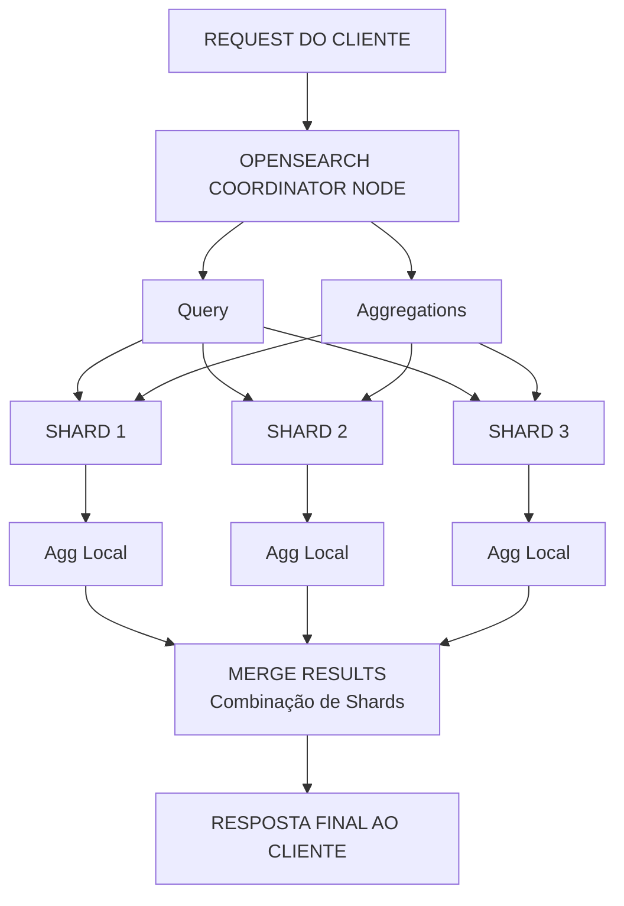

# Capítulo 4: AGGREGATIONS E ANÁLISE DE DADOS

## OBJETIVOS DE APRENDIZAGEM

Ao final deste capítulo, você será capaz de:

1. Compreender a arquitetura e funcionamento das aggregations no OpenSearch
2. Implementar metrics aggregations (avg, sum, stats) para análise estatística de dados
3. Utilizar bucket aggregations (terms, date histogram) para segmentação e agrupamento
4. Construir pipeline aggregations para transformações de dados avançadas
5. Desenvolver nested aggregations complexas para análises multidimensionais
6. Aplicar aggregations em casos de uso reais de análise de dados e business intelligence

---

## 4.1 FUNDAMENTOS DAS AGGREGATIONS

### 4.1.1 O que são Aggregations?

As aggregations no OpenSearch são operações que agrupam, calculam e transformam dados em larga escala diretamente no engine de busca, sem necessidade de extrair todos os documentos para aplicar cálculos em aplicação. Diferentemente de queries tradicionais que retornam documentos, as aggregations retornam informações agregadas (somas, médias, contagens, distribuições) sobre conjuntos de dados.

Esse paradigma oferece ganhos significativos de performance, permitindo análises complexas em datasets com milhões de documentos em tempo real. As aggregations funcionam em paralelo através dos shards de um índice, consolidando resultados de forma distribuída.

### 4.1.2 Arquitetura de Aggregations



A execução segue este fluxo:

1. **Parsing da Request**: O coordenador interpreta a requisição de aggregation
2. **Distribuição**: A agregação é distribuída para todos os shards relevantes
3. **Execução Local**: Cada shard calcula sua agregação localmente sobre seus documentos
4. **Consolidação**: Os resultados de cada shard são combinados
5. **Refinamento**: Se necessário, cálculos adicionais são realizados (como percentis aproximados)
6. **Resposta**: Resultado final é retornado ao cliente

### 4.1.3 Tipos Principais de Aggregations

OpenSearch oferece três categorias principais de aggregations:

**Metrics Aggregations**: Calculam valores métricos (numeração, estatísticas) sobre um conjunto de documentos. Exemplos: média, soma, valor máximo/mínimo, desvio padrão.

**Bucket Aggregations**: Dividem documentos em grupos (buckets) baseado em critérios específicos, permitindo análises por categorias. Exemplos: agrupamento por valor, por data, por intervalo.

**Pipeline Aggregations**: Processam a saída de outras aggregations, aplicando transformações matemáticas ou lógicas adicionais. Exemplos: derivada de uma série temporal, percentis móveis.

---

## 4.2 METRICS AGGREGATIONS: CALCULANDO ESTATÍSTICAS

### 4.2.1 Average Aggregation (avg)

A aggregation `avg` calcula a média aritmética de um campo numérico em todos os documentos que correspondem à query.

**Sintaxe Básica:**

```json
{
  "aggs": {
    "nome_da_agregacao": {
      "avg": {
        "field": "nome_do_campo"
      }
    }
  }
}
```

**Exemplo 1: Preço Médio de Produtos**

Considere um índice de e-commerce com documentos de produtos. Você deseja calcular o preço médio em toda a base:

```json
POST /ecommerce-products/_search
{
  "size": 0,
  "aggs": {
    "preco_medio": {
      "avg": {
        "field": "preco"
      }
    }
  }
}
```

> **O parâmetro `size: 0`**: Quando você só está interessado em aggregations, não em documentos, defina `size: 0` para economizar recursos. OpenSearch não retornará documentos, apenas as aggregations.

**Exemplo 2: Tempo Médio de Entrega por Categoria**

Agora você quer saber o tempo médio de entrega diferente para cada categoria de produto:

```json
POST /ecommerce-products/_search
{
  "size": 0,
  "aggs": {
    "por_categoria": {
      "terms": {
        "field": "categoria.keyword"
      },
      "aggs": {
        "tempo_entrega_medio": {
          "avg": {
            "field": "dias_entrega"
          }
        }
      }
    }
  }
}
```

**Explicação do Resultado:**
- Eletrônicos levam em média 4,2 dias para entrega
- Livros são entregues mais rápido, com 2,1 dias de média
- Roupas ficam em 3,5 dias

### 4.2.2 Sum Aggregation (sum)

A aggregation `sum` calcula a soma total de um campo numérico para todos os documentos.

**Exemplo 1: Receita Total de Vendas**

```json
POST /vendas/_search
{
  "size": 0,
  "aggs": {
    "receita_total": {
      "sum": {
        "field": "valor_venda"
      }
    }
  }
}
```

**Exemplo 2: Total de Visitantes por Dia (Time Series)**

Imagine um índice de análise de website com documento contendo número de visitantes por hora:

```json
POST /analytics-website/_search
{
  "size": 0,
  "aggs": {
    "visitantes_por_dia": {
      "date_histogram": {
        "field": "timestamp",
        "calendar_interval": "day"
      },
      "aggs": {
        "total_visitantes_dia": {
          "sum": {
            "field": "visitantes"
          }
        }
      }
    }
  }
}
```

### 4.2.3 Stats Aggregation (stats)

A aggregation `stats` é uma agregação composta que retorna múltiplas estatísticas em uma única chamada: count, min, max, avg, e sum. É extremamente útil quando você precisa de visão holística dos dados.

**Sintaxe:**

```json
{
  "aggs": {
    "nome_estatisticas": {
      "stats": {
        "field": "nome_do_campo"
      }
    }
  }
}
```

**Exemplo 1: Estatísticas Completas de Latência de Requisições**

```json
POST /logs-api/_search
{
  "size": 0,
  "aggs": {
    "latencia_stats": {
      "stats": {
        "field": "latencia_ms"
      }
    }
  }
}
```

**Explicação:** Esta query retorna:
- **count**: 45.230 requisições analisadas
- **min**: A requisição mais rápida levou 5,2ms
- **max**: A requisição mais lenta levou 2.850,5ms
- **avg**: Latência média de 145,8ms
- **sum**: Soma total de 6.587.042ms de latência

**Exemplo 2: Análise de Performance por Endpoint**

```json
POST /logs-api/_search
{
  "size": 0,
  "aggs": {
    "por_endpoint": {
      "terms": {
        "field": "endpoint.keyword",
        "size": 10
      },
      "aggs": {
        "estatisticas_latencia": {
          "stats": {
            "field": "latencia_ms"
          }
        }
      }
    }
  }
}
```

**Insight Prático:** Observamos que `/api/produtos` tem latência máxima muito superior e média maior. Isso pode indicar necessidade de otimização nesse endpoint.

### 4.2.4 Outras Metrics Aggregations Importantes

**Max e Min Aggregations:**

```json
POST /sensor-iot/_search
{
  "size": 0,
  "aggs": {
    "temperatura_maxima": {
      "max": {
        "field": "temperatura"
      }
    },
    "temperatura_minima": {
      "min": {
        "field": "temperatura"
      }
    }
  }
}
```

**Extended Stats Aggregation:**

Para análises estatísticas mais avançadas (variância, desvio padrão, quartis):

```json
POST /dados-financeiros/_search
{
  "size": 0,
  "aggs": {
    "retorno_acoes": {
      "extended_stats": {
        "field": "retorno_percentual"
      }
    }
  }
}
```

> **Box de Definição - Estatísticas Avançadas**
>
> - **variance**: Medida de dispersão dos dados em torno da média
> - **std_deviation**: Desvio padrão (raiz quadrada da variância). Indica o quanto os dados variam da média
> - **std_deviation_bounds**: Limites de 1 desvio padrão. 68% dos dados caem entre esses limites (em distribuição normal)

---

## 4.3 BUCKET AGGREGATIONS: AGRUPANDO E SEGMENTANDO DADOS

### 4.3.1 Terms Aggregation

A aggregation `terms` agrupa documentos em buckets baseado nos valores únicos de um campo. É uma das aggregations mais utilizadas para análises de distribuição e categorização.

**Sintaxe Básica:**

```json
{
  "aggs": {
    "nome_agregacao": {
      "terms": {
        "field": "nome_do_campo",
        "size": 10,
        "order": { "_count": "desc" }
      }
    }
  }
}
```

**Parâmetros Principais:**
- **field**: Campo a ser agregado (deve estar em formato `.keyword` para strings)
- **size**: Número máximo de buckets a retornar (padrão: 10)
- **order**: Ordenação dos buckets (por count, por key, etc.)

**Exemplo 1: Top 5 Categorias de Produtos por Número de Vendas**

```json
POST /vendas-ecommerce/_search
{
  "size": 0,
  "query": {
    "range": {
      "data_venda": {
        "gte": "2024-01-01",
        "lte": "2024-02-28"
      }
    }
  },
  "aggs": {
    "top_categorias": {
      "terms": {
        "field": "categoria.keyword",
        "size": 5,
        "order": { "_count": "desc" }
      }
    }
  }
}
```

> **Entendendo `doc_count_error_upper_bound`**: Para datasets muito grandes, OpenSearch usa algoritmo aproximativo para evitar consumir muita memória. Este campo indica o erro máximo possível na contagem. Se for 0, os resultados são exatos. Valores altos indicam estimativas menos confiáveis.

**Exemplo 2: Marcas Mais Vendidas com Valor Total de Vendas**

Aqui combinamos uma aggregation terms com uma aggregation sum aninhada:

```json
POST /vendas-ecommerce/_search
{
  "size": 0,
  "aggs": {
    "marcas": {
      "terms": {
        "field": "marca.keyword",
        "size": 15
      },
      "aggs": {
        "receita": {
          "sum": {
            "field": "valor_total"
          }
        },
        "ticket_medio": {
          "avg": {
            "field": "valor_total"
          }
        }
      }
    }
  }
}
```

**Insight Negócio:** Apple tem menos vendas que Samsung, mas ticket médio muito maior (800 vs 400), indicando produtos premium.

### 4.3.2 Date Histogram Aggregation

A aggregation `date_histogram` agrupa documentos em buckets baseado em intervalos de tempo. É fundamental para análises de séries temporais.

**Sintaxe:**

```json
{
  "aggs": {
    "nome_agregacao": {
      "date_histogram": {
        "field": "campo_data",
        "calendar_interval": "day|week|month|year",
        "format": "yyyy-MM-dd"
      }
    }
  }
}
```

**Intervalos Disponíveis:**
- **calendar_interval**: Usa calendário real (day, week, month, quarter, year)
- **fixed_interval**: Usa intervalos fixos (1d, 7d, 30d, 1h, etc.)

**Exemplo 1: Vendas Diárias em Fevereiro**

```json
POST /vendas/_search
{
  "size": 0,
  "aggs": {
    "vendas_diarias": {
      "date_histogram": {
        "field": "data_venda",
        "calendar_interval": "day",
        "format": "yyyy-MM-dd"
      },
      "aggs": {
        "total_vendido": {
          "sum": {
            "field": "valor"
          }
        },
        "quantidade_vendas": {
          "value_count": {
            "field": "_id"
          }
        }
      }
    }
  }
}
```

**Exemplo 2: Análise de Tráfego Web por Hora em Período de 7 Dias**

```json
POST /logs-web/_search
{
  "size": 0,
  "query": {
    "range": {
      "timestamp": {
        "gte": "now-7d"
      }
    }
  },
  "aggs": {
    "trafico_horario": {
      "date_histogram": {
        "field": "timestamp",
        "calendar_interval": "hour",
        "min_doc_count": 0
      },
      "aggs": {
        "requisicoes": {
          "value_count": {
            "field": "request_id"
          }
        },
        "status_codes": {
          "terms": {
            "field": "status_code",
            "size": 5
          }
        },
        "latencia_media": {
          "avg": {
            "field": "response_time_ms"
          }
        }
      }
    }
  }
}
```

> **Parâmetro `min_doc_count`**: Por padrão, OpenSearch omite buckets vazios de date_histogram. Defina `min_doc_count: 0` se quiser incluir períodos sem dados (útil para gráficos contínuos).

### 4.3.3 Histogram Aggregation (Intervalos Numéricos)

Similar a date_histogram, mas para valores numéricos. Agrupa documentos em intervalos de um campo numérico.

**Exemplo: Distribuição de Preços de Produtos**

```json
POST /produtos/_search
{
  "size": 0,
  "aggs": {
    "preco_ranges": {
      "histogram": {
        "field": "preco",
        "interval": 100,
        "min_doc_count": 1
      },
      "aggs": {
        "quantidade_produtos": {
          "value_count": {
            "field": "_id"
          }
        },
        "preco_medio": {
          "avg": {
            "field": "preco"
          }
        }
      }
    }
  }
}
```

### 4.3.4 Range Aggregation

Agrupa documentos em buckets customizados baseado em ranges de valores definidos.

**Exemplo: Análise de Satisfação de Clientes**

```json
POST /avaliacoes-clientes/_search
{
  "size": 0,
  "aggs": {
    "satisfacao": {
      "range": {
        "field": "nota_satisfacao",
        "ranges": [
          { "to": 2 },
          { "from": 2, "to": 3 },
          { "from": 3, "to": 4 },
          { "from": 4, "to": 5 },
          { "from": 5 }
        ]
      },
      "aggs": {
        "comentarios_medio": {
          "value_count": {
            "field": "comentario"
          }
        }
      }
    }
  }
}
```

---

## 4.4 NESTED AGGREGATIONS COMPLEXAS

### 4.4.1 Agregações Aninhadas (Sub-aggregations)

Você pode aninhar agregações para análises multidimensionais. Cada bucket de uma agregação pode conter sub-agregações.

**Exemplo 1: Receita por Categoria e Subcategoria**

```json
POST /vendas/_search
{
  "size": 0,
  "aggs": {
    "por_categoria": {
      "terms": {
        "field": "categoria.keyword",
        "size": 20
      },
      "aggs": {
        "por_subcategoria": {
          "terms": {
            "field": "subcategoria.keyword",
            "size": 10
          },
          "aggs": {
            "receita_total": {
              "sum": {
                "field": "valor"
              }
            }
          }
        }
      }
    }
  }
}
```

**Exemplo 2: Análise Temporal Multidimensional**

Vendas por dia e por região:

```json
POST /vendas/_search
{
  "size": 0,
  "aggs": {
    "vendas_por_dia": {
      "date_histogram": {
        "field": "data_venda",
        "calendar_interval": "day",
        "format": "yyyy-MM-dd"
      },
      "aggs": {
        "por_regiao": {
          "terms": {
            "field": "regiao.keyword"
          },
          "aggs": {
            "total_regiao": {
              "sum": {
                "field": "valor"
              }
            },
            "produtos_vendidos": {
              "sum": {
                "field": "quantidade"
              }
            }
          }
        }
      }
    }
  }
}
```

### 4.4.2 Filter Aggregations (Filtrando Buckets)

A aggregation `filter` permite aplicar filtros a sub-agregações específicas dentro de um bucket.

**Exemplo: Análise Comparativa de Vendas Online vs Offline**

```json
POST /vendas/_search
{
  "size": 0,
  "aggs": {
    "vendas_online": {
      "filter": {
        "term": {
          "canal_venda.keyword": "online"
        }
      },
      "aggs": {
        "receita_online": {
          "sum": {
            "field": "valor"
          }
        },
        "quantidade_online": {
          "value_count": {
            "field": "_id"
          }
        },
        "ticket_medio_online": {
          "avg": {
            "field": "valor"
          }
        }
      }
    },
    "vendas_offline": {
      "filter": {
        "term": {
          "canal_venda.keyword": "offline"
        }
      },
      "aggs": {
        "receita_offline": {
          "sum": {
            "field": "valor"
          }
        },
        "quantidade_offline": {
          "value_count": {
            "field": "_id"
          }
        },
        "ticket_medio_offline": {
          "avg": {
            "field": "valor"
          }
        }
      }
    }
  }
}
```

---

## 4.5 PIPELINE AGGREGATIONS: TRANSFORMAÇÕES AVANÇADAS

### 4.5.1 O que são Pipeline Aggregations?

Pipeline aggregations processam a saída de outras agregações, aplicando transformações matemáticas ou lógicas. Elas não trabalham diretamente com documentos, mas com os resultados de agregações anteriores.

**Casos de Uso Típicos:**
- Calcular a taxa de variação (crescimento) entre períodos
- Identificar tendências em séries temporais
- Derivadas e integrais de séries
- Ordenar buckets por métricas específicas

### 4.5.2 Derivative Aggregation (Taxa de Variação)

Calcula a derivada (taxa de mudança) de métricas em uma série temporal.

**Exemplo 1: Taxa de Crescimento de Vendas Diárias**

```json
POST /vendas/_search
{
  "size": 0,
  "aggs": {
    "vendas_diarias": {
      "date_histogram": {
        "field": "data_venda",
        "calendar_interval": "day",
        "format": "yyyy-MM-dd"
      },
      "aggs": {
        "total_dia": {
          "sum": {
            "field": "valor"
          }
        },
        "variacao_dia_anterior": {
          "derivative": {
            "buckets_path": "total_dia"
          }
        }
      }
    }
  }
}
```

**Interpretação dos Resultados:**
- O campo `variacao_dia_anterior` mostra a diferença de vendas em relação ao dia anterior
- Um valor positivo indica crescimento nas vendas
- Um valor negativo indica queda nas vendas
- Use este padrão para identificar tendências crescentes ou decrescentes em séries temporais

**Exemplo 2: Análise de Tendência com Intervalo Móvel**

```json
POST /metrics/_search
{
  "size": 0,
  "aggs": {
    "metricas_horarias": {
      "date_histogram": {
        "field": "timestamp",
        "calendar_interval": "hour"
      },
      "aggs": {
        "cpu_media": {
          "avg": {
            "field": "cpu_usage"
          }
        },
        "tendencia_cpu": {
          "derivative": {
            "buckets_path": "cpu_media",
            "gap_policy": "skip"
          }
        }
      }
    }
  }
}
```

> **Parâmetro `gap_policy`**: Define como lidar com buckets sem dados. Valores possíveis:
> - **skip**: Ignora buckets com gaps (padrão)
> - **insert_zeros**: Trata como zero
> - **keep_values**: Mantém o último valor conhecido

### 4.5.3 Moving Average Aggregation

Calcula a média móvel de uma métrica, suavizando flutuações e revelando tendências.

**Exemplo: Suavização de Latência API com Janela de 7 Períodos**

```json
POST /logs-api/_search
{
  "size": 0,
  "aggs": {
    "latencia_por_hora": {
      "date_histogram": {
        "field": "timestamp",
        "calendar_interval": "hour"
      },
      "aggs": {
        "latencia_media": {
          "avg": {
            "field": "response_time_ms"
          }
        },
        "media_movel_7h": {
          "moving_avg": {
            "buckets_path": "latencia_media",
            "window": 7
          }
        }
      }
    }
  }
}
```

**Como Interpretar:**
- A `latencia_media` mostra valores brutos que podem ter flutuações
- A `media_movel_7h` calcula a média dos últimos 7 períodos (horas neste caso)
- Use a média móvel para visualizar tendências verdadeiras, eliminando picos e vales temporários
- O parâmetro `window` define quantos períodos anteriores usar no cálculo

### 4.5.4 Percentiles Pipeline Aggregation

Calcula percentis de buckets em uma agregação, útil para identificar limites de performance.

**Exemplo: Percentis de Receita Diária**

```json
POST /vendas/_search
{
  "size": 0,
  "aggs": {
    "vendas_diarias": {
      "date_histogram": {
        "field": "data_venda",
        "calendar_interval": "day"
      },
      "aggs": {
        "receita_dia": {
          "sum": {
            "field": "valor"
          }
        }
      }
    },
    "percentis_receita": {
      "percentiles_bucket": {
        "buckets_path": "vendas_diarias>receita_dia",
        "percents": [25, 50, 75, 90, 95, 99]
      }
    }
  }
}
```

**Interpretação:**
- **25º percentil**: 25% dos dias têm receita abaixo deste valor
- **50º percentil (mediana)**: O valor intermediário de receita diária
- **75º percentil**: 75% dos dias ficam abaixo deste valor
- **90º, 95º, 99º percentis**: Identificam dias de receita excepcionalmente alta
- Use para estabelecer benchmarks de performance e identificar anomalias

---

## 4.6 CASOS DE USO PRÁTICO: AGREGAÇÕES COMPLEXAS

### 4.6.1 Dashboard de Business Intelligence: E-commerce

**Objetivo:** Criar um dashboard completo de análise de vendas em tempo real.

**Query Completa:**

```json
POST /vendas-ecommerce/_search
{
  "size": 0,
  "query": {
    "range": {
      "data_venda": {
        "gte": "now-30d"
      }
    }
  },
  "aggs": {
    "kpi_gerais": {
      "aggs": {
        "receita_total": {
          "sum": {
            "field": "valor"
          }
        },
        "numero_vendas": {
          "value_count": {
            "field": "_id"
          }
        },
        "ticket_medio": {
          "avg": {
            "field": "valor"
          }
        },
        "clientes_unicos": {
          "cardinality": {
            "field": "cliente_id",
            "precision_threshold": 40000
          }
        }
      }
    },
    "top_produtos": {
      "terms": {
        "field": "produto.keyword",
        "size": 10
      },
      "aggs": {
        "receita_produto": {
          "sum": {
            "field": "valor"
          }
        },
        "unidades_vendidas": {
          "sum": {
            "field": "quantidade"
          }
        },
        "margem_media": {
          "avg": {
            "field": "margem_percentual"
          }
        }
      }
    },
    "vendas_por_categoria": {
      "terms": {
        "field": "categoria.keyword"
      },
      "aggs": {
        "receita": {
          "sum": {
            "field": "valor"
          }
        },
        "crescimento_diario": {
          "date_histogram": {
            "field": "data_venda",
            "calendar_interval": "day"
          },
          "aggs": {
            "receita_dia": {
              "sum": {
                "field": "valor"
              }
            }
          }
        }
      }
    },
    "performance_por_regiao": {
      "terms": {
        "field": "regiao.keyword"
      },
      "aggs": {
        "receita_regiao": {
          "sum": {
            "field": "valor"
          }
        },
        "numero_transacoes": {
          "value_count": {
            "field": "_id"
          }
        },
        "taxa_conversao": {
          "avg": {
            "field": "taxa_conversao"
          }
        },
        "satisfacao_cliente": {
          "avg": {
            "field": "nota_satisfacao"
          }
        }
      }
    },
    "faixas_preco_distribuicao": {
      "histogram": {
        "field": "valor",
        "interval": 50
      },
      "aggs": {
        "quantidade_vendas": {
          "value_count": {
            "field": "_id"
          }
        }
      }
    },
    "analise_satisfacao": {
      "range": {
        "field": "nota_satisfacao",
        "ranges": [
          { "to": 2, "key": "Insatisfeito" },
          { "from": 2, "to": 3, "key": "Pouco Satisfeito" },
          { "from": 3, "to": 4, "key": "Satisfeito" },
          { "from": 4, "key": "Muito Satisfeito" }
        ]
      },
      "aggs": {
        "quantidade_clientes": {
          "value_count": {
            "field": "cliente_id"
          }
        }
      }
    }
  }
}
```

**Como Interpretar os Resultados:**

- **kpi_gerais**: Fornece visão geral da saúde do negócio (receita total, número de vendas, ticket médio, clientes únicos)
- **top_produtos**: Identifica quais produtos geram mais receita e a margem associada
- **vendas_por_categoria**: Permite comparar performance entre categorias e identificar tendências diárias
- **performance_por_regiao**: Mostra qual região é mais lucrativa e qual tem melhor taxa de conversão
- **faixas_preco_distribuicao**: Revela em quais faixas de preço os clientes mais compram
- **analise_satisfacao**: Indica nível de satisfação dos clientes e áreas de melhoria

### 4.6.2 Monitoramento de Performance: Sistema de Logs

**Objetivo:** Análise avançada de latência e status de APIs.

```json
POST /logs-api-2024/_search
{
  "size": 0,
  "query": {
    "range": {
      "timestamp": {
        "gte": "now-24h"
      }
    }
  },
  "aggs": {
    "por_endpoint": {
      "terms": {
        "field": "endpoint.keyword",
        "size": 20
      },
      "aggs": {
        "status_distribution": {
          "terms": {
            "field": "status_code"
          }
        },
        "latencia_stats": {
          "extended_stats": {
            "field": "response_time_ms"
          }
        },
        "latencia_percentis": {
          "percentiles": {
            "field": "response_time_ms",
            "percents": [50, 75, 90, 95, 99]
          }
        },
        "taxa_erro": {
          "filter": {
            "range": {
              "status_code": {
                "gte": 400
              }
            }
          },
          "aggs": {
            "quantidade_erros": {
              "value_count": {
                "field": "_id"
              }
            }
          }
        },
        "tendencia_latencia": {
          "date_histogram": {
            "field": "timestamp",
            "calendar_interval": "hour"
          },
          "aggs": {
            "latencia_hora": {
              "avg": {
                "field": "response_time_ms"
              }
            },
            "media_movel_4h": {
              "moving_avg": {
                "buckets_path": "latencia_hora",
                "window": 4
              }
            }
          }
        }
      }
    },
    "alertas_performance": {
      "filter": {
        "range": {
          "response_time_ms": {
            "gte": 5000
          }
        }
      },
      "aggs": {
        "endpoints_lentos": {
          "terms": {
            "field": "endpoint.keyword",
            "size": 10
          },
          "aggs": {
            "latencia_maxima": {
              "max": {
                "field": "response_time_ms"
              }
            }
          }
        }
      }
    }
  }
}
```

**Como Interpretar:**

- **status_distribution**: Mostra proporção de respostas bem-sucedidas (200) vs erros (4xx, 5xx)
- **latencia_stats**: Fornece visão completa: tempo mínimo, máximo, média e desvio padrão
- **latencia_percentis**: Identifica em qual valor 95% das requisições respondem (SLA importante)
- **taxa_erro**: Quantifica problemas em cada endpoint
- **tendencia_latencia**: Mostra se performance piora em certos horários
- **media_movel_4h**: Suaviza flutuações para identificar tendências verdadeiras
- **alertas_performance**: Destaca endpoints problemáticos que excedem o limite de 5 segundos

### 4.6.3 Análise Financeira: Rentabilidade de Clientes

```json
POST /transacoes-financeiras/_search
{
  "size": 0,
  "aggs": {
    "por_cliente": {
      "terms": {
        "field": "cliente_id",
        "size": 100
      },
      "aggs": {
        "valor_total_transacoes": {
          "sum": {
            "field": "valor"
          }
        },
        "numero_transacoes": {
          "value_count": {
            "field": "_id"
          }
        },
        "valor_medio_transacao": {
          "avg": {
            "field": "valor"
          }
        },
        "dias_cliente_ativo": {
          "date_range": {
            "field": "data",
            "ranges": [
              {
                "from": "now-30d",
                "key": "Últimos 30 dias"
              },
              {
                "from": "now-90d",
                "to": "now-30d",
                "key": "30-90 dias"
              },
              {
                "from": "now-1y",
                "to": "now-90d",
                "key": "90-365 dias"
              }
            ]
          }
        },
        "rentabilidade": {
          "sum": {
            "field": "lucro"
          }
        },
        "tipos_produto": {
          "terms": {
            "field": "tipo_produto.keyword",
            "size": 5
          },
          "aggs": {
            "valor_tipo": {
              "sum": {
                "field": "valor"
              }
            }
          }
        }
      }
    },
    "segmentacao_clientes": {
      "range": {
        "field": "valor",
        "ranges": [
          {
            "from": 0,
            "to": 1000,
            "key": "Pequeno"
          },
          {
            "from": 1000,
            "to": 10000,
            "key": "Médio"
          },
          {
            "from": 10000,
            "to": 100000,
            "key": "Grande"
          },
          {
            "from": 100000,
            "key": "Premium"
          }
        ]
      },
      "aggs": {
        "quantidade_clientes": {
          "cardinality": {
            "field": "cliente_id"
          }
        },
        "valor_total_segmento": {
          "sum": {
            "field": "valor"
          }
        }
      }
    }
  }
}
```

**Como Interpretar:**

- **por_cliente**: Identifica clientes mais valiosos, sua frequência de transações e produtos preferidos
- **valor_total_transacoes**: Reconheça clientes com maior faturamento (potencial para upsell)
- **numero_transacoes**: Frequência de compra indica fidelidade
- **valor_medio_transacao**: Clientes premium tendem a ter ticket médio maior
- **dias_cliente_ativo**: Segmenta clientes recentes vs antigos para estratégias de retenção
- **tipos_produto**: Revela quais produtos cada cliente prefere
- **segmentacao_clientes**: Particiona clientes por valor total para estratégias de marketing diferenciadas

---

## 4.7 EXERCÍCIOS PRÁTICOS

### Exercício 1: Análise de Avaliações de Produtos

Você possui um índice `product-reviews` com documentos contendo: `product_id`, `rating` (1-5), `texto_review`, `data_avaliacao`, `verificado` (boolean).

**Tarefa:** Crie uma agregação que retorne:
1. Rating médio geral
2. Distribuição de ratings (quantos reviews de 1 estrela, 2, 3, 4, 5)
3. Top 10 produtos por número de reviews
4. Para cada produto, a média de ratings e quantidade de reviews verificados

**Resolução:**

Para resolver este exercício, você precisa combinar múltiplas aggregations:

1. **Rating médio geral**: Use uma aggregation `avg` diretamente no campo `rating`

2. **Distribuição de ratings**: Use uma aggregation `histogram` com intervalo de 1 no campo `rating`, ou alternativamente um `terms` agrupando por valor inteiro. Cada bucket mostrará quantos documentos caem em cada estrela

3. **Top 10 produtos**: Use `terms` no campo `product_id.keyword` com `size: 10` ordenado por `_count` em ordem decrescente

4. **Agregações aninhadas**: Dentro de cada produto (bucket da aggregation terms), adicione:
   - Uma aggregation `avg` para a média de ratings
   - Uma aggregation `filter` para documentos onde `verificado: true`
   - Dentro do filtro, uma aggregation `value_count` para contar reviews verificados

A estrutura segue o padrão: aggregation principal (terms) > sub-aggregations (avg + filter > value_count)

### Exercício 2: Monitoramento de Saúde do Sistema

Você tem um índice `system-health` com: `timestamp`, `cpu_percentage`, `memoria_mb`, `disco_usado_mb`, `host`.

**Tarefa:** Crie agregações para:
1. CPU máxima e mínima de cada host nas últimas 24h
2. Uso de memória médio por hora (últimas 24h)
3. Alertar quando CPU exceda 80%
4. Tendência de uso de disco (últimas 7 dias)

**Resolução:**

1. **CPU máxima/mínima por host**: Use uma aggregation `terms` no campo `host.keyword`, depois adicione sub-aggregations `max` e `min` no campo `cpu_percentage`. O filtro `range` na query filtra últimas 24h

2. **Memória média por hora**: Use uma aggregation `date_histogram` com `calendar_interval: hour`, depois uma sub-aggregation `avg` no campo `memoria_mb`

3. **Alertar CPU alta**: Use uma aggregation `filter` com condição `cpu_percentage >= 80`, depois agregue `terms` por host para ver quais estão com problema. Use sub-aggregation `value_count` para quantificar ocorrências

4. **Tendência disco 7 dias**: Primeiro filtre documentos de 7 dias com `range` query, depois use `date_histogram` com `calendar_interval: day` e sub-aggregation `avg` no campo `disco_usado_mb`. Opcionalmente, adicione uma pipeline aggregation `derivative` ou `moving_avg` para mostrar taxa de crescimento do uso de disco

A chave é organizar as aggregations por camadas: filtro geral (query) > agregação temporal ou categórica > sub-agregações de métrica

### Exercício 3: Análise de Carrinhos de Compra Abandonados

Índice `abandoned-carts` contém: `customer_id`, `valor_carrinho`, `items_count`, `tempo_sessao_minutos`, `data_abandono`, `categoria_principal`.

**Tarefa:** Identifique:
1. Valor médio de carrinhos abandonados
2. Distribuição por faixa de valor (0-50, 50-100, 100-500, 500+)
3. Categorias mais frequentemente abandonadas
4. Relação entre tempo de sessão e abandono (crie faixas de tempo)
5. Abandono por dia (últimos 30 dias)

**Resolução:**

1. **Valor médio**: Agregation `avg` simples no campo `valor_carrinho` (adicionalmente, use `sum` para valor total perdido)

2. **Distribuição por faixa**: Use aggregation `range` com ranges customizados (0-50, 50-100, 100-500, 500+). Para cada bucket, adicione `value_count` para contar carrinhos e `sum` para valor total perdido por faixa

3. **Categorias abandonadas**: Use aggregation `terms` no campo `categoria_principal.keyword` com `size` elevado. Para cada categoria, adicione `avg` do valor_carrinho e `value_count` para quantidade de abandonos

4. **Tempo de sessão vs abandono**: Use aggregation `range` no campo `tempo_sessao_minutos` com faixas: 0-5, 5-15, 15-60, 60+. Em cada bucket, calcule `avg` do valor_carrinho (carrinhos abandonados em sessões rápidas tendem a ser menores?) e `value_count` para quantidade

5. **Abandono diário**: Use aggregation `date_histogram` com `calendar_interval: day` filtrando últimos 30 dias. Para cada dia, calcule `value_count` (quantidade) e `sum` (valor total). Opcionalmente, adicione pipeline aggregation `derivative` para mostrar tendência de aumento/queda

O padrão geral: Determine a granularidade (hora, dia, categoria, faixa) > Crie bucket aggregation (terms, range, date_histogram) > Adicione metrics aggregations (avg, sum, count)

---

## 4.8 SÍNTESE DO CAPÍTULO

Neste capítulo, você aprendeu sobre o poder das aggregations no OpenSearch para análise de dados em escala.

**Metrics Aggregations** fornecem cálculos estatísticos rápidos (média, soma, máximo, mínimo) sobre seus dados, fundamentais para KPIs e dashboards.

**Bucket Aggregations** dividem seus dados em grupos relevantes (por categoria, data, intervalo), permitindo análises segmentadas e exploratórias. São a base para entender distribuições e padrões.

**Nested Aggregations** permitem análises multidimensionais, combinando várias camadas de agrupamento para insights profundos. Você pode agrupar por categoria, depois por subcategoria, depois por data, tudo em uma única query eficiente.

**Pipeline Aggregations** transformam saídas de outras agregações, calculando tendências, taxas de variação e métricas derivadas. São essenciais para análise temporal e detecção de anomalias.

Os casos de uso práticos demonstraram como essas ferramentas se aplicam a situações reais: dashboards de e-commerce, monitoramento de performance, análise financeira. O OpenSearch processa essas agregações em paralelo através de todos os shards, tornando possível análises complexas mesmo em datasets de bilhões de documentos.

A chave para dominar aggregations é começar simples (uma métrica), depois progredir para combinações multidimensionais. Sempre tenha claro qual pergunta você está respondendo aos dados. Em seguida, no Capítulo 5, aprofundaremos em busca avançada e relevância, explorando como refinar consultas para obter exatamente os documentos que você precisa.

---

## REFERÊNCIAS E LEITURA COMPLEMENTAR

OpenSearch Documentation - Aggregations. Disponível em: https://docs.opensearch.org/latest/query-dsl/aggregations/. Acessado em fevereiro de 2024.

KIBANA VISUALIZATION. Aggregation Basics. Disponível em: https://docs.opensearch.org/latest/dashboards/. Acessado em fevereiro de 2024.

ELASTICSEARCH INC. Aggregation Architecture Performance. Technical Blog, 2023.

RICHARDSON, Chris. Microservices Patterns: With examples in Java. Manning Publications, 2017.