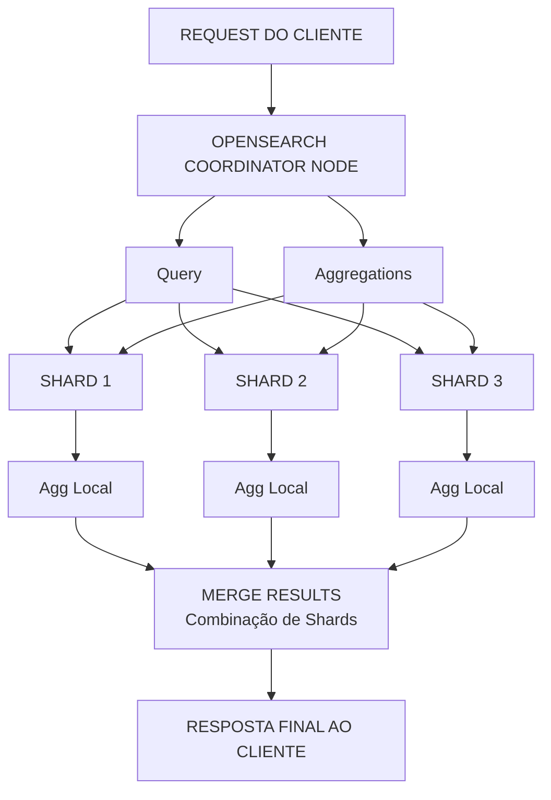

# Capítulo 4: AGGREGATIONS E ANÁLISE DE DADOS

## OBJETIVOS DE APRENDIZAGEM

Ao final deste capítulo, você será capaz de:

1. Compreender a arquitetura e funcionamento das aggregations no OpenSearch
2. Implementar metrics aggregations (avg, sum, stats) para análise estatística de dados
3. Utilizar bucket aggregations (terms, date histogram) para segmentação e agrupamento
4. Construir pipeline aggregations para transformações de dados avançadas
5. Desenvolver nested aggregations complexas para análises multidimensionais
6. Aplicar aggregations em casos de uso reais de análise de dados e business intelligence

---

## 4.1 FUNDAMENTOS DAS AGGREGATIONS

### 4.1.1 O que são Aggregations?

As aggregations no OpenSearch são operações que agrupam, calculam e transformam dados em larga escala diretamente no engine de busca, sem necessidade de extrair todos os documentos para aplicar cálculos em aplicação. Diferentemente de queries tradicionais que retornam documentos, as aggregations retornam informações agregadas (somas, médias, contagens, distribuições) sobre conjuntos de dados.

Esse paradigma oferece ganhos significativos de performance, permitindo análises complexas em datasets com milhões de documentos em tempo real. As aggregations funcionam em paralelo através dos shards de um índice, consolidando resultados de forma distribuída.

### 4.1.2 Arquitetura de Aggregations


```mermaid
graph TD
    A["REQUEST DO CLIENTE"] --> B["OPENSEARCH COORDINATOR NODE"]
    B --> C["Query"]
    B --> D["Aggregations"]
    C --> E["SHARD 1"]
    D --> E
    C --> F["SHARD 2"]
    D --> F
    C --> G["SHARD 3"]
    D --> G
    E --> H["Agg Local"]
    F --> I["Agg Local"]
    G --> J["Agg Local"]
    H --> K["MERGE RESULTS<br/>Combinação de Shards"]
    I --> K
    J --> K
    K --> L["RESPOSTA FINAL AO CLIENTE"]
```

A execução segue este fluxo:

1. **Parsing da Request**: O coordenador interpreta a requisição de aggregation
2. **Distribuição**: A agregação é distribuída para todos os shards relevantes
3. **Execução Local**: Cada shard calcula sua agregação localmente sobre seus documentos
4. **Consolidação**: Os resultados de cada shard são combinados
5. **Refinamento**: Se necessário, cálculos adicionais são realizados (como percentis aproximados)
6. **Resposta**: Resultado final é retornado ao cliente

### 4.1.3 Tipos Principais de Aggregations

OpenSearch oferece três categorias principais de aggregations:

**Metrics Aggregations**: Calculam valores métricos (numeração, estatísticas) sobre um conjunto de documentos. Exemplos: média, soma, valor máximo/mínimo, desvio padrão.

**Bucket Aggregations**: Dividem documentos em grupos (buckets) baseado em critérios específicos, permitindo análises por categorias. Exemplos: agrupamento por valor, por data, por intervalo.

**Pipeline Aggregations**: Processam a saída de outras aggregations, aplicando transformações matemáticas ou lógicas adicionais. Exemplos: derivada de uma série temporal, percentis móveis.

---

## 4.2 METRICS AGGREGATIONS: CALCULANDO ESTATÍSTICAS

### 4.2.1 Average Aggregation (avg)

A aggregation `avg` calcula a média aritmética de um campo numérico em todos os documentos que correspondem à query.

**Sintaxe Básica:**

```json
{
  "aggs": {
    "nome_da_agregacao": {
      "avg": {
        "field": "nome_do_campo"
      }
    }
  }
}
```

**Exemplo 1: Valor Médio de Transações**

Considere um índice de transações com documentos de clientes. Você deseja calcular o valor médio de todas as transações:

```json
POST /customer_transactions/_search
{
  "size": 0,
  "aggs": {
    "valor_medio_transacao": {
      "avg": {
        "field": "transaction_amount"
      }
    }
  }
}
```

> **O parâmetro `size: 0`**: Quando você só está interessado em aggregations, não em documentos, defina `size: 0` para economizar recursos. OpenSearch não retornará documentos, apenas as aggregations.

**Exemplo 2: Valor Médio de Transações por Categoria**

Agora você quer saber o valor médio de transações para cada categoria de gasto:

```json
POST /customer_transactions/_search
{
  "size": 0,
  "aggs": {
    "por_categoria": {
      "terms": {
        "field": "category"
      },
      "aggs": {
        "valor_medio_categoria": {
          "avg": {
            "field": "transaction_amount"
          }
        }
      }
    }
  }
}
```

**Explicação do Resultado:**
- Travel tem valor médio mais alto (maior gasto em viagens)
- Electronics apresenta transações de valor elevado
- Cosmetic e Market têm valores mais baixos por transação

### 4.2.2 Sum Aggregation (sum)

A aggregation `sum` calcula a soma total de um campo numérico para todos os documentos.

**Exemplo 1: Valor Total de Transações**

```json
POST /customer_transactions/_search
{
  "size": 0,
  "aggs": {
    "valor_total_transacoes": {
      "sum": {
        "field": "transaction_amount"
      }
    }
  }
}
```

**Exemplo 2: Valor Total por Dia (Time Series)**

Imagine análise de transações diárias. Você quer somar o valor de todas as transações cada dia:

```json
POST /customer_transactions/_search
{
  "size": 0,
  "aggs": {
    "valor_por_dia": {
      "date_histogram": {
        "field": "date",
        "calendar_interval": "day",
        "format": "yyyy-MM-dd"
      },
      "aggs": {
        "total_dia": {
          "sum": {
            "field": "transaction_amount"
          }
        }
      }
    }
  }
}
```

### 4.2.3 Stats Aggregation (stats)

A aggregation `stats` é uma agregação composta que retorna múltiplas estatísticas em uma única chamada: count, min, max, avg, e sum. É extremamente útil quando você precisa de visão holística dos dados.

**Sintaxe:**

```json
{
  "aggs": {
    "nome_estatisticas": {
      "stats": {
        "field": "nome_do_campo"
      }
    }
  }
}
```

**Exemplo 1: Estatísticas Completas de Valores de Transação**

```json
POST /customer_transactions/_search
{
  "size": 0,
  "aggs": {
    "estatisticas_transacao": {
      "stats": {
        "field": "transaction_amount"
      }
    }
  }
}
```

**Explicação:** Esta query retorna:
- **count**: Total de transações analisadas (ex: 50.000)
- **min**: Menor valor de transação (ex: R$ 1,50)
- **max**: Maior valor de transação (ex: R$ 5.000,00)
- **avg**: Valor médio de transação (ex: R$ 250,00)
- **sum**: Soma total de todas as transações

**Exemplo 2: Análise de Estatísticas por Merchant (Estabelecimento)**

```json
POST /customer_transactions/_search
{
  "size": 0,
  "aggs": {
    "por_merchant": {
      "terms": {
        "field": "merchant_name.keyword",
        "size": 15
      },
      "aggs": {
        "estatisticas_merchant": {
          "stats": {
            "field": "transaction_amount"
          }
        }
      }
    }
  }
}
```

**Insight Prático:** Observamos que alguns estabelecimentos têm valores máximos muito superiores (lojas de eletrônicos e viagens), enquanto outros (cosméticos) têm distribuição mais uniforme. Isso pode indicar diferentes perfis de clientes ou segmentos de produto.

### 4.2.4 Outras Metrics Aggregations Importantes

**Max e Min Aggregations:**

```json
POST /customer_transactions/_search
{
  "size": 0,
  "aggs": {
    "valor_maximo": {
      "max": {
        "field": "transaction_amount"
      }
    },
    "valor_minimo": {
      "min": {
        "field": "transaction_amount"
      }
    }
  }
}
```

**Extended Stats Aggregation:**

Para análises estatísticas mais avançadas (variância, desvio padrão, quartis) nos valores de transação:

```json
POST /customer_transactions/_search
{
  "size": 0,
  "aggs": {
    "estatisticas_avancadas": {
      "extended_stats": {
        "field": "transaction_amount"
      }
    }
  }
}
```

> **Box de Definição - Estatísticas Avançadas**
>
> - **variance**: Medida de dispersão dos dados em torno da média
> - **std_deviation**: Desvio padrão (raiz quadrada da variância). Indica o quanto os dados variam da média
> - **std_deviation_bounds**: Limites de 1 desvio padrão. 68% dos dados caem entre esses limites (em distribuição normal)

---

## 4.3 BUCKET AGGREGATIONS: AGRUPANDO E SEGMENTANDO DADOS

### 4.3.1 Terms Aggregation

A aggregation `terms` agrupa documentos em buckets baseado nos valores únicos de um campo. É uma das aggregations mais utilizadas para análises de distribuição e categorização.

**Sintaxe Básica:**

```json
{
  "aggs": {
    "nome_agregacao": {
      "terms": {
        "field": "nome_do_campo",
        "size": 10,
        "order": { "_count": "desc" }
      }
    }
  }
}
```

**Parâmetros Principais:**
- **field**: Campo a ser agregado (deve estar em formato `.keyword` para strings)
- **size**: Número máximo de buckets a retornar (padrão: 10)
- **order**: Ordenação dos buckets (por count, por key, etc.)

**Exemplo 1: Top 5 Categorias por Número de Transações**

```json
POST /customer_transactions/_search
{
  "size": 0,
  "query": {
    "range": {
      "date": {
        "gte": "2023-01-01",
        "lte": "2023-12-31"
      }
    }
  },
  "aggs": {
    "top_categorias": {
      "terms": {
        "field": "category",
        "size": 5,
        "order": { "_count": "desc" }
      }
    }
  }
}
```

> **Entendendo `doc_count_error_upper_bound`**: Para datasets muito grandes, OpenSearch usa algoritmo aproximativo para evitar consumir muita memória. Este campo indica o erro máximo possível na contagem. Se for 0, os resultados são exatos. Valores altos indicam estimativas menos confiáveis.

**Exemplo 2: Estabelecimentos (Merchants) com Maior Receita e Ticket Médio**

Aqui combinamos uma aggregation terms com uma aggregation sum aninhada:

```json
POST /customer_transactions/_search
{
  "size": 0,
  "aggs": {
    "por_merchant": {
      "terms": {
        "field": "merchant_name.keyword",
        "size": 15
      },
      "aggs": {
        "receita_total": {
          "sum": {
            "field": "transaction_amount"
          }
        },
        "ticket_medio": {
          "avg": {
            "field": "transaction_amount"
          }
        }
      }
    }
  }
}
```

**Insight Negócio:** Estabelecimentos de viagem têm menos transações que supermercados, mas ticket médio muito maior (2.500 vs 100), indicando clientes gastando mais em viagens.

### 4.3.2 Date Histogram Aggregation

A aggregation `date_histogram` agrupa documentos em buckets baseado em intervalos de tempo. É fundamental para análises de séries temporais.

**Sintaxe:**

```json
{
  "aggs": {
    "nome_agregacao": {
      "date_histogram": {
        "field": "campo_data",
        "calendar_interval": "day|week|month|year",
        "format": "yyyy-MM-dd"
      }
    }
  }
}
```

**Intervalos Disponíveis:**
- **calendar_interval**: Usa calendário real (day, week, month, quarter, year)
- **fixed_interval**: Usa intervalos fixos (1d, 7d, 30d, 1h, etc.)

**Exemplo 1: Transações Diárias**

```json
POST /customer_transactions/_search
{
  "size": 0,
  "aggs": {
    "transacoes_por_dia": {
      "date_histogram": {
        "field": "date",
        "calendar_interval": "day",
        "format": "yyyy-MM-dd"
      },
      "aggs": {
        "valor_total_dia": {
          "sum": {
            "field": "transaction_amount"
          }
        },
        "quantidade_transacoes": {
          "value_count": {
            "field": "_id"
          }
        }
      }
    }
  }
}
```

**Exemplo 2: Análise de Transações por Semana com Categorias**

```json
POST /customer_transactions/_search
{
  "size": 0,
  "query": {
    "range": {
      "date": {
        "gte": "now-90d"
      }
    }
  },
  "aggs": {
    "transacoes_por_semana": {
      "date_histogram": {
        "field": "date",
        "calendar_interval": "week",
        "min_doc_count": 0,
        "format": "yyyy-MM-dd"
      },
      "aggs": {
        "por_categoria": {
          "terms": {
            "field": "category",
            "size": 6
          },
          "aggs": {
            "total_categoria": {
              "sum": {
                "field": "transaction_amount"
              }
            }
          }
        },
        "total_semana": {
          "sum": {
            "field": "transaction_amount"
          }
        }
      }
    }
  }
}
```

> **Parâmetro `min_doc_count`**: Por padrão, OpenSearch omite buckets vazios de date_histogram. Defina `min_doc_count: 0` se quiser incluir períodos sem dados (útil para gráficos contínuos).

### 4.3.3 Histogram Aggregation (Intervalos Numéricos)

Similar a date_histogram, mas para valores numéricos. Agrupa documentos em intervalos de um campo numérico.

**Exemplo: Distribuição de Valores de Transação em Faixas**

```json
POST /customer_transactions/_search
{
  "size": 0,
  "aggs": {
    "faixas_valor": {
      "histogram": {
        "field": "transaction_amount",
        "interval": 500,
        "min_doc_count": 1
      },
      "aggs": {
        "quantidade_transacoes": {
          "value_count": {
            "field": "_id"
          }
        },
        "valor_medio": {
          "avg": {
            "field": "transaction_amount"
          }
        }
      }
    }
  }
}
```

### 4.3.4 Range Aggregation

Agrupa documentos em buckets customizados baseado em ranges de valores definidos.

**Exemplo: Segmentação de Clientes por Valor Total de Transações**

```json
POST /customer_transactions/_search
{
  "size": 0,
  "aggs": {
    "segmentacao_valor": {
      "range": {
        "field": "transaction_amount",
        "ranges": [
          { "to": 50, "key": "Pequeno (< R$50)" },
          { "from": 50, "to": 200, "key": "Médio (R$50-200)" },
          { "from": 200, "to": 1000, "key": "Grande (R$200-1000)" },
          { "from": 1000, "key": "Premium (> R$1000)" }
        ]
      },
      "aggs": {
        "quantidade": {
          "value_count": {
            "field": "_id"
          }
        },
        "valor_total": {
          "sum": {
            "field": "transaction_amount"
          }
        }
      }
    }
  }
}
```

---

## 4.4 NESTED AGGREGATIONS COMPLEXAS

### 4.4.1 Agregações Aninhadas (Sub-aggregations)

Você pode aninhar agregações para análises multidimensionais. Cada bucket de uma agregação pode conter sub-agregações.

**Exemplo 1: Transações por Categoria e Merchant**

```json
POST /customer_transactions/_search
{
  "size": 0,
  "aggs": {
    "por_categoria": {
      "terms": {
        "field": "category",
        "size": 10
      },
      "aggs": {
        "por_merchant": {
          "terms": {
            "field": "merchant_name.keyword",
            "size": 5
          },
          "aggs": {
            "valor_total": {
              "sum": {
                "field": "transaction_amount"
              }
            }
          }
        }
      }
    }
  }
}
```

**Exemplo 2: Análise Temporal Multidimensional**

Transações por dia e por categoria:

```json
POST /customer_transactions/_search
{
  "size": 0,
  "aggs": {
    "por_dia": {
      "date_histogram": {
        "field": "date",
        "calendar_interval": "day",
        "format": "yyyy-MM-dd"
      },
      "aggs": {
        "por_categoria": {
          "terms": {
            "field": "category"
          },
          "aggs": {
            "valor_total": {
              "sum": {
                "field": "transaction_amount"
              }
            },
            "quantidade": {
              "value_count": {
                "field": "_id"
              }
            }
          }
        }
      }
    }
  }
}
```

### 4.4.2 Filter Aggregations (Filtrando Buckets)

A aggregation `filter` permite aplicar filtros a sub-agregações específicas dentro de um bucket.

**Exemplo: Análise Comparativa de Transações por Gênero do Cliente**

```json
POST /customer_transactions/_search
{
  "size": 0,
  "aggs": {
    "transacoes_masculino": {
      "filter": {
        "term": {
          "gender": "M"
        }
      },
      "aggs": {
        "valor_total_m": {
          "sum": {
            "field": "transaction_amount"
          }
        },
        "quantidade_m": {
          "value_count": {
            "field": "_id"
          }
        },
        "ticket_medio_m": {
          "avg": {
            "field": "transaction_amount"
          }
        }
      }
    },
    "transacoes_feminino": {
      "filter": {
        "term": {
          "gender": "F"
        }
      },
      "aggs": {
        "valor_total_f": {
          "sum": {
            "field": "transaction_amount"
          }
        },
        "quantidade_f": {
          "value_count": {
            "field": "_id"
          }
        },
        "ticket_medio_f": {
          "avg": {
            "field": "transaction_amount"
          }
        }
      }
    }
  }
}
```

---

## 4.5 PIPELINE AGGREGATIONS: TRANSFORMAÇÕES AVANÇADAS

### 4.5.1 O que são Pipeline Aggregations?

Pipeline aggregations processam a saída de outras agregações, aplicando transformações matemáticas ou lógicas. Elas não trabalham diretamente com documentos, mas com os resultados de agregações anteriores.

**Casos de Uso Típicos:**
- Calcular a taxa de variação (crescimento) entre períodos
- Identificar tendências em séries temporais
- Derivadas e integrais de séries
- Ordenar buckets por métricas específicas

### 4.5.2 Derivative Aggregation (Taxa de Variação)

Calcula a derivada (taxa de mudança) de métricas em uma série temporal.

**Exemplo 1: Taxa de Crescimento de Transações Diárias**

```json
POST /customer_transactions/_search
{
  "size": 0,
  "aggs": {
    "transacoes_por_dia": {
      "date_histogram": {
        "field": "date",
        "calendar_interval": "day",
        "format": "yyyy-MM-dd"
      },
      "aggs": {
        "valor_total_dia": {
          "sum": {
            "field": "transaction_amount"
          }
        },
        "variacao_dia_anterior": {
          "derivative": {
            "buckets_path": "valor_total_dia"
          }
        }
      }
    }
  }
}
```

**Interpretação dos Resultados:**
- O campo `variacao_dia_anterior` mostra a diferença de valor de transações em relação ao dia anterior
- Um valor positivo indica crescimento nas transações
- Um valor negativo indica queda nas transações
- Use este padrão para identificar tendências crescentes ou decrescentes em séries temporais

**Exemplo 2: Análise de Tendência Semanal com Derivada**

```json
POST /customer_transactions/_search
{
  "size": 0,
  "aggs": {
    "transacoes_por_semana": {
      "date_histogram": {
        "field": "date",
        "calendar_interval": "week",
        "min_doc_count": 0
      },
      "aggs": {
        "valor_total_semana": {
          "sum": {
            "field": "transaction_amount"
          }
        },
        "tendencia_semanal": {
          "derivative": {
            "buckets_path": "valor_total_semana",
            "gap_policy": "skip"
          }
        }
      }
    }
  }
}
```

> **Parâmetro `gap_policy`**: Define como lidar com buckets sem dados. Valores possíveis:
> - **skip**: Ignora buckets com gaps (padrão)
> - **insert_zeros**: Trata como zero
> - **keep_values**: Mantém o último valor conhecido

### 4.5.3 Moving Average Aggregation

Calcula a média móvel de uma métrica, suavizando flutuações e revelando tendências.

**Exemplo: Suavização de Valor de Transações com Janela Móvel de 7 Dias**

```json
POST /customer_transactions/_search
{
  "size": 0,
  "aggs": {
    "valor_por_dia": {
      "date_histogram": {
        "field": "date",
        "calendar_interval": "day",
        "min_doc_count": 0
      },
      "aggs": {
        "valor_dia": {
          "sum": {
            "field": "transaction_amount"
          }
        },
        "media_movel_7dias": {
          "moving_avg": {
            "buckets_path": "valor_dia",
            "window": 7
          }
        }
      }
    }
  }
}
```

**Como Interpretar:**
- A `valor_dia` mostra valores brutos de transações que podem ter flutuações diárias
- A `media_movel_7dias` calcula a média dos últimos 7 dias
- Use a média móvel para visualizar tendências verdadeiras, eliminando picos e vales temporários
- O parâmetro `window` define quantos períodos anteriores usar no cálculo (útil para suavizar dados ruidosos)

### 4.5.4 Percentiles Pipeline Aggregation

Calcula percentis de buckets em uma agregação, útil para identificar limites de performance.

**Exemplo: Percentis de Valor Diário de Transações**

```json
POST /customer_transactions/_search
{
  "size": 0,
  "aggs": {
    "valor_por_dia": {
      "date_histogram": {
        "field": "date",
        "calendar_interval": "day"
      },
      "aggs": {
        "valor_dia": {
          "sum": {
            "field": "transaction_amount"
          }
        }
      }
    },
    "percentis_valor": {
      "percentiles_bucket": {
        "buckets_path": "valor_por_dia>valor_dia",
        "percents": [25, 50, 75, 90, 95, 99]
      }
    }
  }
}
```

**Interpretação:**
- **25º percentil**: 25% dos dias têm valor total de transações abaixo deste valor
- **50º percentil (mediana)**: O valor intermediário de transações diárias
- **75º percentil**: 75% dos dias ficam abaixo deste valor
- **90º, 95º, 99º percentis**: Identificam dias com volume de transações excepcionalmente alto
- Use para estabelecer benchmarks de performance e identificar anomalias

---

## 4.6 CASOS DE USO PRÁTICO: AGREGAÇÕES COMPLEXAS

### 4.6.1 Dashboard de Business Intelligence: Análise de Transações de Clientes

**Objetivo:** Criar um dashboard completo de análise de transações em tempo real com segmentação multidimensional.

**Query Completa:**

```json
POST /customer_transactions/_search
{
  "size": 0,
  "query": {
    "range": {
      "date": {
        "gte": "now-90d"
      }
    }
  },
  "aggs": {
    "kpi_gerais": {
      "stats": {
        "field": "transaction_amount"
      }
    },
    "valor_total": {
      "sum": {
        "field": "transaction_amount"
      }
    },
    "numero_transacoes": {
      "value_count": {
        "field": "_id"
      }
    },
    "valor_medio": {
      "avg": {
        "field": "transaction_amount"
      }
    },
    "clientes_unicos": {
      "cardinality": {
        "field": "customer_id",
        "precision_threshold": 10000
      }
    },
    "top_merchants": {
      "terms": {
        "field": "merchant_name.keyword",
        "size": 15
      },
      "aggs": {
        "valor_total_merchant": {
          "sum": {
            "field": "transaction_amount"
          }
        },
        "numero_transacoes_merchant": {
          "value_count": {
            "field": "_id"
          }
        },
        "valor_medio_merchant": {
          "avg": {
            "field": "transaction_amount"
          }
        }
      }
    },
    "transacoes_por_categoria": {
      "terms": {
        "field": "category"
      },
      "aggs": {
        "valor_categoria": {
          "sum": {
            "field": "transaction_amount"
          }
        },
        "tendencia_diaria": {
          "date_histogram": {
            "field": "date",
            "calendar_interval": "day"
          },
          "aggs": {
            "valor_dia": {
              "sum": {
                "field": "transaction_amount"
              }
            }
          }
        }
      }
    },
    "performance_por_genero": {
      "terms": {
        "field": "gender"
      },
      "aggs": {
        "valor_total_genero": {
          "sum": {
            "field": "transaction_amount"
          }
        },
        "numero_transacoes_genero": {
          "value_count": {
            "field": "_id"
          }
        },
        "valor_medio_genero": {
          "avg": {
            "field": "transaction_amount"
          }
        }
      }
    },
    "faixas_valor_distribuicao": {
      "histogram": {
        "field": "transaction_amount",
        "interval": 500,
        "min_doc_count": 1
      },
      "aggs": {
        "quantidade_transacoes": {
          "value_count": {
            "field": "_id"
          }
        }
      }
    },
    "segmentacao_valor": {
      "range": {
        "field": "transaction_amount",
        "ranges": [
          { "to": 50, "key": "Pequeno (< R$50)" },
          { "from": 50, "to": 200, "key": "Médio (R$50-200)" },
          { "from": 200, "to": 1000, "key": "Grande (R$200-1000)" },
          { "from": 1000, "key": "Premium (> R$1000)" }
        ]
      },
      "aggs": {
        "quantidade": {
          "value_count": {
            "field": "_id"
          }
        },
        "valor_total_faixa": {
          "sum": {
            "field": "transaction_amount"
          }
        }
      }
    }
  }
}
```

**Como Interpretar os Resultados:**

- **kpi_gerais**: Fornece visão geral do volume (valor total, número de transações, ticket médio, clientes únicos)
- **top_merchants**: Identifica quais estabelecimentos geram mais receita e quantas transações
- **transacoes_por_categoria**: Permite comparar performance entre categorias e identificar tendências diárias
- **performance_por_genero**: Mostra padrão de gasto diferente por gênero
- **faixas_valor_distribuicao**: Revela em quais faixas de valor as transações mais ocorrem
- **segmentacao_valor**: Particiona transações em grupos de valor para análise de segmentação de clientes

### 4.6.2 Análise de Padrões de Gasto: Comportamento de Clientes

**Objetivo:** Análise avançada de padrões de transação por cliente e categoria.

```json
POST /customer_transactions/_search
{
  "size": 0,
  "query": {
    "range": {
      "date": {
        "gte": "now-180d"
      }
    }
  },
  "aggs": {
    "por_categoria": {
      "terms": {
        "field": "category",
        "size": 10
      },
      "aggs": {
        "por_genero": {
          "terms": {
            "field": "gender"
          }
        },
        "estatisticas_valor": {
          "extended_stats": {
            "field": "transaction_amount"
          }
        },
        "valor_percentis": {
          "percentiles": {
            "field": "transaction_amount",
            "percents": [25, 50, 75, 90, 95]
          }
        },
        "clientes_categoria": {
          "cardinality": {
            "field": "customer_id",
            "precision_threshold": 5000
          }
        },
        "tendencia_mensal": {
          "date_histogram": {
            "field": "date",
            "calendar_interval": "month"
          },
          "aggs": {
            "valor_mes": {
              "sum": {
                "field": "transaction_amount"
              }
            },
            "crescimento_mensal": {
              "derivative": {
                "buckets_path": "valor_mes"
              }
            }
          }
        }
      }
    },
    "transacoes_altas": {
      "filter": {
        "range": {
          "transaction_amount": {
            "gte": 2000
          }
        }
      },
      "aggs": {
        "categorias_altas": {
          "terms": {
            "field": "category",
            "size": 10
          },
          "aggs": {
            "valor_medio_alto": {
              "avg": {
                "field": "transaction_amount"
              }
            }
          }
        }
      }
    }
  }
}
```

**Como Interpretar:**

- **por_categoria**: Agrupamento multidimensional por categoria
- **por_genero**: Distribuição de clientes por gênero em cada categoria
- **estatisticas_valor**: Fornece visão completa de distribuição de valores (min, max, média, desvio padrão)
- **valor_percentis**: Identifica em qual valor 75%, 90%, 95% das transações da categoria ficam
- **clientes_categoria**: Quantifica clientes únicos gastando em cada categoria
- **tendencia_mensal**: Mostra evolução temporal e crescimento/queda de gasto
- **transacoes_altas**: Destaca transações premium (> R$2.000) e suas categorias associadas

### 4.6.3 Análise de Valor de Cliente (CLV): Segmentação por Gasto Total

```json
POST /customer_transactions/_search
{
  "size": 0,
  "aggs": {
    "por_cliente": {
      "terms": {
        "field": "customer_id",
        "size": 100
      },
      "aggs": {
        "valor_total_cliente": {
          "sum": {
            "field": "transaction_amount"
          }
        },
        "numero_transacoes": {
          "value_count": {
            "field": "_id"
          }
        },
        "valor_medio_transacao": {
          "avg": {
            "field": "transaction_amount"
          }
        },
        "recencia": {
          "max": {
            "field": "date"
          }
        },
        "categorias_cliente": {
          "terms": {
            "field": "category",
            "size": 6
          },
          "aggs": {
            "valor_categoria": {
              "sum": {
                "field": "transaction_amount"
              }
            }
          }
        },
        "merchants_cliente": {
          "cardinality": {
            "field": "merchant_name.keyword"
          }
        }
      }
    },
    "segmentacao_clientes_valor": {
      "range": {
        "field": "transaction_amount",
        "ranges": [
          {
            "from": 0,
            "to": 500,
            "key": "Pequeno (< R$500)"
          },
          {
            "from": 500,
            "to": 5000,
            "key": "Médio (R$500-5k)"
          },
          {
            "from": 5000,
            "to": 20000,
            "key": "Grande (R$5k-20k)"
          },
          {
            "from": 20000,
            "key": "Premium (> R$20k)"
          }
        ]
      },
      "aggs": {
        "clientes_segmento": {
          "cardinality": {
            "field": "customer_id"
          }
        },
        "valor_total_segmento": {
          "sum": {
            "field": "transaction_amount"
          }
        },
        "transacoes_segmento": {
          "value_count": {
            "field": "_id"
          }
        }
      }
    },
    "clientes_premium": {
      "filter": {
        "range": {
          "transaction_amount": {
            "gte": 5000
          }
        }
      },
      "aggs": {
        "top_clientes_premium": {
          "terms": {
            "field": "customer_id",
            "size": 20
          },
          "aggs": {
            "gasto_total": {
              "sum": {
                "field": "transaction_amount"
              }
            },
            "genero": {
              "terms": {
                "field": "gender",
                "size": 1
              }
            }
          }
        }
      }
    }
  }
}
```

**Como Interpretar:**

- **por_cliente**: Identifica clientes mais valiosos, frequência de transações e preferências de categorias
- **valor_total_cliente**: Reconheça clientes com maior faturamento (potencial para retenção e upsell)
- **numero_transacoes**: Frequência de compra indica lealdade e engajamento
- **valor_medio_transacao**: Clientes premium tendem a ter ticket médio maior
- **recencia**: Data da última transação (identifica clientes ativos vs inativos)
- **categorias_cliente**: Revela preferências de gasto e oportunidades de cross-sell
- **segmentacao_clientes_valor**: Particiona clientes por valor total para estratégias de marketing segmentadas
- **clientes_premium**: Destaca top 20 clientes de alto valor para tratamento VIP

---

## 4.7 EXERCÍCIOS PRÁTICOS

### Exercício 1: Análise Completa por Categoria

Você possui o índice `customer_transactions` com campos: `category`, `transaction_amount`, `date`, `merchant_name`, `gender`.

**Tarefa:** Crie uma agregação que retorne:
1. Valor médio geral de transações
2. Distribuição de transações por categoria (quantidade e valor total por categoria)
3. Top 10 merchants (estabelecimentos) por valor total
4. Para cada categoria, o valor médio e quantidade de transações

**Resolução:**

Para resolver este exercício, você precisa combinar múltiplas aggregations:

1. **Valor médio geral**: Use uma aggregation `avg` diretamente no campo `transaction_amount`

2. **Distribuição por categoria**: Use uma aggregation `terms` agrupando por `category`. Cada bucket mostrará a quantidade de transações (via doc_count) e adicione uma sub-aggregation `sum` no campo `transaction_amount` para valor total por categoria

3. **Top 10 merchants**: Use `terms` no campo `merchant_name.keyword` com `size: 10` ordenado por `_count` em ordem decrescente. Adicione sub-aggregations `sum` para valor total e `avg` para valor médio

4. **Agregações aninhadas por categoria**: Dentro de cada categoria (bucket da aggregation terms), adicione:
   - Uma aggregation `avg` para o valor médio de transações
   - Uma aggregation `cardinality` para contar merchants únicos naquela categoria
   - Uma aggregation `terms` para ver top 5 merchants da categoria

A estrutura segue o padrão: aggregation principal (terms) > sub-aggregations (avg, sum, cardinality, terms aninhado)

### Exercício 2: Análise Temporal com Derivadas

Você tem o índice `customer_transactions` com: `date`, `transaction_amount`, `customer_id`, `category`.

**Tarefa:** Crie agregações para:
1. Valor total de transações por dia (últimas 30 dias)
2. Taxa de crescimento diário (comparação com dia anterior)
3. Média móvel de 7 dias para suavizar flutuações
4. Tendência semanal com percentis de valor

**Resolução:**

1. **Valor total por dia**: Use uma aggregation `date_histogram` com `calendar_interval: day` no campo `date`, depois uma sub-aggregation `sum` no campo `transaction_amount`. O filtro `range` na query filtra últimos 30 dias

2. **Taxa de crescimento diário**: Dentro da agregação por dia, adicione uma pipeline aggregation `derivative` apontando para `buckets_path: "valor_total"`. Isso calcula a diferença entre dias consecutivos

3. **Média móvel 7 dias**: Junto com a `derivative`, adicione outra pipeline aggregation `moving_avg` com `window: 7` para suavizar valores e revelar tendências reais

4. **Tendência semanal com percentis**: Use outra aggregation `date_histogram` com `calendar_interval: week` em paralelo (mesmo nível). Dentro dela, adicione `sum` para valor total e depois uma pipeline aggregation `percentiles_bucket` que calcula percentis dos valores semanais

A estrutura segue: query (range últimos 30d) > date_histogram (day) > sum + derivative + moving_avg (pipelines) + outro date_histogram (week) > sum + percentiles_bucket

### Exercício 3: Segmentação Avançada com Filtros e Comparação

Índice `customer_transactions` contém: `customer_id`, `transaction_amount`, `gender`, `date`, `category`, `merchant_name`.

**Tarefa:** Identifique:
1. Valor médio de transações
2. Distribuição por faixa de valor (0-100, 100-500, 500-2000, 2000+)
3. Categorias com maior valor total acumulado
4. Comparação de gasto entre homens e mulheres (valor médio, total, quantidade)
5. Valor médio por categoria, agrupado por gênero

**Resolução:**

1. **Valor médio**: Agregation `avg` simples no campo `transaction_amount` (adicionalmente, use `sum` para valor total)

2. **Distribuição por faixa**: Use aggregation `range` com ranges customizados (0-100, 100-500, 500-2000, 2000+). Para cada bucket, adicione `value_count` para contar transações e `sum` para valor total por faixa

3. **Categorias com maior valor**: Use aggregation `terms` no campo `category` com `size: 10`. Para cada categoria, adicione `sum` do transaction_amount e ordene decrescente por soma

4. **Comparação por gênero**: Use aggregation `filter` criando dois buckets (gender:M e gender:F). Em cada um, calcule `sum` (valor total), `value_count` (quantidade) e `avg` (valor médio)

5. **Valor médio por categoria e gênero**: Use aggregation `terms` no campo `category`. Dentro dela, adicione outra aggregation `terms` no campo `gender`. Para cada combinação categoria-gênero, calcule `avg` do transaction_amount

O padrão geral: Determine segmentação (range, filter, terms) > Crie bucket aggregations aninhadas > Adicione metrics aggregations em cada nível

---

## 4.8 SÍNTESE DO CAPÍTULO

Neste capítulo, você aprendeu sobre o poder das aggregations no OpenSearch para análise de dados em escala.

**Metrics Aggregations** fornecem cálculos estatísticos rápidos (média, soma, máximo, mínimo) sobre seus dados, fundamentais para KPIs e dashboards.

**Bucket Aggregations** dividem seus dados em grupos relevantes (por categoria, data, intervalo), permitindo análises segmentadas e exploratórias. São a base para entender distribuições e padrões.

**Nested Aggregations** permitem análises multidimensionais, combinando várias camadas de agrupamento para insights profundos. Você pode agrupar por categoria, depois por subcategoria, depois por data, tudo em uma única query eficiente.

**Pipeline Aggregations** transformam saídas de outras agregações, calculando tendências, taxas de variação e métricas derivadas. São essenciais para análise temporal e detecção de anomalias.

Os casos de uso práticos demonstraram como essas ferramentas se aplicam a situações reais: dashboards de e-commerce, monitoramento de performance, análise financeira. O OpenSearch processa essas agregações em paralelo através de todos os shards, tornando possível análises complexas mesmo em datasets de bilhões de documentos.

A chave para dominar aggregations é começar simples (uma métrica), depois progredir para combinações multidimensionais. Sempre tenha claro qual pergunta você está respondendo aos dados. Em seguida, no Capítulo 5, aprofundaremos em busca avançada e relevância, explorando como refinar consultas para obter exatamente os documentos que você precisa.

---

## REFERÊNCIAS E LEITURA COMPLEMENTAR

OpenSearch Documentation - Aggregations. Disponível em: https://docs.opensearch.org/latest/query-dsl/aggregations/. Acessado em fevereiro de 2024.

KIBANA VISUALIZATION. Aggregation Basics. Disponível em: https://docs.opensearch.org/latest/dashboards/. Acessado em fevereiro de 2024.

ELASTICSEARCH INC. Aggregation Architecture Performance. Technical Blog, 2023.

RICHARDSON, Chris. Microservices Patterns: With examples in Java. Manning Publications, 2017.