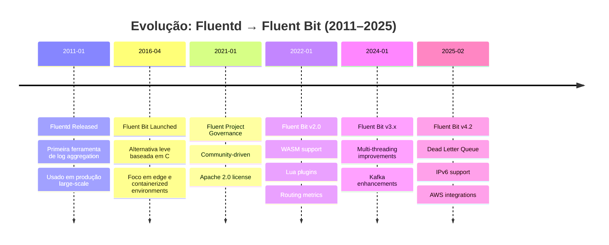
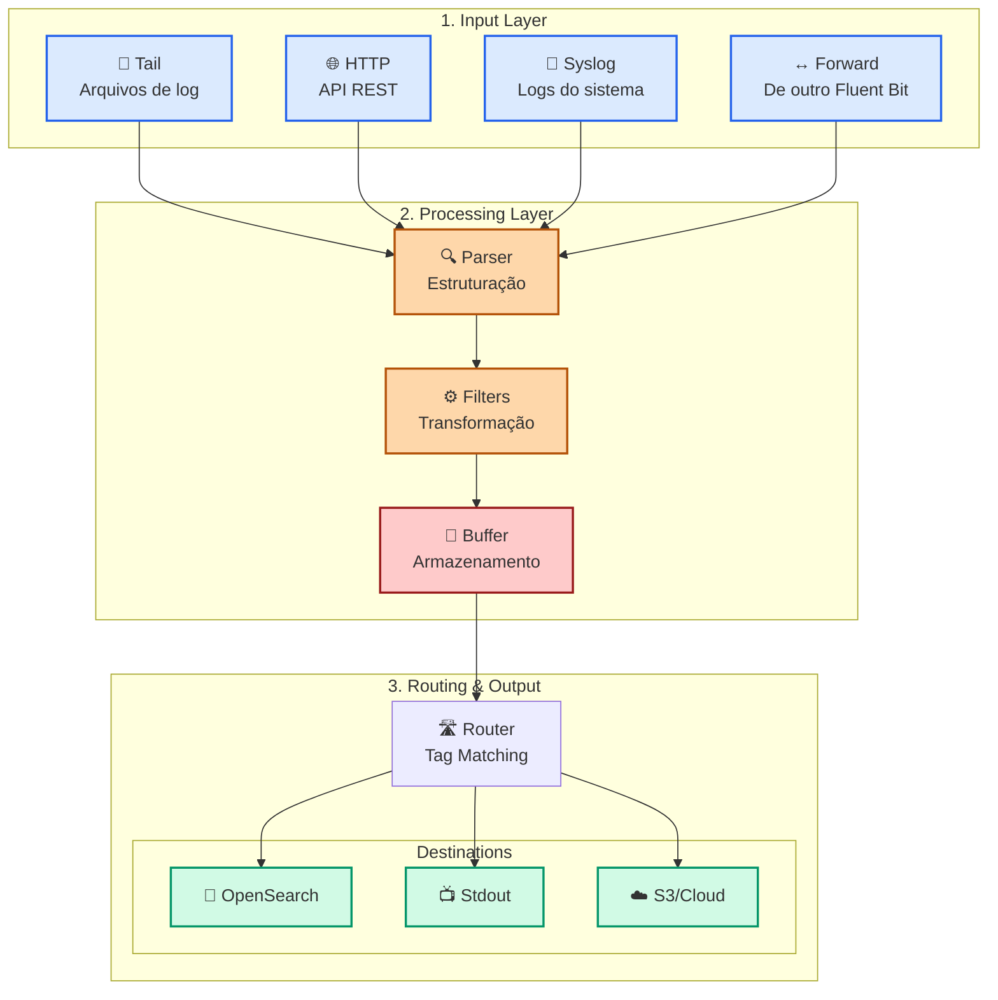
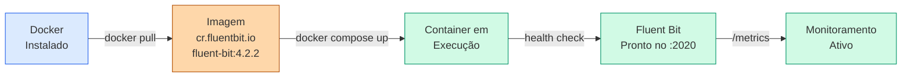
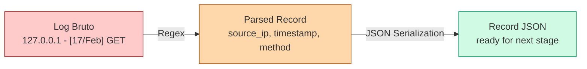

# 5 INGESTÃO DE DADOS COM FLUENT BIT: CONFIGURAÇÃO E USO

---

## 5.1 OBJETIVOS DE APRENDIZAGEM

Ao final deste capítulo, você será capaz de:

1. **Compreender** os conceitos de data pipelines e stream processing no contexto de ingestão de logs
2. **Instalar e configurar** Fluent Bit 4.2 em ambiente Docker integrado com OpenSearch
3. **Criar e debugar** parsers para estruturar dados brutos em formatos JSON
4. **Desenvolver** pipelines de transformação usando filters nativos e scripts Lua
5. **Implementar** soluções end-to-end de ingestão de logs em OpenSearch com tratamento de erros

---

## 5.2 CONTEXTUALIZANDO: O QUE É O FLUENT BIT?

Fluent Bit é um **agente leve de processamento de logs e dados** (log processor e data forwarder) desenvolvido pela comunidade Fluent. Ele coleta, analisa, filtra e envia dados de múltiplas fontes para destinos diversos em tempo real.

Diferentemente de outras soluções, Fluent Bit foi concebido desde o início para ambientes **containerizados, cloud-native e edge computing**, priorizando consumo mínimo de memória (tipicamente 650KB) e CPU.

### 5.2.1 História e Origem: Do Fluentd ao Fluent Bit

**Mermaid Diagram — Evolução da Plataforma Fluent:**



**Diferenças Históricas:**

- **Fluentd (2011)**: Escrito em Ruby, mais pesado (~50MB RAM), usado para grandes volumes de dados, melhor extensibilidade
- **Fluent Bit (2016)**: Escrito em C, leve (~650KB RAM), ideal para edge e containers, performance excepcional
- **Unificação (2021+)**: Ambos coexistem sob governance comum, com Fluent Bit sendo a escolha padrão para novos projetos

### 5.2.2 Fluent Bit 4.2: Novidades e Melhorias

Fluent Bit 4.2 (versão atual em 2025) introduz melhorias significativas:

| Feature | v4.2.0 | v4.2.1 | v4.2.2 | Descrição |
|---------|--------|--------|--------|-----------|
| Dead Letter Queue | ✅ | ✅ | ✅ | Preserva chunks inválidos para análise posterior |
| Routing Metrics | ✅ | ✅ | ✅ | Novo `/metrics` endpoint com statistics de roteamento |
| Windows TLS | ❌ | ✅ | ✅ | Melhorias de certificado TLS no Windows |
| Docker Large Pages | ❌ | ✅ | ✅ | Suporte a huge pages para performance |
| IPv6 Support | ⚠️ Parcial | ✅ | ✅ | Suporte completo a IPv6 e dual-stack |
| AWS Integrations | ✅ | ✅ | ✅ | Melhorias em CloudWatch, Kinesis e AOSS |

**Recomendação**: Use versão **4.2.2** ou superior para ambiente de produção.

### 5.2.3 Fluent Bit vs. Fluentd: Quando Usar Cada Um

```
┌─────────────────────┬──────────────────┬──────────────────┐
│ Critério            │ Fluent Bit        │ Fluentd          │
├─────────────────────┼──────────────────┼──────────────────┤
│ Memória             │ ~650KB            │ ~50MB            │
│ Linguagem           │ C (fast)          │ Ruby (flexible)  │
│ Container-friendly  │ ✅ Excelente     │ ❌ Overhead      │
│ Extensibilidade     │ Limitada (Lua)    │ Plugins Ruby     │
│ Latência            │ Muito baixa       │ Moderada         │
│ Curva aprendizado   │ Média             │ Mais suave       │
│ Casos de uso ideal  │ Edge, K8s, IoT    │ Data warehouse   │
└─────────────────────┴──────────────────┴──────────────────┘
```

**Recomendação**: Use **Fluent Bit 4.2** para:
- Containerização Docker/Kubernetes
- IoT e edge computing
- Ingestão de logs em OpenSearch/Elasticsearch
- Ambientes com restrição de recursos

Use **Fluentd** quando precisar de:
- Extensibilidade avançada via plugins Ruby
- Arquitetura distribuída de agregação
- Transformações complexas de negócio

---

## 5.3 CONCEITOS: DATA PIPELINES E STREAM PROCESSING

Um **data pipeline** é uma sequência automatizada de componentes que coleta, processa e entrega dados de uma origem para um destino. Em contexto de logging, o pipeline transforma logs brutos em dados estruturados, enriquecidos e ready-to-use.

**Diagrama — Arquitetura do Pipeline Fluent Bit:**



### 5.3.1 O que é um Data Pipeline?

Um **data pipeline** em contexto de Fluent Bit é:

**Definição**: Sequência automática de etapas que transforma dados brutos (logs, eventos, métricas) em informação estruturada, enriquecida e pronta para análise.

**Componentes principais:**

1. **Origem (Fonte)**: Arquivo de log, HTTP POST, syslog, forward
2. **Estruturação (Parser)**: Transforma texto bruto em JSON estruturado
3. **Processamento (Filtros)**: Adiciona, remove, modifica ou filtra campos
4. **Armazenamento (Buffer)**: Coleta dados em memória ou disco antes de envio
5. **Roteamento**: Direciona dados para destino(s) correto(s) baseado em tags
6. **Destino (Output)**: OpenSearch, Kafka, S3, stdout

**Exemplo simplificado**:

```
Log Bruto: 127.0.0.1 - - [17/Feb/2025:10:30:45 +0000] "GET /api HTTP/1.1" 200 1234

         ↓ Parser (Regex)

JSON Estruturado: {
  "source_ip": "127.0.0.1",
  "timestamp": "2025-02-17T10:30:45Z",
  "method": "GET",
  "path": "/api",
  "status_code": 200,
  "response_size": 1234
}

         ↓ Filtros (Record_Modifier)

Enriquecido: {
  "source_ip": "127.0.0.1",
  "timestamp": "2025-02-17T10:30:45Z",
  "method": "GET",
  "path": "/api",
  "status_code": 200,
  "response_size": 1234,
  "host": "web-server-01",          ← Adicionado
  "environment": "production",       ← Adicionado
  "processed_at": "2025-02-17T10:30:46Z"  ← Adicionado
}

         ↓ Output (OpenSearch)

Indexado em OpenSearch com campos estruturados e consultáveis
```

### 5.3.2 Stream Processing vs. Batch Processing

```
┌──────────────────────┬─────────────────────┬──────────────────────┐
│ Aspecto              │ Stream Processing   │ Batch Processing     │
├──────────────────────┼─────────────────────┼──────────────────────┤
│ Latência             │ Milissegundos       │ Horas/Dias           │
│ Velocidade de dados  │ Contínuo            │ Periódico (ex: 1x/h) │
│ Exemplo              │ Fluent Bit → 10ms   │ Spark job → 1h       │
│ Use quando           │ Logs, eventos       │ Agregações, ML       │
│ Tecnologias          │ Fluent Bit, Kafka   │ Spark, Hadoop        │
└──────────────────────┴─────────────────────┴──────────────────────┘
```

**Fluent Bit é ferramenta de stream processing**: Processa dados em tempo real conforme chegam, não aguarda acúmulo.

### 5.3.3 Componentes do Pipeline Fluent Bit

Cada estágio do pipeline tem responsabilidade específica:

**[INPUT]** — Coleta de dados
- Responsável por ler dados de uma fonte (arquivo, HTTP, syslog, etc.)
- Inicializa tag para identificar fluxo
- Exemplos: tail, http, syslog, dummy, forward

**[PARSER]** — Estruturação
- Interpreta formato não-estruturado para JSON estruturado
- Usa regex, JSON nativo, logfmt ou LTSV
- Chamado automaticamente pelo INPUT referenciado
- Exemplo: log Apache → `source_ip`, `method`, `status_code`, etc.

**[FILTER]** — Transformação
- Modifica registros (adiciona, remove, altera campos)
- Pode descartar registros (filtragem)
- Pode dividir 1 registro em múltiplos
- Exemplos: grep, record_modifier, modify, nest, lua

**[BUFFER]** — Armazenamento
- Coleta registros processados antes de envio
- Em memória por padrão (rápido)
- Pode usar filesystem (confiável, mais lento)
- Configurável por output

**[ROUTER]** — Roteamento
- Direciona dados para output(s) baseado em tags
- Tag definida por INPUT é matchada contra [OUTPUT]
- Um INPUT pode alimentar múltiplos OUTPUTs
- Exemplo: tag `app.logs` matcheia `[OUTPUT] Match app.*`

**[OUTPUT]** — Envio
- Define destino final dos dados (OpenSearch, Kafka, S3, etc.)
- Recebe registros do ROUTER
- Responsável por envio, retry e tratamento de erro
- Exemplo: output opensearch com Host, Port, Index, autenticação

### 5.3.4 Tags e Matching: Sistema de Roteamento

**Tag** é identificador que acompanha cada registro através do pipeline. Define qual INPUT gerou o dado.

**Exemplo**:

```yaml
[INPUT]
  Name tail
  Path /var/log/app/*.log
  Tag app.logs          # ← Tag atribuída pelo input

[FILTER]
  Name grep
  Match app.*           # ← Filtra por pattern de tag
  Regex level ERROR

[OUTPUT]
  Name opensearch
  Match app.logs        # ← Match exato
  Host localhost:9200
  Index app-logs
```

**Regras de Matching**:
- `app.logs` → Exacto: apenas records com tag exata `app.logs`
- `app.*` → Wildcard: matches `app.logs`, `app.api`, `app.web`, etc.
- `*` → Tudo: todos os records

**Múltiplos Outputs**:

```yaml
[INPUT]
  Name dummy
  Tag myapp

[OUTPUT]
  Name stdout
  Match myapp     # Escreve em stdout

[OUTPUT]
  Name opensearch
  Match myapp     # Também envia para OpenSearch

# O record é enviado para AMBOS os outputs
```

---

## 5.4 INSTALAÇÃO COM DOCKER

**Diagrama — Fluxo de Instalação e Execução:**



### 5.4.1 Pré-requisitos

1. **Docker Desktop** (Windows/Mac) ou **Docker Engine** (Linux) instalado
2. **Docker Compose** v1.28+ para orquestração
3. **OpenSearch 3.5** rodando localmente (do capítulo anterior)
4. **curl** ou **Postman** para testar
5. ~1GB de espaço em disco

### 5.4.2 Container Standalone: Primeiro Contato

**Teste rápido sem configuração:**

```bash
# Baixar e executar imagem padrão do Fluent Bit 4.2.2
docker run --rm -ti cr.fluentbit.io/fluent/fluent-bit:4.2.2

# Output esperado:
# Fluent Bit v4.2.2
# * Config file   : /fluent-bit/etc/fluent-bit.conf
# * Logs   File   : /fluent-bit/var/log/fluent-bit.log
# [0] my_input: (some event)
# ...
```

**Com arquivo de configuração customizado:**

```bash
# Criar arquivo local
cat > fluent-bit.yaml << 'EOF'
pipeline:
  inputs:
    - name: dummy
      tag: test

  outputs:
    - name: stdout
      match: '*'
      format: json_lines
EOF

# Executar com arquivo
docker run --rm -ti \
  -v $(pwd)/fluent-bit.yaml:/fluent-bit/etc/fluent-bit.yaml \
  cr.fluentbit.io/fluent/fluent-bit:4.2.2 \
  -c /fluent-bit/etc/fluent-bit.yaml

# Output: JSON lines a cada segundo
```

### 5.4.3 Docker Compose com OpenSearch

**Recomendado para desenvolvimento e testes**. Arquivo integra Fluent Bit + OpenSearch.

**Exemplo — docker-compose.yml Completo:**

```yaml
version: '3.8'

services:
  # OpenSearch single-node (do capítulo anterior)
  opensearch:
    image: opensearchproject/opensearch:3.5.0
    container_name: opensearch-node
    environment:
      - cluster.name=opensearch-cluster
      - node.name=opensearch-node
      - discovery.seed_hosts=opensearch
      - cluster.initial_master_nodes=opensearch-node
      - OPENSEARCH_INITIAL_ADMIN_PASSWORD=<SENHA_ADMIN>
      - DISABLE_SECURITY_PLUGIN=false
    ports:
      - "9200:9200"
    volumes:
      - opensearch-data:/usr/share/opensearch/data
    networks:
      - log-network
    healthcheck:
      test: ["CMD-SHELL", "curl -s -k -u admin:<SENHA_ADMIN> https://localhost:9200/_cluster/health | grep -q green"]
      interval: 10s
      timeout: 5s
      retries: 5

  # Fluent Bit 4.2.2
  fluent-bit:
    image: cr.fluentbit.io/fluent/fluent-bit:4.2.2
    container_name: fluent-bit
    depends_on:
      opensearch:
        condition: service_healthy

    volumes:
      # Montar arquivo de configuração
      - ./fluent-bit.yaml:/fluent-bit/etc/fluent-bit.yaml:ro

      # Montar parsers customizados (opcional)
      - ./parsers.conf:/fluent-bit/etc/parsers.conf:ro

      # Montar scripts Lua (opcional)
      - ./scripts:/fluent-bit/scripts:ro

      # Montar volume de logs para tail input (opcional)
      - ./logs:/var/log/app:ro

    environment:
      # Variáveis de environment para usar em config
      OPENSEARCH_HOST: opensearch
      OPENSEARCH_PORT: 9200
      OPENSEARCH_USER: admin
      OPENSEARCH_PASSWD: <SENHA_ADMIN>
      LOG_LEVEL: debug  # debug, info, warn, error

    networks:
      - log-network

    # Healthcheck
    healthcheck:
      test: ["CMD", "curl", "-f", "http://localhost:2020/api/v1/metrics"]
      interval: 10s
      timeout: 5s
      retries: 3

volumes:
  opensearch-data:

networks:
  log-network:
    driver: bridge
```

**Arquivo Fluent Bit Config (fluent-bit.yaml) para o Docker Compose:**

```yaml
pipeline:
  service:
    # Configurações globais
    log_level: debug
    flush: 1

    # HTTP server para métricas
    http_server: on
    http_listen: 0.0.0.0
    http_port: 2020

  inputs:
    # Input Dummy: gera dados de teste a cada 1 segundo
    - name: dummy
      tag: app.test
      samples: 1
      interval_sec: 1
      message: '{"level":"info","msg":"test event","timestamp":"2025-02-17T10:00:00Z"}'

  outputs:
    # Output para OpenSearch
    - name: opensearch
      match: 'app.*'
      host: ${OPENSEARCH_HOST}
      port: ${OPENSEARCH_PORT}
      http_user: ${OPENSEARCH_USER}
      http_passwd: ${OPENSEARCH_PASSWD}
      index: fluent-bit-logs
      logstash_format: true
      logstash_prefix: app
      suppress_type_name: on
      tls: on
      tls.verify: off
      retry_limit: false
      buffer.type: filesystem
      buffer.path: /var/log/flb-storage/

    # Output para stdout (debug)
    - name: stdout
      match: 'app.*'
      format: json_lines
```

**Iniciar:**

```bash
# Criar volume para buffer (opcional, seguro)
mkdir -p ./logs ./scripts

# Iniciar serviços
docker compose up -d

# Ver logs
docker compose logs -f fluent-bit

# Parar
docker compose down
```

### 5.4.4 Imagens Release vs. Debug

| Tipo | Imagem | Tamanho | Shells | Quando usar |
|------|--------|---------|--------|-------------|
| **Release** | `cr.fluentbit.io/fluent/fluent-bit:4.2.2` | ~100MB | Não | Produção |
| **Debug** | `cr.fluentbit.io/fluent/fluent-bit:4.2.2-debug` | ~150MB | Sim (sh, bash) | Desenvolvimento, troubleshooting |

**Usar Debug quando**:
```bash
# Acessar shell do container para inspecionar configs
docker run -ti cr.fluentbit.io/fluent/fluent-bit:4.2.2-debug bash

# Dentro do container:
/ # ls -la /fluent-bit/etc/
/ # cat fluent-bit.conf
/ # fluent-bit -c /fluent-bit/etc/fluent-bit.conf -D  # -D = debug mode
```

### 5.4.5 Comandos Docker Essenciais

```bash
# Ver containers rodando
docker ps

# Ver logs em tempo real
docker logs -f <container-name>

# Executar comando no container
docker exec -ti fluent-bit /bin/bash

# Inspecionar métricas
curl http://localhost:2020/api/v1/metrics

# Restarts automáticos
docker update --restart=always fluent-bit

# Pausar/resumir
docker pause fluent-bit
docker unpause fluent-bit

# Ver uso de recursos
docker stats fluent-bit
```

### 5.4.6 Troubleshooting de Instalação

**Problema: "Connection refused" ao OpenSearch**

```bash
# Verificar conectividade
docker exec fluent-bit curl -s http://opensearch:9200/_cluster/health

# Se falhar, verificar:
# 1. OpenSearch está rodando?
docker ps | grep opensearch

# 2. Network está correta?
docker network ls
docker network inspect log-network

# 3. Credenciais estão certas?
curl -k -u admin:<SENHA_ADMIN> https://localhost:9200/_cluster/health
```

**Problema: "Out of memory" no Fluent Bit**

```bash
# Aumentar limite de memória no docker-compose
services:
  fluent-bit:
    mem_limit: 512m
    memswap_limit: 512m
```

---

## 5.5 ARQUIVOS DE CONFIGURAÇÃO EM PROFUNDIDADE

Fluent Bit suporta dois formatos de configuração paralelos:

### 5.5.1 Dois Formatos: .conf (Clássico) vs. YAML (Moderno)

Ambos são válidos e funcionam identicamente. **Recomendação**: Use YAML para novos projetos (mais legível).

**Exemplo — Mesmo Pipeline nos Dois Formatos:**

```conf
# ========== FORMATO .conf (Clássico) ==========
[SERVICE]
  log_level debug
  flush 1
  http_server on
  http_port 2020

[INPUT]
  name tail
  path /var/log/app/*.log
  tag app.logs
  parser json

[FILTER]
  name record_modifier
  match app.logs
  record hostname app-server-01
  record environment production

[OUTPUT]
  name opensearch
  match app.logs
  host localhost
  port 9200
  index my-app-logs
  suppress_type_name on
```

```yaml
# ========== FORMATO YAML (Moderno) ==========
pipeline:
  service:
    log_level: debug
    flush: 1
    http_server: on
    http_port: 2020

  inputs:
    - name: tail
      path: /var/log/app/*.log
      tag: app.logs
      parser: json

  filters:
    - name: record_modifier
      match: app.logs
      record:
        hostname: app-server-01
        environment: production

  outputs:
    - name: opensearch
      match: app.logs
      host: localhost
      port: 9200
      index: my-app-logs
      suppress_type_name: on
```

**Diferenças**:
- Sintaxe: YAML usa indentação, .conf usa [SEÇÕES]
- Performance: Ambas idênticas
- Comunidade: YAML é padrão crescente

### 5.5.2 Seção [SERVICE]: Configurações Globais

Parámetros que afetam todo o Fluent Bit:

```yaml
pipeline:
  service:
    # Nível de log: off, error, warn, info, debug, trace
    log_level: info

    # Flush period em segundos (quão frequente enviar dados)
    flush: 5

    # Daemon mode (rodar em background)
    daemon: off

    # PID file
    pid_file: /var/run/fluent-bit.pid

    # HTTP server para métricas e health checks
    http_server: on
    http_listen: 0.0.0.0
    http_port: 2020
    http_match: /api/v1/*

    # Parsers customizados
    parsers_file: /fluent-bit/etc/parsers.conf
    parsers_file: /fluent-bit/etc/custom-parsers.conf  # Múltiplos

    # Plugins:
    plugins_file: /fluent-bit/etc/plugins.conf

    # Storage path para corretude de delivery
    storage.path: /var/log/flb-storage/
    storage.sync: normal  # normal, full
```

### 5.5.3 Seção [INPUT]: Declarando Fontes de Dados

Sintaxe comum:

```yaml
inputs:
  - name: <tipo-input>      # tail, http, syslog, dummy, forward, etc
    tag: <identificador>     # Ex: app.logs
    # Parâmetros específicos do input...
```

Parâmetros comuns a vários inputs:

| Parâmetro | Descrição |
|-----------|-----------|
| `name` | Tipo do input (tail, http, syslog, ...) |
| `tag` | Tag atribuída aos registros |
| `parser` | Aplica parser aos dados coletados |
| `mem_buf_limit` | Limite de memória em MB (padrão: 5) |
| `skip_long_lines` | Ignorar linhas muito longas (on/off) |

**Exemplo com Tail:**

```yaml
inputs:
  - name: tail
    path: /var/log/app/*.log
    tag: app.logs
    parser: json
    db: /var/log/fluent-bit.db
    db.locking: true
    skip_long_lines: on
    mem_buf_limit: 10
```

### 5.5.4 Seção [FILTER]: Declarando Transformações

Sintaxe comum:

```yaml
filters:
  - name: <tipo-filter>      # grep, record_modifier, modify, lua, nest, ...
    match: <pattern>         # Ex: app.*
    # Parâmetros específicos do filter...
```

Parâmetros comuns:

| Parâmetro | Descrição |
|-----------|-----------|
| `name` | Tipo de filter |
| `match` | Pattern de tag (app.*, *, exact-tag) |
| `regex` | Para filters que usam regex (grep) |

### 5.5.5 Seção [OUTPUT]: Declarando Destinos

Sintaxe comum:

```yaml
outputs:
  - name: <tipo-output>      # opensearch, kafka, s3, stdout, ...
    match: <pattern>         # Ex: app.*
    # Parâmetros específicos do output...
```

Parâmetros comuns do output OpenSearch:

| Parâmetro | Padrão | Descrição |
|-----------|--------|-----------|
| `host` | 127.0.0.1 | Host do OpenSearch |
| `port` | 9200 | Porta TCP |
| `index` | fluent-bit | Nome do índice |
| `http_user` | — | Usuário (HTTP Basic Auth) |
| `http_passwd` | — | Senha |
| `tls` | off | Habilitar TLS |
| `tls.verify` | on | Verificar certificado |
| `suppress_type_name` | off | **OBRIGATÓRIO para OpenSearch 2.0+** |
| `logstash_format` | off | Usar formato logstash-YYYY.MM.DD |
| `logstash_prefix` | logstash | Prefixo do índice com Logstash_Format |
| `write_operation` | create | create, index, update, upsert |
| `generate_id` | off | Gerar _id automático |
| `buffer.type` | memory | memory ou filesystem |
| `compress` | off | Compressão (gzip) |
| `workers` | 1 | Número de workers paralelos |
| `retry_limit` | 1 | Tentativas de reenvio (false = infinito) |

---

Continuaremos com as próximas seções (5.6 a 5.16) na próxima parte...

---

## 5.6 INPUTS: COLETANDO DADOS DE MÚLTIPLAS FONTES

Inputs são **plugins que coletam dados** de diversos sources e os injetam no pipeline Fluent Bit com uma tag.

### 5.6.1 Input Tail: Monitorando Arquivos de Log

Monitora mudanças em arquivos de log em tempo real (como comando `tail -f`).

**Parâmetros principais:**

| Parâmetro | Padrão | Descrição |
|-----------|--------|-----------|
| `path` | — | Padrão glob de arquivos (ex: /var/log/*.log) |
| `tag` | — | Tag atribuída aos registros |
| `parser` | — | Nome do parser a aplicar |
| `db` | — | Arquivo SQLite para checkpoint de posição |
| `db.locking` | false | Lock do arquivo db (use true em múltiplos Fluent Bits) |
| `read_from_head` | false | Ler do início em novos arquivos |
| `rotate_wait` | 5 | Segundos a aguardar após rotação de arquivo |
| `multiline.parser` | — | docker, cri para logs multiline |
| `mem_buf_limit` | 5 | Limite de memória em MB |
| `skip_long_lines` | off | Ignorar linhas > buffer_max_size |

**Exemplo — Monitorando Logs de Aplicação:**

```yaml
inputs:
  - name: tail
    path: /var/log/app/*.log      # Glob pattern
    tag: app.logs
    parser: json                   # Aplicar parser JSON

    # Persistência: salvar posição lida
    db: /var/log/fluent-bit.db
    db.locking: true

    # Comportamento em rotação
    rotate_wait: 5

    # Memória
    mem_buf_limit: 10
    skip_long_lines: on
```

**Caso de uso: Multiline Logs (Java stacktraces)**

```yaml
inputs:
  - name: tail
    path: /var/log/java/*.log
    tag: java.logs
    multiline.parser: multiline  # Parser customizado para stacktraces
```

### 5.6.2 Input HTTP: Recebendo Dados via REST

Cria endpoint HTTP para que aplicações enviem logs (push model).

**Parâmetros principais:**

| Parâmetro | Padrão | Descrição |
|-----------|--------|-----------|
| `listen` | 0.0.0.0 | IP a escutar |
| `port` | 2020 | Porta HTTP |
| `tag_prefix` | http | Prefixo da tag |
| `format` | json | Formato esperado: json ou cjson |

**Exemplo:**

```yaml
inputs:
  - name: http
    listen: 0.0.0.0
    port: 3000
    tag: app.custom
    format: json
```

**Usar via curl:**

```bash
curl -X POST http://localhost:3000 \
  -H "Content-Type: application/json" \
  -d '{
    "level": "error",
    "message": "Database connection failed",
    "service": "payment-service"
  }'

# Fluent Bit recebe e processa com tag "app.custom"
```

### 5.6.3 Input Syslog: Logs de Sistema

Coleta logs via protocolo syslog (UDP/TCP).

```yaml
inputs:
  - name: syslog
    listen: 0.0.0.0
    port: 514          # Porta padrão syslog
    tag: system.logs
    protocol: udp      # ou tcp
    parser: syslog
```

### 5.6.4 Input Dummy: Geração de Dados para Testes

Gera dados fictícios — perfeito para testar pipelines sem dados reais.

```yaml
inputs:
  - name: dummy
    tag: test.dummy
    samples: 100       # Quantos records gerar
    interval_sec: 1    # Intervalo entre records
    message: '{"level":"info","msg":"test","value":123}'
```

### 5.6.5 Input Forward: Agregação de Múltiplas Fontes

Recebe dados de outro Fluent Bit ou Fluentd via protocolo Fluent Forward.

```yaml
inputs:
  - name: forward
    listen: 0.0.0.0
    port: 24224        # Porta padrão
```

---

## 5.7 PARSERS: ESTRUTURANDO DADOS BRUTOS

**Parser** transforma logs não-estruturados em JSON estruturado. Fluent Bit fornece parsers built-in para formatos comuns.

### 5.7.1 Como os Parsers Funcionam



Parsers são definidos em **parsers.conf** e referenciados por nome no INPUT.

**Estrutura básica do parsers.conf:**

```
[PARSER]
    Name <nome-do-parser>
    Format <tipo: regex, json, logfmt, ltsv, multiline>
    Regex <expressão-regular>
    Time_Key <campo-timestamp>
    Time_Format <formato>
```

### 5.7.2 Parser JSON: Logs Estruturados

Para aplicações que já emitem JSON.

**Exemplo — Logs Node.js/Python que já são JSON:**

```bash
# Input:
{"timestamp":"2025-02-17T10:30:45.123Z","level":"INFO","msg":"User login","user_id":"123"}

# Output após parser JSON:
{
  "timestamp": "2025-02-17T10:30:45.123Z",
  "level": "INFO",
  "msg": "User login",
  "user_id": "123"
}
```

**Configuração:**

```
[PARSER]
    Name json
    Format json
    Time_Key timestamp
    Time_Format %Y-%m-%dT%H:%M:%S.%LZ
    Time_Keep on
```

**Uso no config:**

```yaml
inputs:
  - name: tail
    path: /var/log/api/*.log
    parser: json
```

### 5.7.3 Parser Regex: Logs de Texto (Apache/Nginx)

Para logs em formato texto (Apache Combined Log Format é comum).

**Apache Combined Log Format:**

```
127.0.0.1 - frank [17/Feb/2025:10:30:45 +0000] "GET /api/v1/users HTTP/1.1" 200 1234 "https://example.com" "Mozilla/5.0"
```

**Parser Regex:**

```
[PARSER]
    Name apache
    Format regex
    Regex ^\s*(?<remote_ip>[^\s]+)\s+(?<remote_user>[^\s]+)\s+(?<auth_user>[^\s]+)\s+\[(?<timestamp>[^\]]+)\]\s+"(?<method>\w+)\s+(?<path>[^"]+)\s+(?<http_version>[^"]+)"\s+(?<status_code>\d+)\s+(?<bytes_sent>\d+)\s+"(?<referer>[^"]+)"\s+"(?<user_agent>[^"]+)"
    Time_Key timestamp
    Time_Format %d/%b/%Y:%H:%M:%S %z
    Types status_code:integer bytes_sent:integer
```

**Resultado:**

```json
{
  "remote_ip": "127.0.0.1",
  "remote_user": "frank",
  "auth_user": "-",
  "timestamp": "17/Feb/2025:10:30:45 +0000",
  "method": "GET",
  "path": "/api/v1/users",
  "http_version": "HTTP/1.1",
  "status_code": 200,
  "bytes_sent": 1234,
  "referer": "https://example.com",
  "user_agent": "Mozilla/5.0"
}
```

### 5.7.4 Parser Logfmt: Formato de Sistemas Go

Go applications frequentemente usam format `key=value`:

```
timestamp=2025-02-17T10:30:45.123Z level=INFO msg=User login user_id=123 duration_ms=45
```

**Parser:**

```
[PARSER]
    Name logfmt
    Format logfmt
    Time_Key timestamp
```

### 5.7.5 Parser Multiline: Stacktraces e Logs Java

Para logs que se estendem por múltiplas linhas:

```
2025-02-17 10:30:45,123 ERROR - Database connection failed
  at com.example.Database.connect(Database.java:45)
  at com.example.Service.init(Service.java:12)
  at java.base/java.lang.Thread.run(Thread.java:834)
```

**Parser:**

```
[PARSER]
    Name multiline
    Format multiline
    parser_firstline regex
    Regex ^(\d{4}-\d{2}-\d{2}\s+\d{2}:\d{2}:\d{2})
```

### 5.7.6 Como Debugar um Parser

**Problema**: Parser não está funcionando, campos não aparecem estruturados.

**Técnica 1 — Output Stdout com Debug**

```yaml
pipeline:
  service:
    log_level: debug

  inputs:
    - name: tail
      path: /var/log/app/*.log
      tag: app.logs
      parser: meu_parser

  outputs:
    # Saída para stdout para inspeção
    - name: stdout
      match: app.logs
      format: json_lines
```

**Executar e inspecionar:**

```bash
docker logs fluent-bit 2>&1 | grep -A 5 "app.logs"

# Você verá exatamente o que foi parseado
```

**Técnica 2 — Usar Regex Tester Online**

Teste sua regex no https://regex101.com/ com sample de um log real.

**Técnica 3 — Imagem Debug com Shell**

```bash
# Usar imagem debug para mais controle
docker run -ti cr.fluentbit.io/fluent/fluent-bit:4.2.2-debug bash

# Dentro:
/fluent-bit # cat /fluent-bit/etc/parsers.conf  # Ver parsers
/fluent-bit # fluent-bit -c /fluent-bit/etc/fluent-bit.conf -D  # Debug mode
```

---

## 5.8 FILTERS: TRANSFORMANDO E ENRIQUECENDO DADOS

Filters modificam registros **após parsing, antes de output**.

### 5.8.1 Filter Grep: Incluir ou Excluir Registros

Filtra registros por regex (parecido com comando `grep`).

```yaml
filters:
  - name: grep
    match: app.logs
    regex: status_code (500|502|503)  # Apenas erros 5xx
```

Ou exclusão:

```yaml
filters:
  - name: grep
    match: app.logs
    exclude: status_code (200|201|204)  # Exclui sucessos
```

### 5.8.2 Filter Record_Modifier: Adicionar e Remover Campos

Adiciona campos estáticos a todo record.

```yaml
filters:
  - name: record_modifier
    match: app.logs

    # Adicionar campos
    record:
      hostname: web-server-01
      environment: production
      version: "1.2.3"
      datacenter: us-east-1

    # Remover campos
    remove_key user_agent
    remove_key referer
```

### 5.8.3 Filter Modify: Modificar Valores de Campos

Rename, set, convert tipos de campos.

```yaml
filters:
  - name: modify
    match: app.logs

    # Renomear
    rename status_code http_status

    # Definir valor condicional
    add path_normalized "${path//\/user\/\d+/\/user\/{id}/}"

    # Converter tipos
    convert status_code int
```

### 5.8.4 Filter Nest: Organizar Campos em Hierarquias

Agrupa campos relacionados em objetos nested.

```yaml
filters:
  - name: nest
    match: app.logs

    # Agrupar campos HTTP em sub-objeto
    nest_under http
    wildcard http.*
```

**Resultado:**

```json
// Antes:
{
  "http_method": "GET",
  "http_path": "/api",
  "http_status": 200
}

// Depois:
{
  "http": {
    "method": "GET",
    "path": "/api",
    "status": 200
  }
}
```

### 5.8.5 Filter Lua: Transformação Programática

Executa código Lua customizado para transformações complexas.

**Assinatura da Função:**

```lua
function cb_filter(tag, timestamp, record)
  -- tag: string (ex: "app.logs")
  -- timestamp: number (Unix timestamp)
  -- record: table (Lua table = JSON object)

  -- Sua lógica aqui
  record['processed_at'] = os.date('%Y-%m-%d %H:%M:%S')
  record['level_normalized'] = string.upper(record['level'] or '')

  -- Retornar: code, timestamp, record
  -- code: -1 (discard), 0 (no change), 1 (modified), 2 (record only)
  return 1, timestamp, record
end
```

**Exemplo Completo — Enriquecimento:**

**arquivo: enrich.lua**

```lua
function cb_filter(tag, timestamp, record)
  -- Adicionar timestamp processamento
  record['processed_at'] = os.date('%Y-%m-%dT%H:%M:%SZ')

  -- Normalizar nível de log
  local level = record['level'] or 'unknown'
  record['level_normalized'] = string.lower(level)

  -- Classificar por severidade
  if level == 'ERROR' or level == 'FATAL' then
    record['severity'] = 'high'
  elseif level == 'WARN' then
    record['severity'] = 'medium'
  else
    record['severity'] = 'low'
  end

  -- Adicionar host de execução
  record['host'] = os.getenv('HOSTNAME') or 'unknown'

  -- Retornar: -1=discard, 0=unchanged, 1=modified
  return 1, timestamp, record
end
```

**Configuração:**

```yaml
filters:
  - name: lua
    match: app.logs
    script: /fluent-bit/scripts/enrich.lua
    call: cb_filter
```

**Exemplo Avançado — Filtragem Condicional:**

```lua
function cb_filter(tag, timestamp, record)
  -- Descartar logs de healthcheck (codigo -1)
  if record['path'] == '/health' then
    return -1, 0, nil
  end

  -- Descartar sucessos 2xx
  local status = record['status_code'] or 0
  if status >= 200 and status < 300 then
    return -1, 0, nil
  end

  return 2, timestamp, record
end
```

---

## 5.9 OUTPUT: INGESTÃO DE DADOS NO OPENSEARCH

Output **envia registros processados para destino final**.

### 5.9.1 Configuração Básica do Output OpenSearch

```yaml
outputs:
  - name: opensearch
    match: 'app.*'
    host: localhost
    port: 9200
    index: my-app-logs

    # Autenticação
    http_user: admin
    http_passwd: <SENHA_ADMIN>

    # OpenSearch 2.0+ requer
    suppress_type_name: on

    # TLS (se certificado autoassinado)
    tls: on
    tls.verify: off
```

### 5.9.2 Autenticação e TLS

**HTTP Basic Auth:**

```yaml
http_user: ${OPENSEARCH_USER}
http_passwd: ${OPENSEARCH_PASSWD}
```

**TLS com Certificado Autoassinado:**

```yaml
tls: on
tls.verify: off        # Ignora verificação (desenvolvimento)
tls.ca_file: /etc/ssl/certs/opensearch-ca.crt  # Produção
tls.crt_file: /etc/ssl/certs/opensearch.crt
tls.key_file: /etc/ssl/certs/opensearch.key
```

### 5.9.3 Estratégias de Nomenclatura de Índices

**Índice Estático:**

```yaml
index: my-app-logs     # Todos os registros → índice único
```

**Logstash Format (com data):**

```yaml
logstash_format: on
logstash_prefix: app
# Resultado: app-2025.02.17, app-2025.02.18, etc
```

**Dinâmico com Record Accessor:**

```yaml
index: app-${year}${month}${day}  # Usa valores do record se existirem
```

### 5.9.4 Write Operations: Controle de Duplicatas

| Operação | Comportamento | Quando usar |
|----------|-----------|----------|
| `create` | Cria novo; ignora se existente (padrão) | Logs (sem duplicatas OK) |
| `index` | Sobrescreve documento existente | Métricas, estado |
| `update` | Atualiza; ignora se não existente | Updates parciais |
| `upsert` | Cria ou atualiza conforme necessário | Último estado conhecido |

**Com Generate_ID:**

```yaml
write_operation: create
generate_id: on         # Gera _id automático
# Sem gerar _id, cada record ingestado terá ID único automático do OpenSearch
```

### 5.9.5 Performance: Compressão e Workers

```yaml
# Compressão de payload
compress: gzip          # Reduz ~70% do traffic

# Workers paralelos (múltiplos connections)
workers: 2              # Padrão: 1
```

### 5.9.6 Pipeline Completo End-to-End

**arquivo: fluent-bit-complete.yaml**

```yaml
pipeline:
  service:
    log_level: info
    flush: 1
    http_server: on
    http_port: 2020
    parsers_file: /fluent-bit/etc/parsers.conf

  inputs:
    - name: tail
      path: /var/log/app/*.log
      tag: app.logs
      parser: json
      db: /var/log/fluent-bit.db
      db.locking: true

  filters:
    # Enriquecer com campo de hostname
    - name: record_modifier
      match: app.logs
      record:
        hostname: web-server-01
        environment: production

    # Aplicar transformação Lua
    - name: lua
      match: app.logs
      script: /fluent-bit/scripts/enrich.lua
      call: cb_filter

    # Filtrar: apenas erros 5xx
    - name: grep
      match: app.logs
      regex: status_code (500|502|503)

  outputs:
    # Enviar para OpenSearch
    - name: opensearch
      match: app.logs
      host: opensearch
      port: 9200
      http_user: admin
      http_passwd: <SENHA_ADMIN>
      index: app-logs
      logstash_format: on
      logstash_prefix: app
      suppress_type_name: on
      tls: on
      tls.verify: off
      compress: gzip
      workers: 2

    # Também enviar para stdout (debug)
    - name: stdout
      match: app.logs
      format: json_lines
```

---

## 5.10 DEBUGGING E OBSERVABILIDADE DE PIPELINES

### 5.10.1 Níveis de Log: Como Aumentar a Verbosidade

```yaml
pipeline:
  service:
    log_level: debug    # off, error, warn, info, debug, trace
```

**Usar também em runtime:**

```bash
docker exec fluent-bit fluent-bit -c /fluent-bit/etc/fluent-bit.yaml -D
# -D = debug mode, mostra detalhes de parsing, filters, output
```

### 5.10.2 Output Stdout para Inspeção Local

Adicionar segundo output para inspecionar dados intermediários:

```yaml
outputs:
  - name: opensearch
    match: app.logs
    host: localhost
    port: 9200
    index: my-logs

  # Debug: ver exatamente o que será enviado
  - name: stdout
    match: app.logs
    format: json_lines    # Um JSON por linha
```

### 5.10.3 HTTP Server: Métricas do Fluent Bit

Fluent Bit 4.2 expõe métricas internas via HTTP:

```bash
curl http://localhost:2020/api/v1/metrics

# Retorna:
# fluent_bit_output_errors_total{name="opensearch"} 0
# fluent_bit_output_retries_total{name="opensearch"} 2
# fluent_bit_records_received_total{tag="app.logs"} 1234
# ...
```

### 5.10.4 Imagem Debug: Shell no Container

```bash
# Usar versão debug
docker run -ti cr.fluentbit.io/fluent/fluent-bit:4.2.2-debug bash

# Dentro do container:
/fluent-bit # fluent-bit --version
/fluent-bit # cat /fluent-bit/etc/fluent-bit.conf
/fluent-bit # fluent-bit -c conf.yaml -D
```

### 5.10.5 Dead Letter Queue: Capturando Chunks Problemáticos

Novo no Fluent Bit 4.2: preserva registros que falharam para análise.

```yaml
pipeline:
  service:
    storage.path: /var/log/flb-storage/
    storage.backlog.mem_limit: 5M  # Limite de memória para DLQ

  outputs:
    - name: opensearch
      match: app.logs
      host: localhost
      port: 9200
      index: my-logs
      # Chunks inválidos são salvos em /var/log/flb-storage/
```

---

## 5.11 EXEMPLO AVANÇADO: SCRIPTS LUA PARA TRANSFORMAÇÃO COMPLEXA

### 5.11.1 Quando Usar Lua vs. Filters Nativos

| Caso | Solução |
|------|----------|
| Adicionar campo estático | `record_modifier` |
| Renomear campo simples | `modify` |
| Filtrar por regex | `grep` |
| Agrupar campos | `nest` |
| **Lógica condicional complexa** | **Lua** |
| **Chamar funções externas** | **Lua** |
| **Parsing customizado** | **Lua** |

### 5.11.2 Anatomia de um Script Lua para Fluent Bit

```lua
-- Função principal: obrigatória chamar cb_filter
function cb_filter(tag, timestamp, record)
  -- `tag`: string - Ex: "app.logs"
  -- `timestamp`: number - Unix timestamp (segundos desde 1970)
  -- `record`: table - Objeto Lua (equivalente JSON object)

  -- Seu código de transformação aqui
  -- ...

  -- RETORNO obrigatório:
  -- code (int): -1 (discard), 0 (unchanged), 1 (record+timestamp modified), 2 (record only)
  -- timestamp (number): Unix timestamp (pode ser modificado)
  -- record (table): Tabela Lua modificada
  return code, timestamp, record
end
```

### 5.11.3 Exemplo 1: Normalização de Campos e Timestamps

```lua
function cb_filter(tag, timestamp, record)
  -- Normalizar nível (qualquer case → lowercase)
  if record['level'] then
    record['level'] = string.lower(record['level'])
  end

  -- Converter timestamp string para milissegundos
  if record['duration_ms'] then
    record['duration_ms'] = tonumber(record['duration_ms'])
  end

  -- Adicionar timestamp de processamento ISO 8601
  local now = os.time()
  local datestr = os.date('!%Y-%m-%dT%H:%M:%SZ', now)
  record['processed_at'] = datestr

  return 1, timestamp, record  -- 1 = modificado
end
```

### 5.11.4 Exemplo 2: Enriquecimento com Dados Contextuais

```lua
function cb_filter(tag, timestamp, record)
  -- Adicionar informações de ambiente
  record['environment'] = os.getenv('ENVIRONMENT') or 'dev'
  record['region'] = os.getenv('REGION') or 'us-east-1'
  record['version'] = '1.2.3'

  -- Classificar por severidade
  local level = string.lower(record['level'] or '')
  if level == 'error' or level == 'fatal' then
    record['severity_score'] = 100
    record['alert'] = true
  elseif level == 'warn' then
    record['severity_score'] = 50
    record['alert'] = false
  else
    record['severity_score'] = 10
    record['alert'] = false
  end

  -- Extrair info da tag
  record['input_tag'] = tag

  return 1, timestamp, record
end
```

### 5.11.5 Exemplo 3: Filtragem Condicional Avançada

```lua
function cb_filter(tag, timestamp, record)
  -- Descartar logs de health checks
  if record['path'] and string.match(record['path'], '^/health') then
    return -1, 0, nil  -- -1 = discard
  end

  -- Descartar sucessos 2xx
  local status = tonumber(record['status_code'] or 0)
  if status >= 200 and status < 300 then
    return -1, 0, nil
  end

  -- Descartar requisições de robots
  local ua = record['user_agent'] or ''
  if string.match(ua, 'bot|crawler|spider') then
    return -1, 0, nil
  end

  -- Manter todo o resto (apenas modificar)
  return 2, timestamp, record  -- 2 = apenas record, sem timestamp
end
```

### 5.11.6 Debugando Scripts Lua

**Problema: Lua script dá erro ou não funciona**

**Técnica 1 — Print para Stdout:**

```lua
function cb_filter(tag, timestamp, record)
  -- Imprimir informações de debug
  print('[DEBUG] Tag: ' .. tag)
  print('[DEBUG] Record keys: ' .. table.concat(table.keys(record), ', '))

  record['processed'] = true
  return 1, timestamp, record
end
```

**Técnica 2 — Modo Protected:**

```yaml
filters:
  - name: lua
    match: app.logs
    script: /fluent-bit/scripts/transform.lua
    call: cb_filter
    protected_mode: true    # Captura erros sem crashar
```

**Técnica 3 — Logs de Erro:**

```bash
# Ver erros de Lua no stderr
docker logs fluent-bit 2>&1 | grep -i error

# Ou aumentar log_level
docker run -e LOG_LEVEL=debug cr.fluentbit.io/fluent/fluent-bit:4.2.2 ...
```

---

## 5.12 CAIXA DE DEFINIÇÕES

**Chunk**: Bloco de registros agrupado para transmissão. Fluent Bit bufferiza records em chunks antes de enviar.

**Dead Letter Queue**: Novo em 4.2 — local onde são armazenados chunks que falharam, permitindo reprocessamento posterior.

**Filter**: Plugin que transforma records após parsing. Exemplos: grep, record_modifier, lua, nest.

**Flush**: Intervalo (em segundos) entre tentativas de envio de dados. `flush: 1` = tentar enviar a cada 1 segundo.

**Fluent Bit**: Log processor e data forwarder leve (escrito em C, ~650KB RAM).

**Input**: Plugin que coleta dados de uma fonte. Exemplos: tail (arquivos), http (REST), syslog (logs de sistema).

**Output**: Plugin que envia registros processados para destino. Exemplos: opensearch, kafka, s3, stdout.

**Parser**: Transforma dados brutos (texto) em JSON estruturado. Usa regex, JSON nativo, logfmt, LTSV ou multiline.

**Pipeline**: Sequência Input → Parser → Filter → Buffer → Router → Output.

**Record**: Um evento/log individual com seus campos. Exemplo: `{"level":"ERROR", "msg":"failure", "code":500}`.

**Router**: Componente que direiona records para output(s) baseado em matching de tags.

**Stream Processing**: Processamento de dados em tempo real conforme chegam (oposto a batch).

**Tag**: Identificador (string) que acompanha record através do pipeline. Conecta inputs a outputs via matching.

---

## 5.13 QUADROS DE DESTAQUE E ALERTAS

### ⚠️ ALERTA: Suppress_Type_Name é Obrigatório para OpenSearch 2.0+

OpenSearch 2.0 e posteriores removeram o tipo de documento (`_type`). Fluent Bit ainda tenta enviar por padrão, causando erro.

**Solução:**

```yaml
outputs:
  - name: opensearch
    suppress_type_name: on    # ← OBRIGATÓRIO
```

Sem esta opção: erro `BadRequest – Mapping specifies _type`

### 💡 DICA: Use Imagem Debug para Troubleshooting de Parsers

Quando parser não está funcionando:

```bash
# Usar imagem com shell
docker run -ti cr.fluentbit.io/fluent/fluent-bit:4.2.2-debug bash

# Dentro:
cd /fluent-bit/etc/
cat parsers.conf          # Ver parsers built-in
fluent-bit -c fluent-bit.conf -D  # Executar com debug
```

### 📌 OBSERVAÇÃO: Diferença entre fluent/fluent-bit e bitnami/fluent-bit

- **cr.fluentbit.io/fluent/fluent-bit** (Oficial) — Recomendado, upstream
- **bitnami/fluent-bit** (Bitnami) — Imagem alternativa, pode ter diferenças

Use a **oficial** (cr.fluentbit.io) para compatibilidade total.

### 🔒 IMPORTANTE: Nunca Commitar Senhas em fluent-bit.conf

**Errado:**

```yaml
http_passwd: <SENHA_ADMIN>    # ← Exposição de segredo!
```

**Correto — Use Variáveis de Environment:**

```yaml
http_passwd: ${OPENSEARCH_PASSWD}
```

E defina em `.env` ou secrets do Docker/K8s:

```bash
docker run -e OPENSEARCH_PASSWD=<SENHA_ADMIN> ...
```

---

## 5.14 EXERCÍCIOS DE FIXAÇÃO

### Exercício 1: Pipeline Básico — Logs de Aplicação para OpenSearch

**Objetivo**: Configurar pipeline end-to-end completo: Input Dummy → Parser JSON → Filter (enriquecimento) → Output OpenSearch

**Cenário**: Simular aplicação web gerando logs JSON e ingestá-los no OpenSearch.

**Tarefa:**

1. Crie arquivo `fluent-bit-ex1.yaml` com:
   - Input Dummy gerando 10 records com JSON simulando logs de API
   - Parser JSON
   - Filter record_modifier adicionando `host`, `environment`, `version`
   - Output para OpenSearch com índice `exercise1-logs`
   - Output stdout para debug

2. Execute com Docker Compose:
   ```bash
   docker compose up -d opensearch fluent-bit
   sleep 5
   docker logs fluent-bit | head -20
   ```

3. Verifique no OpenSearch:
   ```bash
   curl -sk -u admin:<SENHA_ADMIN> https://localhost:9200/exercise1-logs/_search?pretty
   ```

4. Confirme que registros incluem campos `host`, `environment`, `version`

**Dica**: Use Input Dummy com `message` em JSON:
```yaml
message: '{"level":"info","msg":"request","method":"GET","status_code":200,"duration_ms":45}'
```

---

### Exercício 2: Parser Regex para Apache Combined Log Format

**Objetivo**: Criar parser regex customizado e validar parsing de logs Apache.

**Cenário**: Arquivo de log Apache précisa ser estruturado para análise.

**Tarefa:**

1. Crie `parsers-ex2.conf` com parser para Apache Combined Format:
   ```
   127.0.0.1 - admin [17/Feb/2025:10:30:45 +0000] "GET /api/users HTTP/1.1" 200 4532 "https://example.com" "Mozilla/5.0"
   ```

2. Configure fluent-bit.yaml com:
   - Input Dummy simulando logs Apache
   - Referência ao parser customizado
   - Output stdout para inspeção

3. Execute e capture output:
   ```bash
   docker compose run --rm fluent-bit /fluent-bit/bin/fluent-bit \
     -c fluent-bit-ex2.yaml -D | grep remote_ip
   ```

4. Valide que campos foram extraídos: `remote_ip`, `method`, `path`, `status_code`, `bytes_sent`

**Dica**: A regex Apache é complexa. Use este padrão:
```
Regex ^(?<remote_ip>[^\s]+)\s+(?<remote_user>[^\s]+)\s+(?<auth>[^\s]+)\s+\[(?<timestamp>[^\]]+)\]\s+"(?<method>\w+)\s+(?<path>[^"]+)\s+(?<http_version>[^"]+)"\s+(?<status_code>\d+)\s+(?<bytes_sent>\d+)\s+"(?<referer>[^"]+)"\s+"(?<user_agent>[^"]+)"
```

---

### Exercício 3: Debugar um Parser com Output Stdout

**Objetivo**: Usar técnicas de debug para identificar problemas em parser.

**Cenário**: Parser com regex incorreto — precisa ser corrigido.

**Tarefa:**

1. Crie parser com regex intencionalmente **errado**:
   ```
   Regex ^(?<ip>\S+) (?<method>\S+)  # ← Incompleto, não pega status
   ```

2. Configure fluent-bit com:
   - Log level `debug`
   - Output stdout para inspecionar

3. Execute:
   ```bash
   docker logs fluent-bit 2>&1 | grep -i "failed\|parsing\|error" | head -10
   ```

4. **Identifique o problema**: O campo `status_code` não é extraído

5. **Corrija a regex** para incluir mais campos:
   ```
   Regex ^(?<ip>\S+)\s+(?<method>\S+)\s+(?<path>\S+)\s+(?<status>\d+)$
   ```

6. Reexecute e confirme que `status_code` agora aparece no output

**Dica**: Use https://regex101.com/ para testar a regex com sample real de log antes de colocar no Fluent Bit.

---

### Exercício 4: Filtro Lua — Enriquecimento e Normalização de Logs

**Objetivo**: Desenvolver script Lua que enriquece logs e aplica filtragem condicional.

**Cenário**: Logs de e-commerce com preços em string, precisam ser normalizados, classificados por severidade e enriquecidos.

**Tarefa:**

1. Crie script `transform-ex4.lua`:
   ```lua
   function cb_filter(tag, timestamp, record)
     -- Normalizar nível para minúsculas
     if record['level'] then
       record['level'] = string.lower(record['level'])
     end

     -- Converter preço de string para número
     if record['price'] then
       record['price'] = tonumber(string.gsub(record['price'], 'R$', '')) or 0
     end

     -- Classificar por valor
     if record['price'] > 1000 then
       record['value_category'] = 'high'
     elseif record['price'] > 100 then
       record['value_category'] = 'medium'
     else
       record['value_category'] = 'low'
     end

     -- Adicionar timestamp processamento
     record['processed_at'] = os.date('!%Y-%m-%dT%H:%M:%SZ')

     -- Descartar logs de teste
     if record['level'] == 'debug' then
       return -1, 0, nil
     end

     return 1, timestamp, record
   end
   ```

2. Configure fluent-bit com:
   - Input Dummy simulando logs e-commerce com `price` em string ("R$500.00")
   - Filter Lua chamando `transform-ex4.lua`
   - Output stdout e OpenSearch

3. Execute e verifique:
   ```bash
   curl -sk -u admin:<SENHA_ADMIN> https://localhost:9200/exercise4-logs/_search?pretty | \
     jq '.hits.hits[0]._source | {price, value_category, processed_at}'
   ```

4. Confirme:
   - Preço é número (float), não string
   - Campo `value_category` foi adicionado corretamente
   - `processed_at` contém timestamp ISO

**Dica**: Teste incrementalmente — comece com apenas normalizar nível, depois adicione preço, etc.

---

### Exercício 5: Monitoramento de Containers Docker e Eventos do Host

**Objetivo**: Configurar Fluent Bit para monitorar logs e métricas do próprio ambiente Docker, capturando eventos e saúde dos containers.

**Cenário**: Sistema de produção precisa monitorar saúde de containers em tempo real — Fluent Bit coleta logs de stdout/stderr dos containers, events de Docker daemon, e ingestá em OpenSearch para visualização.

**Tarefa:**

1. Crie arquivo `fluent-bit-ex5-docker.yaml` usando inputs nativos `docker_events` e `docker_metrics`:
   ```yaml
   pipeline:
     service:
       log_level: info
       flush: 5
       http_server: on
       http_port: 2020
       parsers_file: /fluent-bit/etc/parsers.conf

     inputs:
       # Monitorar eventos do Docker daemon em tempo real
       # Requer: /var/run/docker.sock montado
       - name: docker_events
         tag: docker.events
         unix_path: /var/run/docker.sock
         buffer_size: 32768
         parser: json
         threaded: true
         reconnect.retry_interval: 1
         reconnect.retry_limits: 5

       # Coletar métricas de containers (CPU, memória, I/O)
       # Requer: /var/run/docker.sock montado
       - name: docker_metrics
         tag: docker.metrics
         interval_sec: 5
         path.containers: /var/lib/docker/containers
         path.sysfs: /sys/fs/cgroup
         threaded: true

       # Monitorar logs do próprio Fluent Bit
       - name: tail
         path: /fluent-bit/var/log/fluent-bit.log
         tag: docker.fluentbit
         parser: json
         db: /var/log/flb-checkpoint.db

     filters:
       # Enriquecer eventos com contexto
       - name: record_modifier
         match: docker.events
         record:
           cluster: docker-local
           environment: development
           monitored_by: fluent-bit
           data_type: event

       # Processar métricas com Lua (alertas inteligentes)
       - name: lua
         match: docker.metrics
         script: /fluent-bit/scripts/docker-health.lua
         call: cb_filter
         protected_mode: true

       # Enriquecer métricas com contexto
       - name: record_modifier
         match: docker.metrics
         record:
           cluster: docker-local
           environment: development
           monitored_by: fluent-bit
           data_type: metrics

     outputs:
       # Enviar para OpenSearch com índice dinâmico
       - name: opensearch
         match: 'docker.*'
         host: opensearch
         port: 9200
         http_user: admin
         http_passwd: <SENHA_ADMIN>
         index: docker-monitoring
         logstash_format: on
         logstash_prefix: docker
         suppress_type_name: on
         tls: on
         tls.verify: off
         buffer.type: filesystem
         buffer.path: /var/log/flb-storage/

       # Debug: stdout
       - name: stdout
         match: 'docker.*'
         format: json_lines
   ```

2. Configure docker-compose para montar `/var/run/docker.sock` (acesso ao daemon):
   ```yaml
   fluent-bit:
     volumes:
       - /var/run/docker.sock:/var/run/docker.sock:ro
       - ./fluent-bit-ex5-docker.yaml:/fluent-bit/etc/fluent-bit.yaml:ro
       - ./parsers.conf:/fluent-bit/etc/parsers.conf:ro
       - ./scripts/docker-health.lua:/fluent-bit/scripts/docker-health.lua:ro
   ```

3. Inicie e monitore (use docker-compose-ex5.yml):
   ```bash
   docker compose -f docker-compose-ex5.yml up -d
   sleep 10
   docker compose logs -f fluent-bit
   ```

4. Verifique dados ingestados (eventos + métricas):
   ```bash
   # Ver eventos do Docker
   curl -sk -u admin:<SENHA_ADMIN> \
     https://localhost:9200/docker-monitoring/_search?q=docker.events | jq '.hits.hits[0]._source'

   # Ver métricas com alertas
   curl -sk -u admin:<SENHA_ADMIN> \
     https://localhost:9200/docker-monitoring/_search?q=docker.metrics | \
     jq '.hits.hits[0]._source | {container_id, cpu_percent, memory_percent, health_status, alert_high_cpu}'
   ```

5. Gere eventos e métricas em tempo real:
   ```bash
   # Criar novo container para gerar evento de "create" e "start"
   docker run --rm busybox echo "test from fluent bit"

   # Iniciar múltiplos containers para coletar métricas diversificadas
   docker run -d --name stress-test busybox sh -c "while true; do echo 'stress'; sleep 1; done"

   # Ver métricas acumuladas
   curl -sk -u admin:<SENHA_ADMIN> \
     https://localhost:9200/docker-monitoring/_count?pretty

   # Parar container de teste
   docker stop stress-test && docker rm stress-test
   ```

**Conceitos Abordados:**
- Tail input para monitorar arquivos de log em tempo real
- Syslog input para receber eventos remotos
- Acesso a recursos do host (docker.sock)
- Enriquecimento com campos contextuais
- Logstash format para índices com timestamp
- Troubleshooting em tempo real com docker logs

---

## 5.15 SÍNTESE DO CAPÍTULO

**Conceitos-Chave Aprendidos:**

- **Fluent Bit 4.2** é log processor leve (650KB RAM) ideal para containerização, especialmente em Kubernetes e edge computing
- **Data pipelines** seguem sequência Input → Parser → Filter → Buffer → Router → Output, transformando logs brutos em dados estruturados
- **Stream processing** processa logs em tempo real conforme chegam, diferente de batch (mais adequado para análise estratégica)
- **Instalação Docker** é simples com docker compose, permitindo integração total com OpenSearch 3.5
- **Parsers estruturam dados** brutos (regex para texto, JSON para estruturado, logfmt para Go)
- **Filters transformam dados** (grep, record_modifier, modify, nest, lua para lógica complexa)
- **Output OpenSearch** requer `suppress_type_name: on` para OpenSearch 2.0+, suporta múltiplas estratégias de índice e write operations
- **Debugging** usa imagem 4.2.2-debug, log_level debug, stdout output e HTTP metrics endpoint
- **Monitoramento de infraestrutura** com Fluent Bit capturando eventos de Docker, logs de sistema, e métricas em tempo real

**Próximos Passos:** Capítulo 6 aprofundará em otimizações de performance, high availability com múltiplos Fluent Bits, e integração avançada com serviços cloud (AWS, GCP, Azure).

---

## 5.16 REFERÊNCIAS E LEITURA COMPLEMENTAR

FLUENT PROJECT. Fluent Bit Official Manual. Disponível em: https://docs.fluentbit.io/manual. Acesso em: 2025.

FLUENT PROJECT. Installation – Docker. Disponível em: https://docs.fluentbit.io/manual/installation/downloads/docker. Acesso em: 2025.

FLUENT PROJECT. Concepts – Data Pipeline. Disponível em: https://docs.fluentbit.io/manual/concepts/data-pipeline. Acesso em: 2025.

FLUENT PROJECT. Processors and Parsers. Disponível em: https://docs.fluentbit.io/manual/data-pipeline/parsers. Acesso em: 2025.

FLUENT PROJECT. Output – OpenSearch. Disponível em: https://docs.fluentbit.io/manual/data-pipeline/outputs/opensearch. Acesso em: 2025.

FLUENT PROJECT. Filter – Lua. Disponível em: https://docs.fluentbit.io/manual/data-pipeline/filters/lua. Acesso em: 2025.

FLUENT PROJECT. Release Notes v4.2. Disponível em: https://fluentbit.io/announcements/. Acesso em: 2025.

OPENSEARCH PROJECT. Getting started with Fluent Bit and OpenSearch. Disponível em: https://opensearch.org/blog/getting-started-with-fluent-bit-and-opensearch/. Acesso em: 2025.

AMAZON OPENSEARCH SERVICE. Using an OpenSearch Ingestion pipeline with Fluent Bit. Disponível em: https://docs.aws.amazon.com/opensearch-service/latest/developerguide/configure-client-fluentbit.html. Acesso em: 2025.

---

**Fim do Capítulo 5**

*Diagramas: Consulte arquivo `diagramas_opensearch.excalidraw.json` para visualizações de arquitetura do Fluent Bit pipeline*

*Próximo capítulo: 6. Otimizações de Performance e High Availability em Logging*
