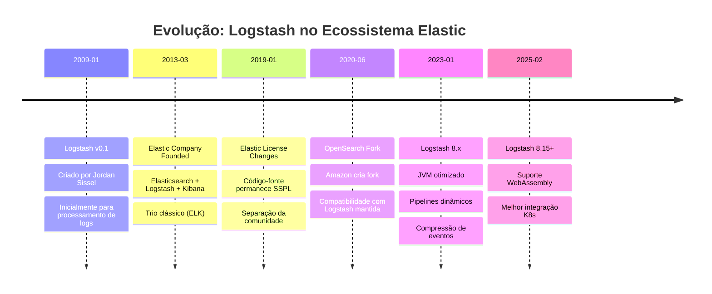
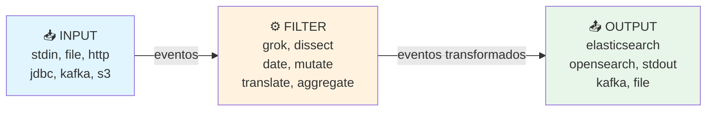

# 6 INGESTÃO DE DADOS COM LOGSTASH: CONFIGURAÇÃO E USO

---

## 6.1 OBJETIVOS DE APRENDIZAGEM

Ao final deste capítulo, você será capaz de:

1. **Compreender** a arquitetura de Logstash e seus components (input, filter, output)
2. **Instalar e configurar** Logstash 8.x em ambiente Docker integrado com OpenSearch
3. **Desenvolver** pipelines de processamento usando filtros: Grok, Dissect, Date, Mutate
4. **Implementar** ingestão de dados estruturados de bancos de dados (SQLite3)
5. **Debugar e validar** pipelines de Logstash com múltiplos padrões de dados

---

## 6.2 CONTEXTUALIZANDO: O QUE É O LOGSTASH?

Logstash é uma **ferramenta de processamento e pipeline de dados** (ETL – Extract, Transform, Load) que coleta dados de múltiplas fontes, aplica transformações complexas e envia para destinos diversos em tempo real ou em batch.

Diferentemente do Fluent Bit (focado em leveza e edge computing), Logstash foi desenvolvido para **ambientes corporativos onde transformações de dados são complexas e extensibilidade é crítica**, com suporte nativo a centenas de plugins.

### 6.2.1 História e Contexto: Logstash no Ecossistema Elastic

**Mermaid Diagram — Evolução do Logstash (2009–2025):**



### 6.2.2 Logstash vs. Fluent Bit: Quando Usar Cada Um

```
┌──────────────────────┬──────────────────────┬──────────────────┐
│ Critério             │ Logstash 8.x         │ Fluent Bit 4.2    │
├──────────────────────┼──────────────────────┼──────────────────┤
│ Memória (mínima)     │ ~500MB (JVM)         │ ~650KB            │
│ Linguagem            │ Ruby/JVM             │ C                 │
│ Complexidade filtros │ ⭐⭐⭐⭐⭐ Máxima    │ ⭐⭐⭐ Média      │
│ Plugins disponíveis  │ 200+ (oficial)       │ 60+ (limitado)    │
│ Entrada JDBC/DB      │ ✅ Nativo            │ ❌ Não suporta    │
│ Latência             │ Moderada             │ Muito baixa       │
│ Cloud-native friendly│ ⚠️ Moderado         │ ✅ Excelente      │
│ Curva aprendizado    │ Inicial alta         │ Média             │
│ Ideal para          │ ETL corporativo      │ Edge/Streaming    │
└──────────────────────┴──────────────────────┴──────────────────┘
```

**Recomendação de Uso:**

- **Use Logstash quando:**
  - Necessita ingestão de bancos de dados estruturados (MySQL, PostgreSQL, SQLite)
  - Transformações de dados são complexas e iterativas
  - Integração com múltiplos sistemas corporativos
  - Ambiente tem recursos suficientes (mínimo 1GB RAM)
  - Precisa de filtros avançados como Grok, Dissect, Translation tables

- **Use Fluent Bit quando:**
  - Recursos são limitados (containers pequenos, IoT)
  - Pipeline é relativamente simples (parsing + forward)
  - Latência ultra-baixa é crítica
  - Ambiente é cloud-native/Kubernetes

**Neste capítulo** focaremos em Logstash como ferramenta corporativa para ingestão estruturada.

### 6.2.3 Arquitetura Interna: Input → Filter → Output

Logstash funciona em um modelo de **three-stage pipeline**:



Cada estágio é independente e **altamente paralelizável** no Logstash, permitindo processamento de múltiplas linhas simultaneamente via workers.

---

## 6.3 INSTALAÇÃO E CONFIGURAÇÃO DO LOGSTASH EM DOCKER

### 6.3.1 Docker Compose: Logstash 8.15

Crie o arquivo `docker-compose-logstash.yml`:

```yaml
version: '3.8'

services:
  logstash:
    image: docker.elastic.co/logstash/logstash:8.15.0
    container_name: logstash
    environment:
      - xpack.monitoring.collection.enabled=false
      - discovery.seed_hosts=opensearch
      - LOGSTASH_JAVA_OPTS=-Xmx512m -Xms256m
    ports:
      - "5000:5000"      # TCP input
      - "5000:5000/udp"  # UDP input (Syslog)
      - "9600:9600"      # Monitoring API
    volumes:
      # Pipelines
      - ./logstash/config/pipelines.yml:/usr/share/logstash/config/pipelines.yml
      - ./logstash/pipelines:/usr/share/logstash/pipelines

      # Data (datasets)
      - ./datasets:/datasets

      # Logs
      - ./logstash/logs:/usr/share/logstash/logs
    networks:
      - opensearch-net
    depends_on:
      - opensearch
    healthcheck:
      test: curl -s http://localhost:9600 > /dev/null || exit 1
      interval: 10s
      timeout: 5s
      retries: 5

networks:
  opensearch-net:
    external: true
    name: opensearch-net

volumes:
  logstash-data:
    driver: local
```

### 6.3.2 Estrutura de Diretórios

```
logstash/
├── config/
│   └── pipelines.yml          # Definição de múltiplos pipelines
├── pipelines/
│   ├── 01-grok-parser.conf   # Pipeline 1: Filtro Grok
│   ├── 02-dissect-parser.conf # Pipeline 2: Filtro Dissect
│   ├── 03-date-parser.conf    # Pipeline 3: Filtro Date
│   ├── 04-mutate-parser.conf  # Pipeline 4: Filtro Mutate
│   └── 05-jdbc-sqlite.conf    # Pipeline 5: Exercício JDBC/SQLite
└── logs/
    └── logstash.log
```

### 6.3.3 Arquivo de Configuração: pipelines.yml

```yaml
# pipelines.yml
# Ativa múltiplos pipelines em paralelo

- pipeline.id: grok_parser
  path.config: "/usr/share/logstash/pipelines/01-grok-parser.conf"
  pipeline.workers: 2
  pipeline.batch.size: 125

- pipeline.id: dissect_parser
  path.config: "/usr/share/logstash/pipelines/02-dissect-parser.conf"
  pipeline.workers: 1
  pipeline.batch.size: 125

- pipeline.id: date_parser
  path.config: "/usr/share/logstash/pipelines/03-date-parser.conf"
  pipeline.workers: 1
  pipeline.batch.size: 125

- pipeline.id: mutate_parser
  path.config: "/usr/share/logstash/pipelines/04-mutate-parser.conf"
  pipeline.workers: 1
  pipeline.batch.size: 125

- pipeline.id: jdbc_sqlite
  path.config: "/usr/share/logstash/pipelines/05-jdbc-sqlite.conf"
  pipeline.workers: 1
  pipeline.batch.size: 100
```

### 6.3.4 Iniciando o Logstash

```bash
# Criar network (se ainda não existir)
docker network create opensearch-net

# Iniciar Logstash
docker-compose -f docker-compose-logstash.yml up -d

# Verificar logs
docker logs -f logstash

# Acessar API de monitoramento
curl -s http://localhost:9600/ | jq .
```

**Output esperado:**

```json
{
  "host": "logstash",
  "version": "8.15.0",
  "http_address": "0.0.0.0:9600",
  "id": "...",
  "name": "logstash",
  "uuid": "...",
  "status": "green",
  "pipeline": {
    "workers": 2,
    "batch_size": 125,
    "batch_delay": 50
  }
}
```

---

## 6.4 FILTROS LOGSTASH: PARSERS E TRANSFORMADORES

Um **filtro** no Logstash é um processador que transforma eventos (logs) estruturando-os, limpando-os ou enriquecendo-os. Estudaremos os filtros essenciais em sequence progressiva.

### 6.4.1 Exemplo 1: Filtro Grok (Parsing de Logs Estruturados)

**O que é Grok?** Grok é um filtro que usa **expressões regulares nomeadas** para extrair campos de strings não-estruturadas, transformando logs em JSON estruturado.

**Padrão Grok:**
```
%{PATTERN_NAME:field_name}
```

**Arquivo: `logstash/pipelines/01-grok-parser.conf`**

```conf
# Exemplo 1: Parsing de Logs Apache (Combined Log Format)
input {
  # Simula logs do Apache como entrada stdin
  stdin {
    codec => json
  }
}

filter {
  # Padrão Apache Combined Log Format:
  # 192.168.1.1 - - [10/Mar/2025:14:32:45 +0000] "GET /api/users HTTP/1.1" 200 1234 "-" "Mozilla/5.0"

  grok {
    match => {
      "message" => '%{IPORHOST:client_ip} %{HTTPDUSER:ident} %{HTTPDUSER:auth} \[%{HTTPDATE:timestamp}\] "%{WORD:method} %{DATA:request} HTTP/%{NUMBER:http_version}" %{NUMBER:status_code:int} (?:%{NUMBER:bytes:int}|-) %{QS:referrer} %{QS:user_agent}'
    }
  }

  # Remove campo original para limpeza
  mutate {
    remove_field => ["message"]
  }
}

output {
  # Para debug: mostra na tela
  stdout {
    codec => json_lines
  }

  # Para produção: envia ao OpenSearch
  opensearch {
    hosts => ["opensearch:9200"]
    index => "grok-logs-%{+YYYY.MM.dd}"
    auth_type => "basic"
    user => "admin"
    password => "Admin@123456"
    ssl_certificate_verification => false
  }
}
```

**Teste Interativo:**

```bash
# Shell do container
docker exec -it logstash /bin/bash

# Instale jq para teste local (opcional)
apt update && apt install -y jq

# Execute logstash com debug
/usr/share/logstash/bin/logstash -f /usr/share/logstash/pipelines/01-grok-parser.conf -t
```

**Entrada de teste (JSON):**
```json
{
  "message": "192.168.1.100 - - [10/Mar/2025:14:32:45 +0000] \"GET /api/users HTTP/1.1\" 200 5432 \"-\" \"Mozilla/5.0\""
}
```

**Saída esperada:**
```json
{
  "client_ip": "192.168.1.100",
  "ident": "-",
  "auth": "-",
  "timestamp": "10/Mar/2025:14:32:45 +0000",
  "method": "GET",
  "request": "/api/users",
  "http_version": "1.1",
  "status_code": 200,
  "bytes": 5432,
  "referrer": "-",
  "user_agent": "Mozilla/5.0",
  "@timestamp": "2025-03-10T14:32:45.123Z"
}
```

**Padrões Grok Mais Comuns:**

| Padrão | Descrição | Exemplo |
|--------|-----------|---------|
| `%{IPORHOST:field}` | IP ou hostname | 192.168.1.1, example.com |
| `%{HTTPDATE:field}` | Data HTTP | 10/Mar/2025:14:32:45 |
| `%{WORD:field}` | Uma palavra | GET, POST, error |
| `%{NUMBER:field}` | Número | 200, 404, 123.45 |
| `%{QS:field}` | String entre aspas | "Mozilla/5.0" |
| `%{DATA:field}` | Qualquer string | /api/users, anything |
| `%{TIMESTAMP_ISO8601:field}` | ISO 8601 | 2025-03-10T14:32:45Z |
| `%{LOGLEVEL:field}` | Nível de log | ERROR, WARN, INFO |

**Repositório de Padrões:**
Consulte https://github.com/logstash-plugins/logstash-patterns-core/tree/main/patterns para mais padrões pré-definidos.

---

### 6.4.2 Exemplo 2: Filtro Dissect (Parsing Simples e Rápido)

**O que é Dissect?** Dissect é um filtro mais **simples e performático que Grok**, usando delimitadores explícitos em vez de regex. Ideal para logs com estrutura bem-definida.

**Padrão Dissect:**
```
%{field1} %{field2} %{field3}
```

**Arquivo: `logstash/pipelines/02-dissect-parser.conf`**

```conf
# Exemplo 2: Parsing de CSV ou Logs com Delimitadores Fixos
input {
  stdin {
    codec => json
  }
}

filter {
  # Log com estructura fixa:
  # timestamp | level | service | message
  # 2025-03-10T14:32:45.123Z | ERROR | payment-service | Failed to process transaction

  dissect {
    mapping => {
      "message" => "%{timestamp} | %{level} | %{service} | %{message_content}"
    }
  }

  # Validar se parsing foi bem-sucedido
  if "_dissectfailure" in [tags] {
    # Fallback: se dissect falhar, loga erro
    mutate {
      add_field => { "parsing_error" => "Dissect failed" }
    }
  }
}

output {
  stdout {
    codec => json_lines
  }

  opensearch {
    hosts => ["opensearch:9200"]
    index => "dissect-logs-%{+YYYY.MM.dd}"
    auth_type => "basic"
    user => "admin"
    password => "Admin@123456"
    ssl_certificate_verification => false
  }
}
```

**Entrada de teste:**
```json
{
  "message": "2025-03-10T14:32:45.123Z | ERROR | payment-service | Failed to process transaction #12345"
}
```

**Saída esperada:**
```json
{
  "timestamp": "2025-03-10T14:32:45.123Z",
  "level": "ERROR",
  "service": "payment-service",
  "message_content": "Failed to process transaction #12345",
  "@timestamp": "2025-03-10T14:32:45.123Z"
}
```

**Vantagens de Dissect vs Grok:**
- ⚡ **3-10x mais rápido** que Grok (sem regex)
- 📦 Menor overhead de CPU
- ✅ Ideal para logs com estrutura previsível
- ❌ Não funciona com variações de formato

---

### 6.4.3 Exemplo 3: Filtro Date (Parsing e Normalização de Timestamps)

**O que é Date?** O filtro Date converte strings de timestamp para o formato ISO 8601 padrão (`@timestamp`), permitindo análise temporal precisa no OpenSearch.

**Arquivo: `logstash/pipelines/03-date-parser.conf`**

```conf
# Exemplo 3: Parsing de Diferentes Formatos de Data
input {
  stdin {
    codec => json
  }
}

filter {
  # Parse timestamp em múltiplos formatos possíveis
  date {
    match => [
      "log_timestamp",           # Campo contém a data
      "dd/MMM/yyyy:HH:mm:ss Z",  # Formato Apache (10/Mar/2025:14:32:45 +0000)
      "ISO8601",                 # Formato ISO 8601
      "dd-MM-yyyy HH:mm:ss",     # Formato brasileiro
      "yyyy-MM-dd HH:mm:ss.SSS"  # Formato MySQL/PostgreSQL
    ]
    target => "@timestamp"       # Campo alvo
    timezone => "America/Sao_Paulo"  # Timezone para parsing
  }

  # Adiciona também a data parseada em um campo estruturado
  mutate {
    add_field => {
      "event_date" => "%{@timestamp}"
      "event_hour" => "%{+HH}"
      "event_day_of_week" => "%{+EEEE}"
    }
  }
}

output {
  stdout {
    codec => json_lines
  }

  opensearch {
    hosts => ["opensearch:9200"]
    index => "date-logs-%{+YYYY.MM.dd}"
    auth_type => "basic"
    user => "admin"
    password => "Admin@123456"
    ssl_certificate_verification => false
  }
}
```

**Teste com diferentes formatos:**

```json
{
  "log_timestamp": "10/Mar/2025:14:32:45 +0000",
  "message": "User login"
}
```

**Saída:**
```json
{
  "@timestamp": "2025-03-10T14:32:45.000Z",
  "event_date": "2025-03-10T14:32:45.000Z",
  "event_hour": "14",
  "event_day_of_week": "Monday",
  "log_timestamp": "10/Mar/2025:14:32:45 +0000",
  "message": "User login"
}
```

**Formatos de Data Suportados:**

| Padrão | Exemplo |
|--------|---------|
| `dd/MMM/yyyy:HH:mm:ss Z` | 10/Mar/2025:14:32:45 +0000 |
| `ISO8601` | 2025-03-10T14:32:45Z |
| `dd-MM-yyyy HH:mm:ss` | 10-03-2025 14:32:45 |
| `yyyy-MM-dd HH:mm:ss.SSS` | 2025-03-10 14:32:45.123 |
| `EEE, d MMM yyyy HH:mm:ss Z` | Mon, 10 Mar 2025 14:32:45 +0000 |
| `UNIX_MS` | 1741611165000 (milissegundos) |
| `UNIX` | 1741611165 (segundos) |

---

### 6.4.4 Exemplo 4: Filtro Mutate (Transformação e Enriquecimento de Dados)

**O que é Mutate?** Mutate é o filtro de **transformação geral** que permite adicionar, remover, renomear, converter tipos de dados e manipular campos.

**Arquivo: `logstash/pipelines/04-mutate-parser.conf`**

```conf
# Exemplo 4: Transformação de Dados com Mutate
input {
  stdin {
    codec => json
  }
}

filter {
  # 1. Converter tipos de dados
  mutate {
    convert => {
      "status_code" => "integer"
      "response_time_ms" => "float"
      "is_error" => "boolean"
    }
  }

  # 2. Adicionar campos calculados ou enriquecidos
  mutate {
    add_field => {
      "environment" => "production"
      "log_source" => "%{[host][name]}"
      "processing_timestamp" => "%{@timestamp}"
    }
  }

  # 3. Renomear campos
  mutate {
    rename => {
      "client_ip" => "source.ip"
      "response_time_ms" => "duration_ms"
    }
  }

  # 4. Converter para lowercase (normalizar)
  mutate {
    lowercase => ["log_level", "service_name"]
  }

  # 5. Remover campos sensíveis ou desnecessários
  mutate {
    remove_field => ["@version", "host", "message"]
  }

  # 6. Split: dividir campo em array (útil para tags)
  mutate {
    split => { "tags" => "," }
  }

  # 7. Merge: juntar campos (combinação)
  mutate {
    merge => {
      "all_ids" => ["user_id", "session_id", "request_id"]
    }
  }
}

output {
  stdout {
    codec => json_lines
  }

  opensearch {
    hosts => ["opensearch:9200"]
    index => "mutate-logs-%{+YYYY.MM.dd}"
    auth_type => "basic"
    user => "admin"
    password => "Admin@123456"
    ssl_certificate_verification => false
  }
}
```

**Entrada de teste:**
```json
{
  "status_code": "200",
  "response_time_ms": "123.45",
  "is_error": "false",
  "client_ip": "192.168.1.100",
  "log_level": "ERROR",
  "service_name": "PAYMENT_API",
  "tags": "urgent,prod,error",
  "user_id": "usr_001",
  "session_id": "sess_002",
  "request_id": "req_003",
  "host": {
    "name": "server-01"
  }
}
```

**Saída esperada:**
```json
{
  "status_code": 200,
  "response_time_ms": 123.45,
  "is_error": false,
  "source.ip": "192.168.1.100",
  "log_level": "error",
  "service_name": "payment_api",
  "tags": ["urgent", "prod", "error"],
  "environment": "production",
  "log_source": "server-01",
  "processing_timestamp": "2025-03-10T14:32:45.123Z",
  "duration_ms": 123.45,
  "all_ids": ["usr_001", "sess_002", "req_003"],
  "@timestamp": "2025-03-10T14:32:45.123Z"
}
```

**Operações Mutate Disponíveis:**

| Operação | Descrição | Exemplo |
|----------|-----------|---------|
| `convert` | Converte tipo de dado | `convert => { "status" => "integer" }` |
| `add_field` | Adiciona novo campo | `add_field => { "env" => "prod" }` |
| `rename` | Renomeia campo | `rename => { "old_name" => "new_name" }` |
| `remove_field` | Remove campos | `remove_field => ["@version"]` |
| `lowercase` | Converte para minúsculas | `lowercase => ["field1", "field2"]` |
| `uppercase` | Converte para maiúsculas | `uppercase => ["field1"]` |
| `split` | Divide string em array | `split => { "tags" => "," }` |
| `join` | Junta array em string | `join => { "tags" => ";" }` |
| `merge` | Combina arrays/hashes | `merge => { "combined" => ["arr1", "arr2"] }` |
| `gsub` | Substitui (global) | `gsub => { "message" => ["buggy", "fixed"] }` |

---

## 6.5 EXERCÍCIO UNIFICADO: INGESTÃO DE BANCO DE DADOS SQLITE3

Agora aplicaremos os conceitos aprendidos em um **exercício prático completo**: ingerir dados estruturados do banco de dados **Chinook** (aplicação de e-commerce musical) em OpenSearch usando Logstash.

### 6.5.1 Preparação: Download e Setup do Banco Chinook

O banco de dados Chinook é um exemplo clássico com estrutura real de e-commerce. Ele contém tabelas como:
- `customers` (clientes)
- `invoices` (faturas)
- `invoice_items` (itens de fatura)
- `products` (produtos)
- `artists` (artistas)

**Download do dataset:**

```bash
# Criar diretório de datasets
mkdir -p datasets

# Download do chinook.db
cd datasets
wget https://raw.githubusercontent.com/tornis/esstackenterprise/master/datasets/chinook.db

# Verificar integridade
ls -lh chinook.db
# Esperado: ~600KB
```

**Verificar conteúdo do banco:**

```bash
# Instalar sqlite3
sudo apt install sqlite3

# Conectar ao banco
sqlite3 datasets/chinook.db

# Comandos úteis:
# .tables                          (listar tabelas)
# .schema customers                (ver estrutura da tabela)
# SELECT COUNT(*) FROM customers;  (contar registros)
```

**Estrutura de exemplo (Clientes):**

```sql
-- Tabela: customers
-- Colunas: CustomerId, FirstName, LastName, City, Country, Email, Phone
-- Registros: 59 clientes

SELECT
  CustomerId,
  FirstName,
  LastName,
  City,
  Country,
  Email
FROM customers
LIMIT 3;
```

| CustomerId | FirstName | LastName | City | Country | Email |
|-----------|-----------|----------|------|---------|-------|
| 1 | Luís | Gonçalves | São Paulo | Brazil | luisg@embraer.com.br |
| 2 | Leonie | Köhler | Stuttgart | Germany | leonekohler@surfeu.de |
| 3 | François | Tremblay | Montreal | Canada | ftremblay@gmail.com |

### 6.5.2 Instalação do Plugin JDBC no Logstash

O plugin `logstash-input-jdbc` permite ler dados diretamente de bancos de dados SQL.

```bash
# Dentro do container Logstash
docker exec -it logstash /usr/share/logstash/bin/logstash-plugin install logstash-input-jdbc

# Verificar instalação
docker exec logstash /usr/share/logstash/bin/logstash-plugin list | grep jdbc
```

**Alternativa: Adicionar ao docker-compose.yml**

```yaml
# Modifique o serviço logstash:
logstash:
  ...
  environment:
    ...
    LS_JAVA_OPTS: "-Xmx512m -Xms256m"
  # Adicione esta linha para instalar plugins ao iniciar:
  # command: |
  #   sh -c 'logstash-plugin install logstash-input-jdbc && \
  #   logstash -f /usr/share/logstash/pipelines/05-jdbc-sqlite.conf'
```

### 6.5.3 Pipeline JDBC: Ingestão do SQLite3

**Arquivo: `logstash/pipelines/05-jdbc-sqlite.conf`**

```conf
# Pipeline 5: Ingestão de Dados do SQLite3 (Chinook Database)
# Extrai dados de clientes, faturas e itens de fatura

input {
  # Input 1: Tabela Customers
  jdbc {
    jdbc_driver_library => "/opt/jdbc-drivers/sqlite-jdbc-3.48.0.0.jar"
    jdbc_driver_class => "org.sqlite.JDBC"
    jdbc_connection_string => "jdbc:sqlite:/datasets/chinook.db"

    # Query para extrair clientes com seus pedidos agregados
    statement => "
      SELECT
        c.CustomerId,
        c.FirstName,
        c.LastName,
        c.City,
        c.Country,
        c.Email,
        c.Phone,
        COUNT(i.InvoiceId) as total_invoices,
        COALESCE(SUM(i.Total), 0) as lifetime_value
      FROM customers c
      LEFT JOIN invoices i ON c.CustomerId = i.CustomerId
      GROUP BY c.CustomerId
    "

    # Marcação de sincronização (rastreia última linha processada)
    use_column_value => true
    tracking_column => "CustomerId"
    tracking_column_type => "numeric"

    # Frequência de execução
    schedule => "0 0 * * * *"  # 1x por dia à meia-noite

    # Configurações de performance
    jdbc_pool_size => 5
    jdbc_paging_size => 10000

    # Adicione as informações do evento
    add_field => {
      "data_source" => "sqlite_chinook"
      "entity_type" => "customer"
    }
  }
}

filter {
  # 1. Converter tipos numéricos
  mutate {
    convert => {
      "CustomerId" => "integer"
      "total_invoices" => "integer"
      "lifetime_value" => "float"
    }
  }

  # 2. Renomear para convenção padrão (lowercase com underscore)
  mutate {
    rename => {
      "CustomerId" => "customer_id"
      "FirstName" => "first_name"
      "LastName" => "last_name"
      "Email" => "email"
      "Phone" => "phone"
      "City" => "city"
      "Country" => "country"
    }
  }

  # 3. Enriquecer com dados calculados
  mutate {
    add_field => {
      "full_name" => "%{first_name} %{last_name}"
      "location" => "%{city}, %{country}"
      "is_high_value" => false
    }
  }

  # 4. Classificar clientes por valor
  if [lifetime_value] > 50 {
    mutate {
      replace => { "is_high_value" => true }
      add_field => { "customer_segment" => "VIP" }
    }
  } else if [lifetime_value] > 10 {
    mutate {
      add_field => { "customer_segment" => "Regular" }
    }
  } else {
    mutate {
      add_field => { "customer_segment" => "Prospect" }
    }
  }

  # 5. Normalizar email
  mutate {
    lowercase => ["email"]
  }

  # 6. Remover campos desnecessários
  mutate {
    remove_field => ["@version", "host", "tags"]
  }
}

output {
  # Debug: mostra primeiro evento
  if [@metadata][index_num] == 1 {
    stdout {
      codec => json_lines
    }
  }

  # Saída principal: OpenSearch
  opensearch {
    hosts => ["opensearch:9200"]
    index => "chinook-customers"
    document_id => "%{customer_id}"
    auth_type => "basic"
    user => "admin"
    password => "Admin@123456"
    ssl_certificate_verification => false
  }
}
```

### 6.5.4 Configuração do JDBC Driver

SQLite requer driver JDBC específico:

```bash
# Criar diretório de drivers
mkdir -p logstash/drivers

# Download do SQLite JDBC Driver
cd logstash/drivers
wget https://github.com/xerial/sqlite-jdbc/releases/download/3.48.0.0/sqlite-jdbc-3.48.0.0.jar

# Verificar
ls -lh sqlite-jdbc-*.jar
```

**Alternativa: Usar volume no docker-compose.yml**

```yaml
volumes:
  - ./logstash/drivers:/opt/jdbc-drivers
  - ./datasets:/datasets
```

### 6.5.5 Teste e Validação

**1. Verificar sintaxe do pipeline:**

```bash
docker exec logstash /usr/share/logstash/bin/logstash -f \
  /usr/share/logstash/pipelines/05-jdbc-sqlite.conf -t
```

**Esperado:** `Configuration OK` (sem erros)

**2. Executar pipeline em foreground (para debug):**

```bash
docker exec -it logstash /usr/share/logstash/bin/logstash -f \
  /usr/share/logstash/pipelines/05-jdbc-sqlite.conf
```

**Esperado:**
```
[2025-03-10T14:32:45,123][INFO ][logstash.inputs.jdbc] (1.1) SELECT...
[2025-03-10T14:32:47,456][INFO ][logstash.outputs.opensearch] Elasticsearch output plugin version: 11.5.0
[2025-03-10T14:32:48,789][INFO ][logstash.agent] Pipeline started successfully
```

**3. Validar dados em OpenSearch:**

```bash
# Query para verificar ingestão
curl -s -k -u admin:Admin@123456 https://localhost:9200/chinook-customers/_search | jq '.hits.total.value'

# Esperado: 59 (número de clientes no Chinook)

# Visualizar primeiro documento
curl -s -k -u admin:Admin@123456 https://localhost:9200/chinook-customers/_doc/1 | jq '._source'
```

**Resposta esperada:**

```json
{
  "customer_id": 1,
  "first_name": "Luís",
  "last_name": "Gonçalves",
  "full_name": "Luís Gonçalves",
  "email": "luisg@embraer.com.br",
  "phone": "+55 (11) 3308-7161",
  "city": "São Paulo",
  "country": "Brazil",
  "location": "São Paulo, Brazil",
  "total_invoices": 7,
  "lifetime_value": 39.62,
  "is_high_value": false,
  "customer_segment": "Regular",
  "data_source": "sqlite_chinook",
  "entity_type": "customer",
  "@timestamp": "2025-03-10T14:32:48.000Z"
}
```

---

## 6.6 CASOS DE USO AVANÇADOS

### 6.6.1 Pipelines em Série (Output como Input)

Você pode encadear pipelines, onde a saída de um alimenta a entrada de outro:

```conf
# Pipeline A: extrai dados brutos
input { ... }
filter { ... }
output {
  kafka {
    topic_id => "raw-events"
  }
}

# Pipeline B: consome de Kafka e enriquece
input {
  kafka {
    topic_id => "raw-events"
  }
}
filter {
  # Enriquecimento adicional
}
output {
  opensearch { ... }
}
```

### 6.6.2 Tratamento de Erros com Dead Letter Queue

```conf
output {
  opensearch {
    hosts => ["opensearch:9200"]
    dlq_write_clients => true
  }
}
```

Eventos falhados são armazenados em `.logstash-dlq` para reprocessamento posterior.

### 6.6.3 Agregação de Eventos

```conf
filter {
  aggregate {
    task_id => "%{session_id}"
    code => '
      map["total_actions"] ||= 0
      map["total_actions"] += 1
      map["first_timestamp"] = event.get("@timestamp") if !map["first_timestamp"]
      map["last_timestamp"] = event.get("@timestamp")
    '
    timeout => 30
  }
}
```

---

## 6.7 TROUBLESHOOTING E DEBUGGING

### 6.7.1 Logs Detalhados

```bash
# Aumentar verbosidade
docker exec logstash /usr/share/logstash/bin/logstash -f \
  /path/to/pipeline.conf --log.level=debug
```

### 6.7.2 Validação de Pipeline

```bash
# Testar sintaxe SEM executar
docker exec logstash /usr/share/logstash/bin/logstash -f \
  /path/to/pipeline.conf -t
```

### 6.7.3 Monitoring via API

```bash
# Status geral
curl http://localhost:9600/

# Métricas de pipeline
curl http://localhost:9600/stats/pipeline

# Estatísticas de JVM
curl http://localhost:9600/stats/jvm
```

---

## 6.8 RESUMO DO CAPÍTULO

Neste capítulo, você aprendeu:

✅ **Arquitetura de Logstash** e seu modelo three-stage (input → filter → output)
✅ **Instalação em Docker Compose** com configuração modular
✅ **Filtros essenciais:**
- Grok: parsing complexo com regex
- Dissect: parsing simples e rápido
- Date: normalização de timestamps
- Mutate: transformação e enriquecimento de dados

✅ **Ingestão de banco de dados** via plugin JDBC (SQLite)
✅ **Debugging e validação** de pipelines em OpenSearch

### Próximos Passos

1. Implemente outros inputs (Kafka, HTTP, CloudWatch)
2. Desenvolva pipelines custom com Lua/Ruby
3. Configure alertas em tempo real com OpenSearch Alerting
4. Integre com sistemas corporativos (SAP, Salesforce, etc.)

### Referências Oficiais

- [Logstash Documentation](https://www.elastic.co/guide/en/logstash/current/index.html)
- [OpenSearch Logstash Plugin](https://docs.opensearch.org/latest/tools/logstash/index/)
- [Grok Patterns Repository](https://github.com/logstash-plugins/logstash-patterns-core)
- [JDBC Input Plugin](https://www.elastic.co/guide/en/logstash/current/plugins-inputs-jdbc.html)

---

**Fim do Capítulo 6**
