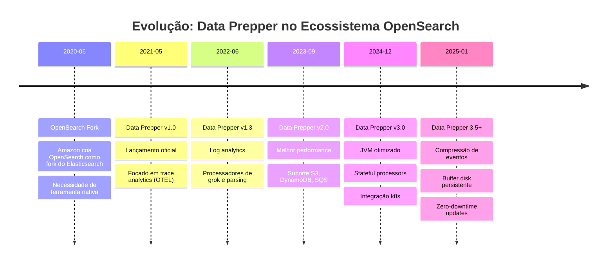
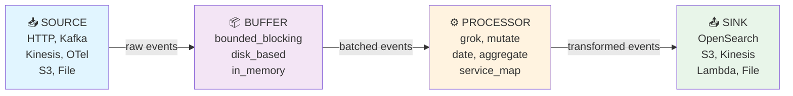

# 7 INGESTÃO DE DADOS COM DATA PREPPER: PIPELINES E TRANSFORMAÇÃO

---

## 7.1 OBJETIVOS DE APRENDIZAGEM

Ao final deste capítulo, você será capaz de:

1. **Compreender** a arquitetura e conceitos do Data Prepper (pipelines, sources, sinks, buffers, processors)
2. **Distinguir** Data Prepper vs. Logstash: quando usar cada ferramenta
3. **Instalar e configurar** Data Prepper 3.x em Docker integrado com OpenSearch
4. **Desenvolver** pipelines de processamento de logs com HTTP source e OpenSearch sink
5. **Implementar** ingestão de dados estruturados via Fluent Bit para Data Prepper
6. **Debugar e validar** pipelines com múltiplos processadores e padrões de dados

---

## 7.2 CONTEXTUALIZANDO: O QUE É O DATA PREPPER?

Data Prepper é uma **ferramenta nativa de ingestão e processamento de dados** desenvolvida pela Amazon para o OpenSearch, especialmente otimizada para **análise de logs (log analytics) e traces distribuídos** em ambientes modernos cloud-native.

Diferentemente do Logstash (que é agnóstico a qualquer plataforma de destino), Data Prepper foi desenvolvido **especificamente para OpenSearch**, oferecendo integração nativa, menor latência e configuração mais simples para pipelines de observabilidade.

### 7.2.1 História e Contexto: Data Prepper no Ecossistema OpenSearch



### 7.2.2 Data Prepper vs. Logstash: Quando Usar Cada Um

```
┌──────────────────────┬────────────────────────┬─────────────────────┐
│ Critério             │ Data Prepper 3.x       │ Logstash 8.x        │
├──────────────────────┼────────────────────────┼─────────────────────┤
│ Memória (mínima)     │ ~300MB (JVM otimizado) │ ~500MB (JVM padrão) │
│ Latência P50         │ <10ms (típico)         │ 20-50ms             │
│ Linguagem            │ Java/YAML              │ Ruby/DSL            │
│ Complexidade filtros │ ⭐⭐⭐⭐ Média-Alta   │ ⭐⭐⭐⭐⭐ Máxima │
│ Plugins disponíveis  │ 20+ (focado)           │ 200+ (extensível)   │
│ Integração OpenSearch│ ✅ Nativa (ótima)      │ ✅ Boa (universal)  │
│ OTEL/Traces          │ ✅ Nativo              │ ❌ Via plugins      │
│ Entrada JDBC/DB      │ ❌ Não                 │ ✅ Nativo           │
│ Cloud-native amigável│ ✅ Excelente (K8s)    │ ⚠️ Moderado        │
│ Curva aprendizado    │ Baixa (YAML)           │ Média (DSL Ruby)    │
│ Ideal para           │ Observability modern   │ ETL corporativo    │
└──────────────────────┴────────────────────────┴─────────────────────┘
```

**Matriz de Decisão:**

| Caso de Uso | Recomendação | Razão |
|-----------|--------------|-------|
| **Logs de aplicação (Cloud-native)** | Data Prepper ✅ | Latência baixa, fácil integração K8s, YAML simples |
| **Logs Apache/Nginx + transformação simples** | Data Prepper ✅ | Grok processador eficiente, overhead menor |
| **Integração com múltiplas bases de dados (JDBC)** | Logstash ✅ | Entrada JDBC nativa, Data Prepper não suporta |
| **Transformações complexas e iterativas** | Logstash ✅ | DSL mais poderoso, filtros avançados (conditional logic) |
| **Sistema legado corporativo + múltiplos destinos** | Logstash ✅ | Suporte universal a qualquer origem/destino |
| **Microserviços + Kubernetes** | Data Prepper ✅ | Métricas integradas, sidecars eficientes |
| **Trace distribuído (OpenTelemetry)** | Data Prepper ✅ | Suporte nativo, processadores especializados |

**Recomendação Prática:**

- **Use Data Prepper quando:**
  - Ambiente é moderno/cloud-native (Docker, Kubernetes)
  - Logs provêm de aplicações containerizadas
  - Observability (logs + traces) é prioridade
  - Latência ultra-baixa é necessária
  - Equipe conhece YAML (configuração simples)
  - Ingestão de dados via Fluent Bit, Otel Collector, HTTP
  - Destino final é OpenSearch

- **Use Logstash quando:**
  - Integração com bancos de dados estruturados (MySQL, PostgreSQL, Oracle)
  - Transformações complexas com lógica condicional avançada
  - Múltiplos destinos heterogêneos
  - Ambiente corporativo legado com ELK já instalado
  - Precisa de centenas de plugins diferentes

**Neste capítulo** focaremos em Data Prepper como ferramenta moderna para observability em ambientes cloud-native.

### 7.2.3 Arquitetura Interna: Pipelines, Sources, Sinks, Buffers e Processors

Data Prepper funciona com um modelo de **pipeline flexível e extensível**. Cada pipeline é independente e processa dados através de componentes bem definidos:



**Componentes Detalhados:**

#### **SOURCE (Origem de Dados)**

Define de onde os dados entram no pipeline. Exemplos:

| Source | Uso | Exemplo |
|--------|-----|---------|
| `http` | Logs via HTTP/HTTPS | Fluent Bit, Otel Collector, aplicações custom |
| `kafka` | Streaming de Kafka | Filas de eventos em tempo real |
| `kinesis` | AWS Kinesis Streams | Ingestão AWS cloud-native |
| `otel_metrics` | OpenTelemetry Metrics | Métricas distribuídas |
| `otel_trace` | OpenTelemetry Traces | Traces distribuídos (APM) |
| `s3` | Arquivos em S3 | Batch de logs em cloud storage |
| `file` | Arquivos locais | Logs em disco |

#### **BUFFER (Armazenamento Temporário)**

Armazena eventos entre SOURCE e PROCESSOR, oferecendo garantias de entrega e resiliência:

| Buffer | Características | Ideal para |
|--------|-----------------|-----------|
| `bounded_blocking` (padrão) | Em memória, limpo por tamanho/tempo | Throughput médio, baixa latência |
| `disk_based` | Persistente em disco | Garantia de não perda, volumes altos |
| `in_memory` | Mínimo overhead | Latência ultra-baixa, dados não críticos |

#### **PROCESSOR (Transformação)**

Aplica lógica de processamento aos eventos. Processadores principais:

| Processador | Função | Exemplo |
|------------|--------|---------|
| `grok` | Parse de logs estruturados via regex | `%{COMMONAPACHELOG}` para Apache logs |
| `mutate` | Renomear, remover, adicionar campos | Adicionar timestamp, remover PII |
| `date` | Parse e normalização de timestamps | Converter ISO8601 para epoch |
| `aggregate` | Agregar múltiplos eventos | Consolidar logs de multi-linha |
| `service_map` | Construir mapa de serviços | Visualização de dependências |
| `trace_peer_forwarder` | Forwardar traces entre pipelines | Distribuição de traces |
| `copy` | Duplicar eventos para múltiplos processadores | Fan-out de dados |
| `csv` | Parse de CSV | Dados estruturados delimitados |

#### **SINK (Destino)**

Define para onde os dados são enviados após processamento:

| Sink | Destino | Autenticação |
|-----|---------|--------------|
| `opensearch` | OpenSearch/Elasticsearch | Basic auth, AWS SigV4 |
| `s3` | AWS S3 buckets | IAM roles |
| `sqs` | AWS SQS queues | IAM roles |
| `file` | Arquivos em disco | Permissões FS |
| `lambda` | AWS Lambda functions | IAM roles |

---

## 7.3 INSTALAÇÃO E CONFIGURAÇÃO DO DATA PREPPER EM DOCKER

### 7.3.1 Docker Compose: Data Prepper 3.x (Standalone)

Crie o arquivo `docker-compose-data-prepper.yml` na raiz do projeto:

```yaml
version: '3.8'

services:
  data-prepper:
    image: opensearchproject/data-prepper:3.5.0
    container_name: data-prepper
    ports:
      - "21000:21000"    # HTTP source padrão para logs
      - "21001:21001"    # Otel trace receiver
      - "21002:21002"    # Otel metrics receiver
      - "9411:9411"      # Zipkin receiver
    environment:
      # Configuração de logging
      JAVA_OPTS: "-Xmx512m -Xms512m -Dlog4j.configurationFile=/usr/share/data-prepper/config/log4j2.properties"
      # Habilitar métricas Prometheus (opcional)
      # METRICS_PORT: "9090"
    volumes:
      # Bind mount para configuração de pipelines
      - ./data-prepper/pipelines:/usr/share/data-prepper/pipelines
      # Configuração de servidor (port, thread pools, etc.)
      - ./data-prepper/config/data-prepper-config.yaml:/usr/share/data-prepper/config/data-prepper-config.yaml:ro
      # Buffer persistente em disco (opcional)
      - data-prepper-buffer:/var/lib/data-prepper
    networks:
      - opensearch-net
    depends_on:
      - opensearch
    healthcheck:
      test: ["CMD", "curl", "-f", "http://localhost:21000/health"]
      interval: 10s
      timeout: 5s
      retries: 3
    restart: unless-stopped

  # OpenSearch já deve estar rodando (compartilhado do docker-compose principal)
  opensearch:
    image: opensearchproject/opensearch:3.5.0
    container_name: opensearch
    environment:
      - cluster.name=opensearch-cluster
      - node.name=opensearch-node1
      - discovery.seed_hosts=opensearch
      - cluster.initial_master_nodes=opensearch-node1
      - OPENSEARCH_JAVA_OPTS=-Xms512m -Xmx512m
      - DISABLE_SECURITY_PLUGIN=true
    ports:
      - "9200:9200"
    volumes:
      - opensearch-data:/usr/share/opensearch/data
    networks:
      - opensearch-net
    healthcheck:
      test: ["CMD-SHELL", "curl -f http://localhost:9200/_cluster/health || exit 1"]
      interval: 10s
      timeout: 5s
      retries: 5
    restart: unless-stopped

volumes:
  opensearch-data:
  data-prepper-buffer:

networks:
  opensearch-net:
    driver: bridge
```

**⚠️ Importante:** Se você já possui OpenSearch rodando em outro docker-compose, comente/remova a seção `opensearch` e ajuste a rede `opensearch-net` para usar a rede existente:

```bash
# Verificar redes existentes
docker network ls

# Usar rede existente
networks:
  opensearch-net:
    external: true
    name: seu-network-existente
```

### 7.3.2 Estrutura de Diretórios

Organize os arquivos de configuração do Data Prepper:

```
projeto-root/
├── docker-compose-data-prepper.yml
├── data-prepper/
│   ├── pipelines/
│   │   ├── log-pipeline.yaml          # Pipeline de logs padrão
│   │   ├── apache-logs.yaml            # Pipeline específico Apache
│   │   └── fluentbit-ingest.yaml      # Pipeline de ingestão Fluent Bit
│   └── config/
│       └── data-prepper-config.yaml   # Configuração do servidor
└── exercicios/cap07/
    └── fluentbit-config/
        ├── fluent-bit.conf
        └── parsers.conf
```

### 7.3.3 Arquivo de Configuração do Servidor

Crie `data-prepper/config/data-prepper-config.yaml`:

```yaml
# Configuração geral do Data Prepper
# Data Prepper Server Configuration

server:
  # Porta HTTP (padrão 21000)
  port: 21000

  # Request timeout em segundos
  request_timeout_ms: 30000

  # Thread pool para processamento
  thread_pool_size: 8

metrics:
  # Habilitar métricas Prometheus
  metrics_enabled: true
  # Porta para métricas
  metrics_port: 9090

# Buffer padrão para todos os pipelines
buffer:
  bounded_blocking:
    buffer_size: 12800  # Número de eventos em buffer

# Sincronização de pipeline (monitorar alterações)
pipeline_config_file_path: /usr/share/data-prepper/pipelines/

# Habilitar CORS para dashboard remoto
server_api_endpoints:
  enabled: true
```

### 7.3.4 Iniciar Data Prepper

```bash
# Navegar para diretório do projeto
cd /mnt/projetos/teste/ebook-opensearch

# Criar estrutura de diretórios
mkdir -p data-prepper/pipelines data-prepper/config

# Iniciar Data Prepper + OpenSearch
docker-compose -f docker-compose-data-prepper.yml up -d

# Verificar logs
docker logs -f data-prepper

# Testar saúde
curl -s http://localhost:21000/health | jq .
```

**Output esperado:**

```json
{
  "status": "UP"
}
```

---

## 7.4 PIPELINE 1: INGESTÃO BÁSICA DE LOGS HTTP

### 7.4.1 Configuração Simples: HTTP Source → OpenSearch Sink

Crie `data-prepper/pipelines/log-pipeline.yaml`:

```yaml
# Pipeline básico: receber logs HTTP e armazenar no OpenSearch
# Suporta logs em formato JSON simples

log-ingestion-pipeline:
  # SOURCE: Receber logs via HTTP POST
  source:
    http:
      # Porta de escuta (padrão OpenSearch Data Prepper)
      port: 21000

      # Caminho da API
      path: "/log/ingest"

      # Formato esperado dos eventos
      # Padrão: array JSON ou newline-delimited JSON
      # [ { "message": "log entry", "timestamp": "..." }, ... ]

  # PROCESSOR: Mutate para adicionar campos
  processor:
    - mutate:
        # Adicionar timestamp se não existir
        add_entries:
          - key: "ingest_timestamp"
            value: "${now()}"  # Timestamp em ms

        # Renomear campo 'msg' para 'message'
        rename_keys:
          "msg": "message"

  # SINK: Armazenar no OpenSearch
  sink:
    - opensearch:
        # Endpoints do OpenSearch
        hosts: ["https://opensearch:9200"]

        # Credenciais (ou use AWS SigV4 em produção)
        username: "admin"
        password: "admin"

        # Desabilitar validação SSL em dev (APENAS DEV!)
        insecure: true

        # Índice de destino
        index: "logs-app-%{yyyy.MM.dd}"

        # Tipo de documento (para compatibilidade)
        document_type: "_doc"

        # Bulk flush settings (performance tuning)
        bulk_size: 500
        flush_interval: 30
```

### 7.4.2 Testar Pipeline com curl

```bash
# 1. Enviar um log simples
curl -X POST http://localhost:21000/log/ingest \
  -H "Content-Type: application/json" \
  -d '[
    {
      "message": "Application started successfully",
      "level": "INFO",
      "service": "api-server"
    },
    {
      "message": "Database connection established",
      "level": "INFO",
      "service": "api-server"
    }
  ]'

# 2. Verificar dados no OpenSearch
curl -s -u admin:admin https://localhost:9200/logs-app-*/_search \
  -H "Content-Type: application/json" \
  -k | jq '.hits.hits'

# Output esperado:
# [
#   {
#     "_id": "...",
#     "_source": {
#       "message": "Application started successfully",
#       "level": "INFO",
#       "service": "api-server",
#       "ingest_timestamp": 1234567890000
#     }
#   }
# ]
```

---

## 7.5 PIPELINE 2: PARSING DE LOGS APACHE COM GROK

### 7.5.1 Processador Grok para Estruturação

Crie `data-prepper/pipelines/apache-logs.yaml`:

```yaml
# Pipeline para parsing de logs Apache Common Log Format
# Entrada: Linhas de log Apache bruto
# Saída: Campos estruturados no OpenSearch

apache-logs-pipeline:
  source:
    http:
      port: 21001
      path: "/apache/logs"

  processor:
    # Grok: Parse usando padrões pré-definidos
    - grok:
        # Padrão para Apache Common Log Format
        # 192.168.1.1 - - [01/Jan/2025:12:00:00 +0000] "GET /index.html HTTP/1.1" 200 1234
        match:
          message: [ "%{COMMONAPACHELOG}" ]

        # Padrão customizado (alternativa)
        # match:
        #   message: [
        #     "%{IP:client_ip} %{USER:ident} %{USER:auth} \[%{HTTPDATE:timestamp}\] \"%{WORD:http_method} %{DATA:request} HTTP/%{NUMBER:http_version}\" %{INT:status_code} %{INT:bytes}"
        #   ]

    # Date: Converter timestamp Apache para ISO8601
    - date:
        # Campo de entrada
        from_time_received: false
        match:
          timestamp:
            - "dd/MMM/yyyy:HH:mm:ss Z"

        # Campo de saída
        destination: "@timestamp"

    # Mutate: Adicionar contexto e conversões
    - mutate:
        # Converter strings numéricas para integers
        convert:
          status_code: "int"
          bytes: "int"

        # Adicionar campos derivados
        add_entries:
          - key: "http_method_normalized"
            value: "${http_method | downcase}"

          - key: "response_category"
            value: "${status_code >= 400 ? 'error' : 'success'}"

  sink:
    - opensearch:
        hosts: ["https://opensearch:9200"]
        username: "admin"
        password: "admin"
        insecure: true
        index: "apache-logs-%{yyyy.MM.dd}"
        bulk_size: 500
```

### 7.5.2 Testar com Logs Apache Reais

```bash
# 1. Log Apache típico
APACHE_LOG='192.168.1.10 - frank [01/Jan/2025:12:00:00 +0000] "GET /apache.html HTTP/1.0" 200 2326'

# 2. Enviar para Data Prepper
curl -X POST http://localhost:21001/apache/logs \
  -H "Content-Type: application/json" \
  -d "[{\"message\": \"$APACHE_LOG\"}]"

# 3. Verificar no OpenSearch
curl -s -u admin:admin https://localhost:9200/apache-logs-*/_search \
  -H "Content-Type: application/json" -k | jq '.hits.hits[0]._source'

# Output esperado:
# {
#   "clientip": "192.168.1.10",
#   "ident": "-",
#   "auth": "frank",
#   "timestamp": "01/Jan/2025:12:00:00 +0000",
#   "verb": "GET",
#   "request": "/apache.html",
#   "httpversion": "1.0",
#   "status_code": 200,
#   "bytes": 2326,
#   "@timestamp": "2025-01-01T12:00:00.000Z"
# }
```

---

## 7.6 PIPELINE 3: ENRIQUECIMENTO COM MÚLTIPLOS PROCESSADORES

### 7.6.1 Agregação e Enriquecimento de Eventos

Crie `data-prepper/pipelines/enriched-logs.yaml`:

```yaml
# Pipeline avançado: parse → enriquecer → agregar → OpenSearch
# Caso de uso: Consolidar logs multi-linha (stack traces, structured logging)

enriched-logs-pipeline:
  source:
    http:
      port: 21002
      path: "/enriched/logs"

  processor:
    # 1. Parse inicial com Grok
    - grok:
        match:
          message: [
            "%{TIMESTAMP_ISO8601:log_timestamp} \[%{WORD:level}\] \[%{DATA:logger}\] - %{GREEDYDATA:log_message}"
          ]

    # 2. Mutate: Normalizar level
    - mutate:
        rename_keys:
          "level": "severity_level"

        add_entries:
          - key: "severity_numeric"
            value: |
              ${
                severity_level == 'ERROR' ? 40 :
                severity_level == 'WARN' ? 30 :
                severity_level == 'INFO' ? 20 :
                severity_level == 'DEBUG' ? 10 : 0
              }

    # 3. Agregar eventos (consolidar multi-linha)
    - aggregate:
        # Agrupar por request_id se existir
        identification_keys:
          - request_id

        # Timeout em segundos
        timeout_duration: 10

        # Ação ao completar agregação
        action:
          type: "put_all"
          key: "aggregated_logs"

  # 4. Sink com transformações
  sink:
    - opensearch:
        hosts: ["https://opensearch:9200"]
        username: "admin"
        password: "admin"
        insecure: true
        index: "app-logs-%{yyyy.MM.dd}"
        routing: "${severity_level}"  # Distribuir por nível
```

---

## 7.7 RESUMO DE CONCEITOS

### Quadro Resumido: Componentes do Data Prepper

| Componente | Função | Exemplo |
|-----------|--------|---------|
| **Source** | Origem dos dados | HTTP, Kafka, Otel, S3 |
| **Buffer** | Intermediário entre source e processor | bounded_blocking, disk_based |
| **Processor** | Transformação/enriquecimento | Grok, mutate, date, aggregate |
| **Sink** | Destino final | OpenSearch, S3, SQS, Lambda |

### Checklist: Validação de Pipeline

- ✅ Source está escutando na porta correta?
- ✅ Processadores correspondem ao formato dos dados?
- ✅ Campos obrigatórios estão presentes?
- ✅ Credenciais OpenSearch estão corretas?
- ✅ Índice tem policy de criação automática?
- ✅ Buffer é suficiente para volume esperado?

---

## 7.8 PRÓXIMOS PASSOS: EXERCÍCIO PRÁTICO

O **Exercício Prático 7** (seção 7.9 em `exercicios/cap07/`) demonstra:

1. ✅ Instalação do Fluent Bit
2. ✅ Coleta de logs do Apache2
3. ✅ Envio para Data Prepper via HTTP
4. ✅ Pipeline completo de transformação
5. ✅ Consultas no OpenSearch

**Você está pronto para o exercício!** Vá para a seção de exercícios.

---

## REFERÊNCIAS

- [OpenSearch Data Prepper Documentation](https://docs.opensearch.org/latest/data-prepper/)
- [Data Prepper GitHub Repository](https://github.com/opensearch-project/data-prepper)
- [Log Analytics with Data Prepper](https://docs.opensearch.org/latest/data-prepper/common-use-cases/log-analytics/)
- [OpenTelemetry Data Prepper Integration](https://docs.opensearch.org/latest/data-prepper/getting-started/basic-usage/)
- [Apache Log Format Specification](https://httpd.apache.org/docs/current/logs.html)
